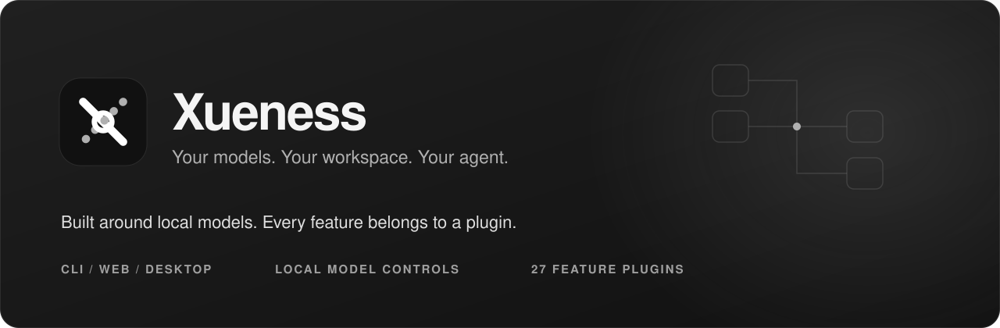
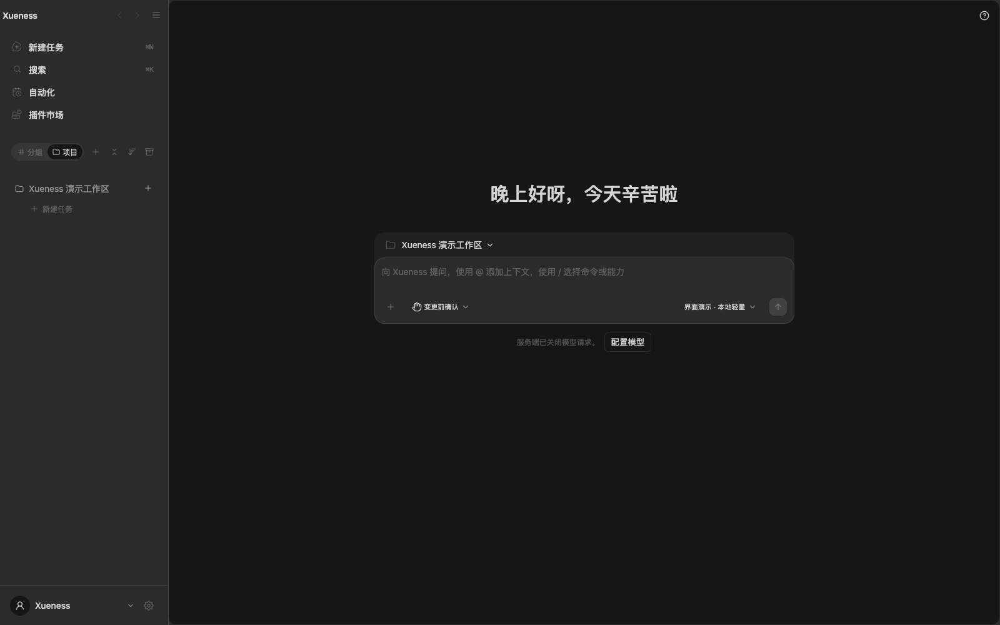
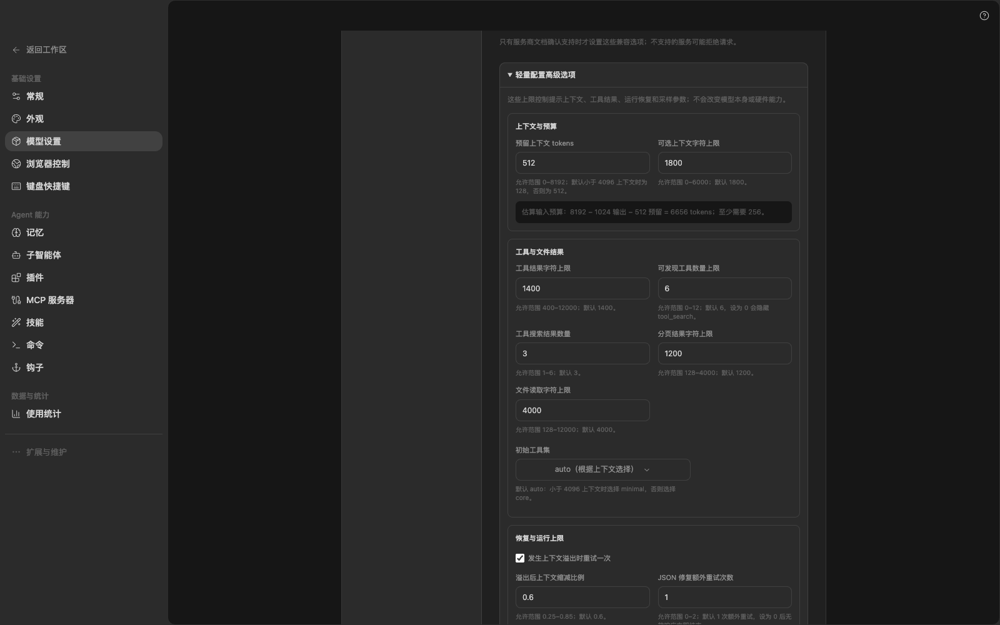
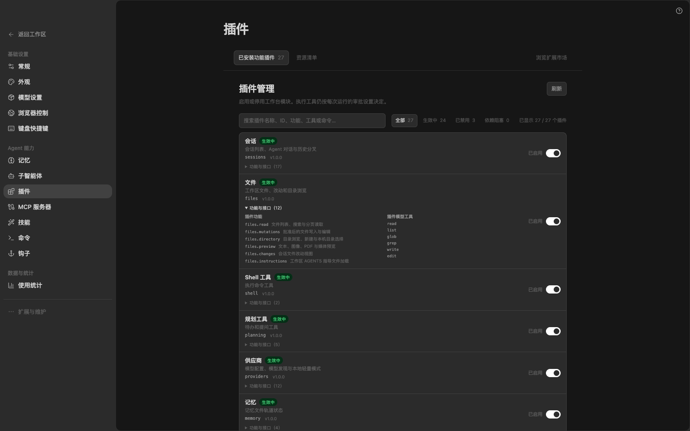

# Xueness

<div align="center">
  
  <p>An Agent CLI, local Web workbench, and self-contained desktop app, powered by one plugin system.</p>
  <p>
    <a href="README.md">简体中文</a> ·
    <a href="https://github.com/xuediner-source/xueness/releases/latest">Download desktop builds</a> ·
    <a href="docs/xueness-desktop.md">Desktop guide (中文)</a> ·
    <a href="docs/xueness-local-lightweight-mode.md">Local lightweight mode (中文)</a> ·
    <a href="docs/xueness-plugin-architecture.md">Plugin catalog (中文)</a>
  </p>
  <p>
    <a href="https://github.com/xuediner-source/xueness/actions/workflows/desktop-build.yml"></a>
    <a href="https://github.com/xuediner-source/xueness/blob/main/LICENSE"></a>
    <a href="https://github.com/xuediner-source/xueness/releases/latest"></a>
    
  </p>
</div>

<p align="center">
  
</p>
<p align="center">
  
  
</p>

Xueness is a personal development workbench for using an agent from the terminal, a local browser, or a Windows/macOS desktop app. It focuses on detailed runtime controls for local models, visible host and request status, and product capabilities that can be enabled by domain.

## Download

Visit [GitHub Releases](https://github.com/xuediner-source/xueness/releases/latest) and choose the installer for your OS and CPU architecture. Each desktop release includes its packaged builds and a `SHA256SUMS.txt` checksum file.

| System | Installer / disk image | Portable / app ZIP |
| --- | --- | --- |
| Windows 10/11 · x64 | [Installer `.exe`](https://github.com/xuediner-source/xueness/releases/download/v0.1.2/Xueness-0.1.2-windows-x64-setup.exe) | [Portable `.zip`](https://github.com/xuediner-source/xueness/releases/download/v0.1.2/Xueness-0.1.2-windows-x64-portable.zip) |
| macOS · Apple Silicon | [arm64 `.dmg`](https://github.com/xuediner-source/xueness/releases/download/v0.1.2/Xueness-0.1.2-macos-arm64.dmg) | [arm64 app `.zip`](https://github.com/xuediner-source/xueness/releases/download/v0.1.2/Xueness-0.1.2-macos-arm64.zip) |
| macOS · Intel | [x64 `.dmg`](https://github.com/xuediner-source/xueness/releases/download/v0.1.2/Xueness-0.1.2-macos-x64.dmg) | [x64 app `.zip`](https://github.com/xuediner-source/xueness/releases/download/v0.1.2/Xueness-0.1.2-macos-x64.zip) |

SHA-256 checksums for this release are in [`SHA256SUMS.txt`](https://github.com/xuediner-source/xueness/releases/download/v0.1.2/SHA256SUMS.txt). Desktop packages include Electron, a frozen Python backend, the built workbench, and browser drivers; Python and Node.js do not need to be installed separately. Git, SSH, ffmpeg, and other external programs are still required by the plugins that use them. Browser automation requires Chrome or Edge on the machine. Current builds are not code-signed or notarized; see the [desktop guide](docs/xueness-desktop.md) for first-launch and data-location details.

## What you can do

- **Tune local-model runs.** Choose the “Local lightweight” profile and adjust prompts, tool selection, context and output budgets, sampling, and protocol options. The resource panel reports CPU, memory, and process activity on the machine running Xueness. The output view shows request phases, tool activity, and usage reported by the model service. Missing token or GPU-memory measurements are shown as unavailable instead of being estimated.
- **Use 27 trusted plugins and 128 registered features.** Capabilities include sessions, workspace files, providers, shell, Git, terminals, workflows, memory, hooks, MCP, browser automation, remote connections, channels, automations, diagnostics, and Office previews. The plugin manager shows the full catalog and dependency state; the CLI can inspect and change plugin switches.
- **Switch the plugin mix in one click.** Pick the minimal, lightweight, or standard tier at the top of “Settings → Providers”, or run `xueness plugins profile list|show|apply` in the CLI. A tier is only a data list of plugin ids and booleans: your own explicit switches always win, and switching never changes the workspace, approval rules, or the permission mode. Audit marketplace manifests read-only with `xueness plugins validate <path>`, and upgrade already-installed manifests atomically with `xueness plugins update <id>|--all`, which only accepts listings that pass the same validation.
- **Give a session one durable goal.** Choose “Add goal” in the composer’s “+” menu when starting a task, or pass `--target` in the CLI, and the objective stays in force across turns: a short reminder is injected before every model request, and a one-line badge under the session title shows or clears it. When a run claims completion, the host checks whether the answer explicitly states the goal was achieved and otherwise marks the session for review. The check is deterministic: it makes no extra model call and does not prove on the user's behalf that the goal really was met. The feature belongs to the planning plugin; disabling it stops the entry points, injection, and the check together.
- **Keep one local runtime across three entry points.** Run sessions in the Agent CLI, manage them in the loopback Web workbench, or install the Windows/macOS desktop app. Platform-specific support stays with the plugin that owns the feature.

The lightweight profile tunes runtime behavior; it does not download models, change model weights, or automatically alter the inference server’s GPU allocation. Office previews cover selected document pages, images, charts, and cached spreadsheet values. They are not a complete Microsoft Office layout or compatibility engine.

## Quick start

### Web workbench and CLI

Source use requires Python 3.10+. The backend uses only the Python standard library, and the repository includes a prebuilt Web interface, so Node.js is not needed for normal use.

```sh
git clone https://github.com/xuediner-source/xueness.git
cd xueness

# Start the Web workbench on loopback
python3 -m xueness.web --port 8138
# Open http://127.0.0.1:8138

# Start an Agent session from the CLI
./bin/xueness chat --root /absolute/path/to/project
# Resume the most recent session in that workspace
./bin/xueness chat --continue --root /absolute/path/to/project
# Choose a separate private state directory (global option before subcommand)
./bin/xueness --state /absolute/path/to/private-state chat --root /absolute/path/to/project
# Set a durable session goal; --target-replace is required to overwrite an existing goal
./bin/xueness run --root /absolute/path/to/project --prompt "Add tests for the export command" --target "The export command has full tests and usage docs"
# Show, replace, or clear the goal of a session
./bin/xueness goal --session <session-id> show
./bin/xueness goal --session <session-id> replace "A new objective"
./bin/xueness goal --session <session-id> clear
./bin/xueness --help
```

In “Settings → Model configuration”, enter the endpoint, model ID, and credential for a model service you have chosen. Alternatively, set `XUENESS_API_BASE`, `XUENESS_MODEL`, and `XUENESS_API_KEY` in the local environment. Xueness does not provide a fake offline conversation mode.

Choose and authorize a workspace in Web settings. The CLI stores sessions and configuration in the project’s `.state/` directory by default; pass `--state /absolute/path/to/private-state` to use a separate directory. State may contain task text, tool output, and model credentials. Keep it private and out of Git. See the [desktop guide](docs/xueness-desktop.md) for desktop data paths and sharing data with the CLI.

### One-command local run

From a repository checkout:

```sh
./install.sh
# Default: http://127.0.0.1:8137

# Choose a port and private data directory
PORT=9000 DATA_DIR=/absolute/path/to/private-data ./install.sh
```

This entry point does not install system-wide software, and the Web server binds to loopback by default. Docker Compose is an optional local deployment; see the [deployment guide](docs/deploy.md).

## Plugins and security boundaries

Every product feature is provided by a trusted built-in plugin. The Web plugin manager lists the complete backend catalog, dependencies, and child features, including disabled plugins. The build-time allowlist defines executable plugins; extension marketplace manifests are data and are not loaded as arbitrary code. Future features follow the same ownership rule in [AGENTS.md](AGENTS.md) and [CONTRIBUTING.md](CONTRIBUTING.md).

Enabling a plugin does not approve an action. File changes and commands remain subject to the Gate, per-action approval, workspace scope, and host request boundaries. The Web interface is for one local operator: it has no multi-user authentication, TLS, or OS-level sandbox. Do not expose it directly to a LAN or the public Internet. Model credentials stay with the local backend; prompts and selected context are sent to the model service you configure when you start a run.

## Development

Backend development uses Python 3.10+. Editing and building the frontend requires Node.js 20.19+ or 22.12+. Product changes must follow plugin ownership, permission, and lifecycle rules. The core structure checks are:

```sh
python3 tools/check_plugin_architecture.py
python3 -m unittest tests.test_plugin_architecture -q
```

See [CONTRIBUTING.md](CONTRIBUTING.md) for test commands and contribution steps. Desktop builds require a native target platform, Node.js 24, and Python 3.12+; PyInstaller backends must be built on the target OS and architecture. Details are in the [desktop build guide](docs/xueness-desktop.md).

## Documentation

- [Desktop builds, data paths, and supported platforms](docs/xueness-desktop.md) (中文)
- [Local lightweight model profile](docs/xueness-local-lightweight-mode.md) (中文)
- [Plugin architecture and feature ownership](docs/xueness-plugin-architecture.md) (中文)
- [CLI, workflows, and workbench usage](docs/xueness-four-workstreams.md) (中文)
- [Deployment and network boundaries](docs/deploy.md)
- [Contribution guide](CONTRIBUTING.md) (中文)

## License and attribution

This repository uses the [Apache License 2.0](LICENSE). The Web interface contains adapted interface material from [ZCode](https://github.com/zai-org/ZCode); [NOTICE.md](NOTICE.md) records the attribution and changes. Xueness has its own Agent runtime, plugin interfaces, and Electron desktop shell. It is not an official product of Z.AI, ZCode, or DeepSeek. Its plugin interfaces are Xueness-specific; this project does not claim upstream plugin ABI compatibility or complete feature parity. [DeepSeek Harness](https://github.com/deepseek-ai/deepseek-harness) informed architecture and desktop design review only; its desktop code, trademarks, and icons are not distributed here. License notices for Web and desktop dependencies are included with the source and packaged builds; see [third-party notices](webapp/public/third-party-notices.txt).
