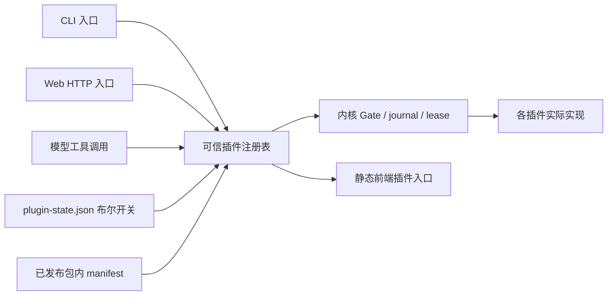

# Xueness 插件架构与功能归属

第二十批历史记录：2026-09-30。本轮将现有功能实现迁入独立包，同时补齐第十九批审查中的本地 Agent CLI 缺口。上游参照仍为 ZCode `29628c9`；功能范围以自用 CLI 与辅助 Web 为准。

## 边界与目录

后端实现位于 `xueness/bundled_plugins/<id>/`。每包包含 `manifest.json`、可信 `plugin.py` 入口和实际实现；旧 `xueness/provider.py`、`workflows.py` 等文件是模块身份兼容别名，旧导入和 monkeypatch 继续作用于同一实现。

内核保留持久 Store、单写入者 lease、工具 Gate、写锁、journal/事件协议、预算/验证、HTTP Host/Origin/CSRF 防护和注册表。会话 HTTP 路由、文件路由、工具处理器、模型、能力加载器和业务 API 均由插件贡献。插件开关与执行批准分别记录：启用插件不会授权写文件、命令、MCP、真实模型或外部连接。



`plugin_runtime.py` 是共同注册表：根据包内 manifest 处理依赖和命令/API 所属关系，调用 `register_cli`、`execute_cli`、`dispatch`、`tools` 等贡献。`tool_contract.py` 定义 `BuiltinTool` 和只在调用期间存在的 `ContextVar` 执行上下文；`tool_registry.py` 合并稳定工具对象，schema 和实际 dispatch 使用相同对象。执行批准所需的规范化 subject 由工具自身提供，防止 UI 与 handler 对同一调用产生不同批准内容。

前端的 `webapp/src/plugins/` 包含工作流、模型、终端、MCP、自动化、扩展市场、诊断和记忆编辑面板。`XuenessOperations.tsx` 是兼容导出；容器从插件入口挂载。静态 `xuenessPluginRegistry.ts` 根据后端 `effective` 状态选择已知视图，目录数据不能注入 JavaScript 或任意路由。通用文件、Git、设置、时间线组件仍共用工作台布局，但入口受所属插件控制。

## 26 个插件

| ID | 主要能力 | 依赖 | 初始状态 |
|---|---|---|---|
| sessions | 会话、聊天、TUI、历史检索、导出导入、模型增量流 | — | 开 |
| files | 文件读写/编辑/搜索、文件树与预览 | — | 开 |
| shell | 批准后执行 argv 命令 | — | 开 |
| planning | todo 与 ask_user | — | 开 |
| providers | OpenAI-compatible、Anthropic、配置与多模态适配 | — | 开 |
| memory | 记忆注入、轨道、手动编辑/冲突检测 | — | 开 |
| settings | 配置、主题/编辑器、快捷键验证 | — | 开 |
| usage | 会话/步骤统计、厂商报告 token 与成本 | — | 开 |
| git | 状态/diff/log、暂存/提交/分支/stash、检查点/恢复 | — | 开 |
| workflows | DAG/DSL、模型编排、actor、后台命令、复用/并发 | sessions, files, shell | 开 |
| terminal | 真实 POSIX PTY | sessions, shell | 开 |
| office | DOCX 页面、PPTX 图片/图表、XLSX 缓存值预览 | files | 开 |
| commands | 斜杠命令资源 | — | 开 |
| skills | 按需技能目录/读取 | — | 开 |
| hooks | 明确启用的事件钩子 | — | 开 |
| mcp | stdio/HTTP/旧 SSE、OAuth、resources/prompts、连接恢复 | — | 开 |
| subagents | 嵌套 Agent、进度/取消 | sessions, files | 开 |
| network | WebFetch、配置式 WebSearch | — | 开 |
| automation | 时区 cron、批准后的无人值守计划、历史 | workflows | 开 |
| extensions | manifest 市场浏览/安装/升级 | — | 开 |
| diagnostics | 脱敏诊断导出、状态存储统计、限定日志清理 | — | 开 |
| browser | Playwright 持久页面与精确动作批准 | files | **关** |
| remote | 命名 SSH 连接和字面 argv 执行 | — | **关** |
| bots | Telegram 白名单收件箱和明确回复 | sessions | **关** |
| onboarding | 隐藏密钥输入的配置向导 | providers | 开 |
| updates | 检查/明确批准源仓库快进更新 | — | 开 |

“开”指模块可用。Hooks/MCP/子代理等运行 opt-in 仍默认关闭；Web 写操作继续逐调用批准。禁用依赖不会改写其他开关，但会让依赖者 `effective=false`。重新启用依赖后，原来启用的依赖者恢复；显式关闭的插件保持关闭。文件禁用不影响独立 PTY，但 shell 或 sessions 禁用会关闭终端。

## 使用

```sh
python3 -m xueness plugins list
python3 -m xueness plugins show workflows
python3 -m xueness plugins disable files
python3 -m xueness plugins enable files
python3 -m xueness plugins enable browser
python3 -m xueness chat --tui
python3 -m xueness --language en chat
python3 -m xueness onboarding
python3 -m xueness automation list
python3 -m xueness automation create schedule.json
python3 -m xueness automation approve ID --approve-execution
python3 -m xueness automation daemon
python3 -m xueness remote --help
python3 -m xueness bots --help
python3 -m xueness update check
```

`--state DIR` 放在子命令之前；CLI 与该状态目录的 Web 服务共用开关。Web「设置 → 插件」默认展示全部 26 个实际功能插件及其启用/依赖状态；「资源清单」另列扩展 manifest，不能将其等同于功能插件。功能插件管理始终可访问；settings 关闭时通过账户菜单中的「插件管理」直达恢复入口，extensions/sessions 关闭也不影响目录。损坏的开关文件会关闭全部功能，并在目录中显示配置错误；修复 `plugin-state.json` 后恢复。它只允许 `apiVersion:1` 与已知 ID 的布尔 `enabled` 字典，不能提供 import 路径或命令。

`GET /api/plugins` 返回 `enabled/effective/blockedBy`；`POST /api/plugins/<id>` 仅接受 `{enabled:boolean}`，需要 CSRF。所有功能 API 都检查实际生效状态。禁用终端/浏览器会清理本进程持有的服务；运行中的工作流在节点边界停止调度新节点。停用不是撤销已经发生的文件或外部副作用。

## 本轮补齐的审查项

| 第十九批具体缺口 | 本轮实际实现 | 实际范围 |
|---|---|---|
| 模型增量输出、恢复、Anthropic | SSE 文本/tool-call 组装、持久 delta、流前最多三次退避、限流元数据、原生 Messages | 已输出文本后不重试整请求；保留中断文本，避免重复 side effect |
| 模型原生工作流 | create/amend/run/status 工具；AST 白名单声明 DSL | `agent/parallel/pipeline/phase` 声明语言，不执行任意 Python/JavaScript |
| 可写 actor、问答、结果复用 | 明确 writable 计划批准、转录与升级问题、答案继续、文件指纹复用验证 | 保守工作区指纹；更改计划会改变摘要，旧批准不能启动新计划 |
| 自适应并发 | provider/model 桶、429/503 AIMD 与 Retry-After、跨运行轮转 | 逻辑工具失败不会被当作限流；运行中降低上限不杀已活动节点 |
| CLI 全屏与多模态 | curses 全屏、TTY 回退、语言选择、图像/PDF/视频帧附件、显式 `/paste-image` | 根据模型能力拒绝不支持的附件；视频依赖 ffmpeg；剪贴板只在明确命令后读取；不是 ZCode 所有 TUI 小组件的克隆 |
| 原生长任务、网页工具 | 后台 start/status/logs/cancel 模型工具；WebFetch/WebSearch | 公网 HTTPS 读取固定 DNS 连接；搜索需 `XUENESS_SEARCH_KEY`，可指定 Brave-compatible endpoint |
| 跨会话上下文 | `read_session_context` 模型工具 | 只检索相同工作区的有限 user/assistant 片段 |
| MCP 生命周期 | PKCE/state、token 刷新、旧 SSE、连接失效恢复、资源与提示词 | OAuth endpoint/client 配置由操作员提供；工具失败不自动重放；关闭外部重定向 |
| Git 写操作与 checkpoint | stage/unstage/commit/branch/stash、临时 index 快照、恢复前备份 | 本地操作；保留原 index；恢复有 review/confirm 与 recovery checkpoint |
| Office 富预览 | 重构并清理 OOXML 后，懒加载 DOCX 页面与 PPTX 幻灯片/图片/缓存图表渲染器；XLSX 工作表缓存值；失败保留 DTO 预览 | ZIP/XML/图片预算；外链、HTML altChunk、宏、OLE、ActiveX、字体二进制不进入完整渲染包。旧 `.doc/.xls/.ppt` 和启用宏格式明确不支持；不是 Microsoft Office 的排版/动画引擎 |
| 定时自动化 | 五字段 cron、IANA 时区、下次时间、持久认领与历史 | 未批准的定时触发只生成待审计划；修改计划取消旧批准；host 禁止真实模型时不会越权启动 |
| 设置/用量/可移植会话 | 主题/字号/tab/wrap、实际快捷键与冲突检测、token/cost 元数据、脱敏导出导入 | 不估算厂商未报告的价格/额度；导入移除执行状态、批准和附件 payload |
| 插件拆分与 marketplace | 26 包、共同注册、CLI/Web 开关、manifest 市场安装/升级 | 下载内容为数据 manifest，不能执行外部插件代码；外部代码需要单独审计并加入可信构建注册表 |

另补充手动记忆编辑、诊断/存储管理、浏览器、SSH、Telegram、引导与 CLI 更新入口。浏览器需 Node/Playwright/Chromium，应用级 URL/IP 过滤不是 OS 沙箱；截图用一次精确 exec 批准，返回最多 450 KiB 的 PNG data URL，不自动写工作区。SSH 依赖事先信任的 host key，默认禁用用户 SSH 配置/ProxyCommand。渠道仅把白名单消息导入待处理会话，不自动执行或自动发送回复。

仍属于形态或产品范围差异的部分：原生桌面壳、厂商商业账号/配额/团队云服务、全部渠道协议、Microsoft Office 等价渲染/动画与旧格式转换、ZCode 全部 TUI/编辑器交互、远程 GUI/CUA 和平台分发更新器。本轮没有把这些声称为逐项完整复刻。

## 新增贡献方式

1. 在 `bundled_plugins/<id>/` 实现工具/API/CLI；工具使用 `BuiltinTool`，每个 handler 保留 Gate 检查，批准操作提供同一规范化 `approval_subject`。
2. 提供包内 manifest，声明依赖、tools/commands/panels；加入可信 `PLUGIN_IDS` 构建注册表。运行状态文件不能改变该 allowlist。
3. 需要前端时实现静态插件入口并登记在前端注册表，挂载/effect 使用后端 effective 状态。避免目录提供任意代码 URL。
4. 运行隔离/开关/依赖/权限测试；资源需尊重 state/workspace 范围和 symlink 边界。凭据只留服务端，诊断/导出不复制 provider/OAuth 状态。

自动化、浏览器、SSH、模型请求属于会产生长期资源或外部请求的贡献；明确管理 shutdown 和故障恢复。底层 MCP 协议参考 [授权说明](https://modelcontextprotocol.io/specification/2025-06-18/basic/authorization) 与 [传输说明](https://modelcontextprotocol.io/specification/2025-03-26/basic/transports)；渠道协议参考 [Telegram Bot API](https://core.telegram.org/bots/api)。

## 验证记录

Python 全量 **961 项通过**（141.739 秒）；随后快捷键有效默认值/平台别名冲突补测与 settings/bots 回归 **39 项通过**。前端 **238 项通过**，TypeScript、Vite 构建、两个 golden 协议校验及 `git diff --check` 通过。构建仍有既有的大 chunk/混合动态导入提示；Python 网络拒绝用例有 HTTPError 的 ResourceWarning，断言全部通过。

验收使用一次性状态目录和工作区，没有运行真实模型、SSH 更新、渠道发送或改变项目本身的 Git 状态。Git/checkpoint 用临时仓库；OAuth 用受控响应；浏览器持久进程实际检查公共只读页面和内存截图；Web 用真实 Python 后端和系统 Chrome 验证界面。剪贴板用模拟捕获测试，没有读取实际剪贴板。

浏览器实测：插件依赖级联与禁用 API、后台服务关闭、manifest 安装默认禁用、自动化待审、Git 检查点 review/confirm、手动记忆加载/冲突、脱敏诊断、偏好启动恢复、Mac 自定义快捷键。插件页浅色/深色均可读，390px 页面无横向溢出。Office 实测三个 DOCX 页面与嵌入图片、PPTX 图片与缓存柱状图，渲染过程外部网络请求为零；异步卸载会销毁 viewer。全部隔离 QA 服务已停止。

截图：[插件浅色](screenshots/batch20-plugins-light.png)、[深色](screenshots/batch20-plugins-dark.png)、[窄屏](screenshots/batch20-plugins-mobile.png)、[自动化](screenshots/batch20-automation.png)、[DOCX 页面](screenshots/batch21-office-full-docx.png)、[PPTX 图表](screenshots/batch21-office-chart.png)。

## 第二十八批目录补充（2026-10-01）

providers 的 CLI parser/handler 已迁入 `xueness/bundled_plugins/providers/operator_cli.py`，旧 `operator_cli` 仅作兼容转发。高级轻量选项在 `providers/lightweight_config.py`，输出观测在 `providers/activity.py`，模型发现仍由 providers API/transport 实现。sessions 的历史分叉位于 `sessions/forking.py`；本机资源采样由 `diagnostics/runtime_metrics.py` 提供，前端展示在 `webapp/src/plugins/providers/LocalRuntimeMonitor.tsx`。共同布局只负责挂载与状态协调。

这些入口继续使用插件开关、宿主 HTTP 防护、会话 lease 和 Gate；启用插件不是执行授权。详细轻量配置与遥测范围见 [本地小模型轻量模式](xueness-local-lightweight-mode.md)。

## 新增功能的长期约束（2026-10-01）

项目所有者要求之后新增的每项产品功能都作为插件实现。已有领域内扩展现有插件，独立领域新建插件；业务实现、工具/API/CLI/前端入口、后台请求和生命周期都归属于插件，不能只登记名称而继续在宿主实现。详见根目录 [AGENTS.md](../AGENTS.md) 与 [CONTRIBUTING.md](../CONTRIBUTING.md)。

每份功能 manifest 的 `features` 提供稳定子功能 ID 和双语名称，`modules` 覆盖全部后端实现，`frontendModules` 登记前端实现或历史共享展示文件的导出。插件面板默认显示完整 catalog，展开卡片可核对子功能及 CLI/工具；资源市场清单另列。`tools/check_plugin_architecture.py` 是无状态、无网络的结构门禁，检查模块遗漏、双端目录/面板一致性、重复贡献、依赖及前端归属；实际开关与运行语义仍需行为测试。

## 功能逐项归属清单

下表由本轮 26 份 manifest 中的 84 项用户能力核对而来。命令/工具/依赖和实际实现文件以同一份 manifest 为准；前端卡片直接展示该功能清单，不维护第二份隐藏列表。纯安全内核与通用布局的边界如前文所述。

| 插件 | 已实现的用户能力 |
|---|---|
| sessions | 会话创建与 Agent 对话；选择、搜索、重命名、固定与归档；历史导航与跨会话上下文检索；闭合历史轮次分叉与来源链接；脱敏导出、导入与恢复；文本、思考与工具调用增量流；附件、上下文引用与会话输入；多行 CLI、全屏 TUI 与中断恢复 |
| files | 文件列表、搜索与分页读取；批准后的文件写入与编辑；目录浏览、新建与本机目录选择；文本、图像、PDF 与媒体预览；会话文件改动视图；工作区 AGENTS 指导文件加载 |
| shell | 批准后的 argv 命令执行 |
| planning | 待办计划读取与更新；提问、用户回答与继续 |
| providers | 模型配置保存、选择与切换；OpenAI 兼容与 Anthropic 协议；显式模型发现；本地小模型轻量档位；上下文、输出与安全预算；精简工具、按需发现与结果分页；JSON 工具协议与有限修复；兼容参数、超时与有限重试；输出阶段、延迟、计数与速率趋势 |
| memory | 只读记忆轨道与上下文注入；手动编辑与版本冲突检测；记忆能力与工作区配置 |
| settings | 工作区登记、项目选择与默认目录；主题、语言、字体与代码显示；快捷键配置、验证与冲突检测；Agent 运行与能力偏好 |
| usage | 会话、步骤与日期统计；供应商实际报告的 Token 统计；实际报告成本与模型维度统计 |
| git | 状态、差异、日志与分支查看；批准后的暂存、提交、分支与 stash；检查点、恢复预览与恢复前备份 |
| workflows | DAG、声明式 DSL 与模型编排；只读及已批准可写 actor 与问答；持久恢复、结果复用与文件校验；动态并发、限流退避与跨运行调度；后台命令、日志、状态与取消 |
| terminal | 工作区交互式 POSIX PTY；终端尺寸、日志、关闭与服务清理；默认 Shell 与终端偏好 |
| office | DOCX 页面与嵌入图片预览；PPTX 幻灯片、图片与缓存图表；XLSX 工作表与缓存单元格值 |
| commands | 自定义斜杠提示模板；命令资源创建、编辑与开关 |
| skills | 技能资源与按需目录摘要；有界技能正文读取 |
| hooks | 明确启用的生命周期事件钩子；钩子命令审批与运行记录 |
| mcp | stdio、HTTP 与旧 SSE 连接；OAuth PKCE、凭据刷新与隔离；外部工具、资源与提示词；连接诊断、失效恢复与设置 |
| subagents | 只读子任务与嵌套代理；子任务进度、结果与取消；子代理资源与能力配置 |
| network | 受限公网 HTTPS 页面读取；显式配置的网页搜索 |
| automation | 五字段 cron、时区与下次执行；计划审批与无人值守触发；持久认领、运行历史与暂停 |
| extensions | 可信资源清单市场浏览；数据 manifest 安装、升级与移除 |
| diagnostics | 脱敏支持诊断导出；状态存储统计与限定日志清理；实时本机 CPU、内存与磁盘采样 |
| browser | 受审批约束的页面导航与检查；精确点击、输入与内存截图；浏览器控制配置与生命周期清理 |
| remote | 命名 SSH 主机连接配置；明确批准的远程 argv 执行 |
| bots | Telegram 白名单收件箱；明确批准的消息回复 |
| onboarding | 模型与工作区初次配置向导；隐藏密钥输入与配置保存 |
| updates | 源仓库版本与更新检查；明确批准的干净仓库快进更新 |

## 第二十九批复核结果（2026-10-01）

这次复核纠正了“开关已登记，但部分 CLI 行为仍在宿主实现”的遗漏。会话 parser/聊天/运行器已迁入 `sessions/cli.py`；settings、usage、memory、git、MCP 的 parser/执行在各自 `operator_cli.py`，workflows 也提供自己的 CLI 执行入口。主 CLI 只保留公共解析、归属检查、分发和兼容包装，旧提示输入/剪贴板/运行器 patch 接口继续有效。子代理专属的选择、只读子任务构造、进度/取消及结果处理迁入 `subagents/runner.py`，内核仅保留桥接和共享运行引擎。

所有插件的实际 Python 模块已登记；诊断、市场和远程面板与前端声明对齐；sessions 删除了不存在的 `demo` 命令声明。内建工具、实际 CLI parser 与 manifest 的唯一归属已核对。上下文绑定的直接工具调用在共同分发边界再次检查持久开关；扩展数据资源 CRUD 归 extensions，功能插件管理本身保留为内核恢复入口。

插件卡片直接展示 manifest 中 84 项能力的中英名、稳定 ID、工具和命令，并支持这些字段的搜索。26 个插件全关时，仍能从账户菜单进入插件管理，显示 26/26 卡片及 84/84 能力；该页面只请求插件目录，未启动其它功能请求。providers 与 diagnostics 可独立禁用：关 diagnostics 只停止监测，模型设置仍可用；关 providers 不妨碍诊断导出。320px 窄屏与英文界面通过真实构建检查。生产 8138 只读检查通过，零页面错误及 POST，没有改变用户配置或会话。

长期规则已写入根目录 AGENTS、CONTRIBUTING 和 README；前端 prebuild 与本地打包均调用结构检查。结构检查及实际命令/工具/禁用边界回归共同核验，不能用填空壳清单代替真实拆分。

截图：[中文窄屏](screenshots/batch29/plugins-320-zh.png)、[英文展开](screenshots/batch29/plugins-1280-en.png)、[全部关闭](screenshots/batch29/plugins-all-disabled-1280.png)、[生产功能搜索](screenshots/batch29/plugins-production-320.png)。

最终验收：后端运行 1189 项（210.434 秒），1166 通过、23 条环境/复用覆盖条件跳过；前端 368 项通过，类型、构建、协议 golden、机壳残留检查与 197 个依赖声明检查通过。MCP 官方 SDK 和第三方 server 缓存当前未提供，单独互操作检查确认整类跳过；unittest 的整类跳过按一条计数，所以总数与前次条件不同。新增的结构/发布检查 15 项通过，子代理迁移后相关回归 68 项通过。没有安装缺失依赖、下载模型或调用真实模型。
