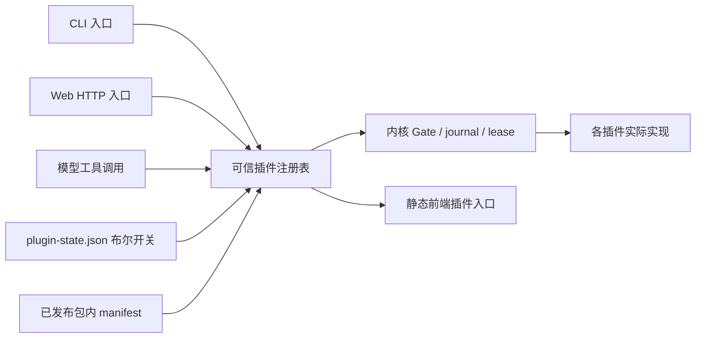

# Xueness 插件架构与功能归属

2026-10-04 前端优化：设置搜索归 `settings.destination_search`；命令面板搜索与键盘导航归 `sessions.command_palette`；跟随消息及回到底部归 `sessions.timeline_follow`。文件逐行差异与未变上下文折叠扩展既有 `files.changes`。启动主题解析位于 settings 的 `themeBoot.ts`，会话刷新调度位于 sessions 的 `SessionPolling.ts`，均登记实际 frontendModules。当前完整目录包含 **27 个插件、108 项子功能**。令牌、跳转主要内容、加载占位及局部渲染错误边界属于既有基础 UI，不执行产品操作，也不改变插件权限。完整改动与验收见 [本轮记录](frontend-optimization-2026-10-04.md)。

第二十批历史记录：2026-09-30。本轮将现有功能实现迁入独立包，同时补齐第十九批审查中的本地 Agent CLI 缺口。上游参照仍为 ZCode `29628c9`；功能范围以自用 CLI 与辅助 Web 为准。

## 边界与目录

会话结束记录的静态状态与协议错误文案由 sessions 的 `completionPresentation.ts` 提供；未通过验证不会显示运行中的加载动画。providers 的资源面板默认折叠，`runtimeSampling.ts` 管理展开时采样及收起/卸载时的请求取消，仍依赖 diagnostics 的资源接口。交付检查的未检查、通过、失败三态仍归 planning。上述修正没有增加新的共享内核例外。

后端实现位于 `xueness/bundled_plugins/<id>/`。每包包含 `manifest.json`、可信 `plugin.py` 入口和实际实现；旧 `xueness/provider.py`、`workflows.py` 等文件是模块身份兼容别名，旧导入和 monkeypatch 继续作用于同一实现。

内核保留持久 Store、单写入者 lease、工具 Gate、写锁、journal/事件协议、预算/验证、HTTP Host/Origin/CSRF 防护和注册表。会话 HTTP 路由、文件路由、工具处理器、模型、能力加载器和业务 API 均由插件贡献。插件开关与执行批准分别记录：启用插件不会授权写文件、命令、MCP、真实模型或外部连接。



`plugin_runtime.py` 是共同注册表：根据包内 manifest 处理依赖和命令/API 所属关系，调用 `register_cli`、`execute_cli`、`dispatch`、`tools` 等贡献。`tool_contract.py` 定义 `BuiltinTool` 和只在调用期间存在的 `ContextVar` 执行上下文；`tool_registry.py` 合并稳定工具对象，schema 和实际 dispatch 使用相同对象。执行批准所需的规范化 subject 由工具自身提供，防止 UI 与 handler 对同一调用产生不同批准内容。

前端产品组件放在 `webapp/src/plugins/<id>/`，容器从所属插件入口挂载；静态 `xuenessPluginRegistry.ts` 根据后端 `effective` 状态选择已知视图，目录数据不能注入 JavaScript 或任意路由。宿主恢复入口、工作台布局和跨资源的能力编辑界面属于共享基础设施。下表列出已迁入插件目录的 23 个工作台组件；完整声明以各插件 manifest 的 `frontendModules` 为准。

| 插件 | 插件目录下的前端组件 |
|---|---|
| sessions | `XuenessComposerToolbar.tsx`、`XuenessConversationHistoryRail.tsx`、`XuenessRenameDialog.tsx`、`XuenessTaskList.tsx`、`XuenessTimeline.tsx`、`XuenessWorkbenchView.tsx` |
| files | `DirectoryBrowser.tsx`、`FileBrowser.tsx`、`DiffView.tsx` |
| settings | `SettingsPanel.tsx`、`SettingsSections.tsx`、`XuenessSettingsView.tsx`、`XuenessShortcutsPanel.tsx`、`XuenessWorkspacePickerDialog.tsx`、`XuenessWorkspaceSettings.tsx` |
| providers | `ProvidersPanel.tsx` |
| mcp | `McpDiagnostics.tsx` |
| usage | `UsagePanel.tsx`、`XuenessUsageSettings.tsx` |
| memory | `MemoryPanel.tsx` |
| terminal | `XuenessTerminalPreferences.tsx` |
| git | `XuenessGitView.tsx` |
| office | `OfficeDocumentRenderer.tsx` |

## 27 个插件

| ID | 主要能力 | 依赖 | 初始状态 |
|---|---|---|---|
| sessions | 会话、聊天、TUI、历史检索、导出导入、模型增量流、计划权限模式 | — | 开 |
| files | 文件读写/编辑/搜索、文件树与预览 | — | 开 |
| shell | 批准后执行 argv 命令 | — | 开 |
| planning | todo、ask_user 与交付清单检查 | — | 开 |
| providers | OpenAI-compatible、Anthropic、配置与多模态适配 | — | 开 |
| memory | 记忆注入、轨道、手动编辑/冲突检测 | — | 开 |
| settings | 配置、主题/编辑器、快捷键验证 | — | 开 |
| usage | 会话/步骤统计、厂商报告 token 与成本 | — | 开 |
| git | 状态/diff/log、暂存/提交/分支/stash、检查点/恢复 | — | 开 |
| workflows | DAG/DSL、模型编排、actor、后台命令、复用/并发 | sessions, files, shell | 开 |
| terminal | 真实 POSIX PTY | sessions, shell | 开 |
| office | DOCX 页面、PPTX 图片/图表、XLSX 缓存值预览 | files | 开 |
| commands | 斜杠命令资源 | — | 开 |
| skills | 按需技能目录/读取 | — | 开 |
| hooks | 明确启用的事件钩子 | — | 开 |
| mcp | stdio/HTTP/旧 SSE、OAuth、resources/prompts、连接恢复 | — | 开 |
| subagents | 嵌套 Agent、进度/取消 | sessions, files | 开 |
| network | WebFetch、配置式 WebSearch | — | 开 |
| automation | 时区 cron、批准后的无人值守计划、历史 | workflows | 开 |
| extensions | manifest 市场浏览/安装/升级 | — | 开 |
| diagnostics | 脱敏诊断导出、状态存储统计、限定日志清理 | — | 开 |
| browser | Playwright 持久页面与精确动作批准 | files | **关** |
| remote | 命名 SSH 连接和字面 argv 执行 | — | **关** |
| bots | Telegram 白名单收件箱和明确回复 | sessions | **关** |
| onboarding | 隐藏密钥输入的配置向导 | providers | 开 |
| updates | 源仓库快进更新与桌面客户端更新 | — | 开 |
| desktop | 原生窗口、目录选择、状态和标题栏 | — | 开 |

“开”指模块可用。Hooks/MCP/子代理等运行 opt-in 仍默认关闭；Web 写操作继续逐调用批准。禁用依赖不会改写其他开关，但会让依赖者 `effective=false`。重新启用依赖后，原来启用的依赖者恢复；显式关闭的插件保持关闭。文件禁用不影响独立 PTY，但 shell 或 sessions 禁用会关闭终端。

## 使用

```sh
python3 -m xueness plugins list
python3 -m xueness plugins show workflows
python3 -m xueness plugins disable files
python3 -m xueness plugins enable files
python3 -m xueness plugins enable browser
python3 -m xueness chat --tui
python3 -m xueness --language en chat
python3 -m xueness onboarding
python3 -m xueness automation list
python3 -m xueness automation create schedule.json
python3 -m xueness automation approve ID --approve-execution
python3 -m xueness automation daemon
python3 -m xueness remote --help
python3 -m xueness bots --help
python3 -m xueness update check
python3 -m xueness git turn-checkpoints --session SESSION
python3 -m xueness git rewind --session SESSION --latest --root DIR --confirmed
python3 -m xueness sessions fork-checkpoint SESSION --latest
```

`--state DIR` 放在子命令之前；CLI 与该状态目录的 Web 服务共用开关。Web「设置 → 插件」默认展示全部 27 个实际功能插件及其启用/依赖状态；「资源清单」另列扩展 manifest，不能将其等同于功能插件。功能插件管理始终可访问；settings 关闭时通过账户菜单中的「插件管理」直达恢复入口，extensions/sessions 关闭也不影响目录。损坏的开关文件会关闭全部功能，并在目录中显示配置错误；修复 `plugin-state.json` 后恢复。它只允许 `apiVersion:1` 与已知 ID 的布尔 `enabled` 字典，不能提供 import 路径或命令。

`GET /api/plugins` 返回 `enabled/effective/blockedBy`；`POST /api/plugins/<id>` 仅接受 `{enabled:boolean}`，需要 CSRF。所有功能 API 都检查实际生效状态。禁用终端/浏览器会清理本进程持有的服务；运行中的工作流在节点边界停止调度新节点。停用不是撤销已经发生的文件或外部副作用。

## 本轮补齐的审查项

| 第十九批具体缺口 | 本轮实际实现 | 实际范围 |
|---|---|---|
| 模型增量输出、恢复、Anthropic | SSE 文本/tool-call 组装、持久 delta、流前最多三次退避、限流元数据、原生 Messages | 已输出文本后不重试整请求；保留中断文本，避免重复 side effect |
| 模型原生工作流 | create/amend/run/status 工具；AST 白名单声明 DSL | `agent/parallel/pipeline/phase` 声明语言，不执行任意 Python/JavaScript |
| 可写 actor、问答、结果复用 | 明确 writable 计划批准、转录与升级问题、答案继续、文件指纹复用验证 | 保守工作区指纹；更改计划会改变摘要，旧批准不能启动新计划 |
| 自适应并发 | provider/model 桶、429/503 AIMD 与 Retry-After、跨运行轮转 | 逻辑工具失败不会被当作限流；运行中降低上限不杀已活动节点 |
| CLI 全屏与多模态 | curses 全屏、TTY 回退、语言选择、图像/PDF/视频帧附件、显式 `/paste-image` | 根据模型能力拒绝不支持的附件；视频依赖 ffmpeg；剪贴板只在明确命令后读取；不是 ZCode 所有 TUI 小组件的克隆 |
| 原生长任务、网页工具 | 后台 start/status/logs/cancel 模型工具；WebFetch/WebSearch 与独立 SearchModel | WebFetch/WebSearch 每次经 Gate 批准；公网 HTTPS 读取固定并校验的 DNS 地址；服务密钥、OpenAI-compatible SearchModel endpoint/model/key 分别保存在 network 插件设置；仅在显式配置 DoH 且系统 DNS 全部为 RFC 2544 FakeIP 时使用 DoH |
| 跨会话上下文 | `read_session_context` 模型工具 | 只检索相同工作区的有限 user/assistant 片段 |
| MCP 生命周期 | PKCE/state、token 刷新、旧 SSE、连接失效恢复、资源与提示词 | OAuth endpoint/client 配置由操作员提供；工具失败不自动重放；关闭外部重定向 |
| Git 写操作与 checkpoint | stage/unstage/commit/branch/stash、临时 index 快照、恢复前备份 | 本地操作；保留原 index；恢复有 review/confirm 与 recovery checkpoint |
| Office 富预览 | 重构并清理 OOXML 后，懒加载 DOCX 页面与 PPTX 幻灯片/图片/缓存图表渲染器；XLSX 工作表缓存值；失败保留 DTO 预览 | ZIP/XML/图片预算；外链、HTML altChunk、宏、OLE、ActiveX、字体二进制不进入完整渲染包。旧 `.doc/.xls/.ppt` 和启用宏格式明确不支持；不是 Microsoft Office 的排版/动画引擎 |
| 定时自动化 | 五字段 cron、IANA 时区、下次时间、持久认领与历史 | 未批准的定时触发只生成待审计划；修改计划取消旧批准；host 禁止真实模型时不会越权启动 |
| 设置/用量/可移植会话 | 主题/字号/tab/wrap、实际快捷键与冲突检测、token/cost 元数据、脱敏导出导入 | 不估算厂商未报告的价格/额度；导入移除执行状态、批准和附件 payload |
| 插件拆分与 marketplace | 26 包、共同注册、CLI/Web 开关、manifest 市场安装/升级 | 下载内容为数据 manifest，不能执行外部插件代码；外部代码需要单独审计并加入可信构建注册表 |

另补充手动记忆编辑、诊断/存储管理、浏览器、SSH、Telegram、引导与 CLI 更新入口。浏览器需 Node/Playwright/Chromium，应用级 URL/IP 过滤不是 OS 沙箱；截图用一次精确 exec 批准，返回最多 450 KiB 的 PNG data URL，不自动写工作区。SSH 依赖事先信任的 host key，默认禁用用户 SSH 配置/ProxyCommand。渠道仅把白名单消息导入待处理会话，不自动执行或自动发送回复。

仍属于形态或产品范围差异的部分：原生桌面壳、厂商商业账号/配额/团队云服务、全部渠道协议、Microsoft Office 等价渲染/动画与旧格式转换、ZCode 全部 TUI/编辑器交互、远程 GUI/CUA 和平台分发更新器。本轮没有把这些声称为逐项完整复刻。

## 新增贡献方式

1. 在 `bundled_plugins/<id>/` 实现工具/API/CLI；工具使用 `BuiltinTool`，每个 handler 保留 Gate 检查，批准操作提供同一规范化 `approval_subject`。
2. 提供包内 manifest，声明依赖、tools/commands/panels；加入可信 `PLUGIN_IDS` 构建注册表。运行状态文件不能改变该 allowlist。
3. 需要前端时实现静态插件入口并登记在前端注册表，挂载/effect 使用后端 effective 状态。避免目录提供任意代码 URL。
4. 运行隔离/开关/依赖/权限测试；资源需尊重 state/workspace 范围和 symlink 边界。凭据只留服务端，诊断/导出不复制 provider/OAuth 状态。

自动化、浏览器、SSH、模型请求属于会产生长期资源或外部请求的贡献；明确管理 shutdown 和故障恢复。底层 MCP 协议参考 [授权说明](https://modelcontextprotocol.io/specification/2025-06-18/basic/authorization) 与 [传输说明](https://modelcontextprotocol.io/specification/2025-03-26/basic/transports)；渠道协议参考 [Telegram Bot API](https://core.telegram.org/bots/api)。

## 验证记录

Python 全量 **961 项通过**（141.739 秒）；随后快捷键有效默认值/平台别名冲突补测与 settings/bots 回归 **39 项通过**。前端 **238 项通过**，TypeScript、Vite 构建、两个 golden 协议校验及 `git diff --check` 通过。构建仍有既有的大 chunk/混合动态导入提示；Python 网络拒绝用例有 HTTPError 的 ResourceWarning，断言全部通过。

验收使用一次性状态目录和工作区，没有运行真实模型、SSH 更新、渠道发送或改变项目本身的 Git 状态。Git/checkpoint 用临时仓库；OAuth 用受控响应；浏览器持久进程实际检查公共只读页面和内存截图；Web 用真实 Python 后端和系统 Chrome 验证界面。剪贴板用模拟捕获测试，没有读取实际剪贴板。

浏览器实测：插件依赖级联与禁用 API、后台服务关闭、manifest 安装默认禁用、自动化待审、Git 检查点 review/confirm、手动记忆加载/冲突、脱敏诊断、偏好启动恢复、Mac 自定义快捷键。插件页浅色/深色均可读，390px 页面无横向溢出。Office 实测三个 DOCX 页面与嵌入图片、PPTX 图片与缓存柱状图，渲染过程外部网络请求为零；异步卸载会销毁 viewer。全部隔离 QA 服务已停止。

截图：[插件浅色](screenshots/batch20-plugins-light.png)、[深色](screenshots/batch20-plugins-dark.png)、[窄屏](screenshots/batch20-plugins-mobile.png)、[自动化](screenshots/batch20-automation.png)、[DOCX 页面](screenshots/batch21-office-full-docx.png)、[PPTX 图表](screenshots/batch21-office-chart.png)。

## 第二十八批目录补充（2026-10-01）

providers 的 CLI parser/handler 已迁入 `xueness/bundled_plugins/providers/operator_cli.py`，旧 `operator_cli` 仅作兼容转发。高级轻量选项在 `providers/lightweight_config.py`，输出观测在 `providers/activity.py`，模型发现仍由 providers API/transport 实现。sessions 的历史分叉位于 `sessions/forking.py`；本机资源采样由 `diagnostics/runtime_metrics.py` 提供，前端展示在 `webapp/src/plugins/providers/LocalRuntimeMonitor.tsx`。共同布局只负责挂载与状态协调。

这些入口继续使用插件开关、宿主 HTTP 防护、会话 lease 和 Gate；启用插件不是执行授权。详细轻量配置与遥测范围见 [本地小模型轻量模式](xueness-local-lightweight-mode.md)。

2026-10-05 的轻量恢复改进仍归 providers：`response_metadata.py` 提供有界的真实用量与生成结束原因，`context_budget.py` 提供会话内预算校准和无需额外推理的历史摘录。功能面板登记 `providers.termination`、`providers.budget_feedback`、`providers.checkpoints`。内核只协调既有预算/完成流程，截断结果不记录工具意图；events 的可选完成状态扩展为 `incomplete`，sessions 显示暂停原因，planning 不把截断当作交付通过。新增模块未扩大共享架构白名单。

轻量档的极简工作台前端归 providers（`providers.lightweight_layout`，实现在 `webapp/src/plugins/providers/LightweightWorkbench.tsx`）：选中本地轻量档且 providers 生效时，容器挂载极简输入控制区（模型名与上下文用量）、默认收起侧栏并隐藏与本地运行无关的会话头部面板与徽标；共享 `XuenessShell.tsx` 只新增初始收起这一布局原语，输入框与工具条的通用组件仍归 sessions。providers 未生效或切回标准档时恢复原有布局。

## 新增功能的长期约束（2026-10-01）

项目所有者要求之后新增的每项产品功能都作为插件实现。已有领域内扩展现有插件，独立领域新建插件；业务实现、工具/API/CLI/前端入口、后台请求和生命周期都归属于插件，不能只登记名称而继续在宿主实现。详见根目录 [AGENTS.md](../AGENTS.md) 与 [CONTRIBUTING.md](../CONTRIBUTING.md)。

每份功能 manifest 的 `features` 提供稳定子功能 ID 和双语名称，`modules` 覆盖全部后端实现，`frontendModules` 登记前端实现或历史共享展示文件的导出。插件面板默认显示完整 catalog，展开卡片可核对子功能及 CLI/工具；资源市场清单另列。`tools/check_plugin_architecture.py` 是无状态、无网络的结构门禁，检查模块遗漏、双端目录/面板一致性、重复贡献、依赖及前端归属；实际开关与运行语义仍需行为测试。

## 功能逐项归属清单

下表概述当前 27 份 manifest 中的 111 项用户能力。命令/工具/依赖和实际实现文件以同一份 manifest 为准；前端卡片直接展示该功能清单，不维护第二份隐藏列表。纯安全内核与通用布局的边界如前文所述。

| 插件 | 已实现的用户能力 |
|---|---|
| sessions | 会话创建与 Agent 对话；选择、搜索、重命名、固定与归档；历史导航与跨会话上下文检索；闭合历史轮次分叉与来源链接；从轮次检查点分叉并记录来源快照；脱敏导出、导入与恢复；文本、思考与工具调用增量流；附件、上下文引用与会话输入；计划权限模式与会话计划草稿；多行 CLI、全屏 TUI 与中断恢复 |
| files | 文件列表、搜索与分页读取；批准后的文件写入与编辑；目录浏览、新建与本机目录选择；文本、图像、PDF 与媒体预览；会话文件改动视图；工作区 AGENTS 指导文件加载 |
| shell | 批准后的 argv 命令执行 |
| planning | 待办计划读取与更新；提问、用户回答与继续；持久交付清单与内容完成检查 |
| providers | 模型配置保存、选择与切换；OpenAI 兼容与 Anthropic 协议；显式模型发现；本地小模型轻量档位；轻量档极简工作台布局；上下文、输出与安全预算；精简工具、按需发现与结果分页；JSON 工具协议与有限修复；兼容参数、超时与有限重试；本地接口对话、原生/JSON 工具、SSE 与工具续轮诊断；输出阶段、延迟、计数与速率趋势 |
| memory | 只读记忆轨道与上下文注入；手动编辑与版本冲突检测；记忆能力与工作区配置 |
| settings | 工作区登记、项目选择与默认目录；主题、语言、字体与代码显示；快捷键配置、验证与冲突检测；Agent 运行与能力偏好 |
| usage | 会话、步骤与日期统计；供应商实际报告的 Token 统计；实际报告成本与模型维度统计 |
| git | 状态、差异、日志与分支查看；批准后的暂存、提交、分支与 stash；检查点、恢复预览与恢复前备份；轮次首个改动前自动检查点；回退工作区到指定轮次检查点 |
| workflows | DAG、声明式 DSL 与模型编排；只读及已批准可写 actor 与问答；持久恢复、结果复用与文件校验；动态并发、限流退避与跨运行调度；后台命令、日志、状态与取消 |
| terminal | 工作区交互式 POSIX PTY；终端尺寸、日志、关闭与服务清理；默认 Shell 与终端偏好 |
| office | DOCX 页面与嵌入图片预览；PPTX 幻灯片、图片与缓存图表；XLSX 工作表与缓存单元格值 |
| commands | 自定义斜杠提示模板；命令资源创建、编辑与开关 |
| skills | 技能资源与按需目录摘要；有界技能正文读取 |
| hooks | 明确启用的生命周期事件钩子；钩子命令审批与运行记录 |
| mcp | stdio、HTTP 与旧 SSE 连接；OAuth PKCE、凭据刷新与隔离；外部工具、资源与提示词；连接诊断、失效恢复与设置 |
| subagents | 只读子任务与嵌套代理；后台并发派发、主代理持续工作、结果收集与完成检查；子任务进度、结果与协作取消；子代理资源与能力配置 |
| network | 受限公网 HTTPS 页面读取；显式配置的网页搜索服务；独立 OpenAI-compatible 搜索模型；搜索地址、模型 ID 与密钥管理；按需 DNS/服务诊断；FakeIP 环境下可选的公开 DoH |
| automation | 五字段 cron、时区与下次执行；计划审批与无人值守触发；持久认领、运行历史与暂停 |
| extensions | 可信资源清单市场浏览；数据 manifest 安装、升级与移除 |
| diagnostics | 脱敏支持诊断导出；状态存储统计与限定日志清理；实时本机 CPU、内存与磁盘采样 |
| browser | 受审批约束的页面导航与检查；精确点击、输入与内存截图；浏览器控制配置与生命周期清理 |
| remote | 命名 SSH 主机连接配置；明确批准的远程 argv 执行 |
| bots | Telegram 白名单收件箱；明确批准的消息回复 |
| onboarding | 模型与工作区初次配置向导；隐藏密钥输入与配置保存 |
| updates | 源仓库版本与更新检查；明确批准的干净仓库快进更新；桌面客户端检查、下载、取消与安装控制 |
| desktop | Windows/macOS 桌面宿主集成；原生目录选择与平台状态；集成标题栏与窗口控制 |

计划权限模式 `sessions.plan_mode` 在 build/edit/yolo 之外补上第四种模式，实现只落在 sessions 包内：`plan` 下读取、搜索类工具照常，写/编辑/执行/网页工具一律拒绝，唯一例外是本会话专属的计划草稿 `<状态目录>/plan-drafts/<会话 id>.md`（在状态目录内按会话划分，不在工作区内）。草稿路径布局与中英双语拒绝文案都由 `sessions/plan_mode.py` 决定，WebGate 只按该插件给出的凭据精确匹配放行一次写入，files 的写/编辑解析也先问 Gate，因此工作区 jail 未被放宽、没有新增内建工具或共享内核例外。拒绝结果带 `plan_mode_denied`，不会伪装成可批准的等待项；sessions 禁用或依赖不可用时 `plan` 值被拒绝，从 plan 切回 build/edit/yolo 沿用既有 `permission_mode_history` 审计。CLI 没有 `--permission-mode` 参数，故该模式仅经 HTTP 与工作台权限选择器提供。

## 第二十九批复核结果（2026-10-01）

这次复核纠正了“开关已登记，但部分 CLI 行为仍在宿主实现”的遗漏。会话 parser/聊天/运行器已迁入 `sessions/cli.py`；settings、usage、memory、git、MCP 的 parser/执行在各自 `operator_cli.py`，workflows 也提供自己的 CLI 执行入口。主 CLI 只保留公共解析、归属检查、分发和兼容包装，旧提示输入/剪贴板/运行器 patch 接口继续有效。子代理专属的选择、只读子任务构造、进度/取消及结果处理迁入 `subagents/runner.py`，内核仅保留桥接和共享运行引擎。

所有插件的实际 Python 模块已登记；诊断、市场和远程面板与前端声明对齐；sessions 删除了不存在的 `demo` 命令声明。内建工具、实际 CLI parser 与 manifest 的唯一归属已核对。上下文绑定的直接工具调用在共同分发边界再次检查持久开关；扩展数据资源 CRUD 归 extensions，功能插件管理本身保留为内核恢复入口。

插件卡片直接展示 manifest 中 85 项能力的中英名、稳定 ID、工具和命令，并支持这些字段的搜索。全部 26 个插件关闭时，仍能从账户菜单进入插件管理，显示完整插件卡片及功能目录；该页面只请求插件目录，不启动其它功能请求。providers 与 diagnostics 可独立禁用：关 diagnostics 只停止监测，模型设置仍可用；关 providers 不妨碍诊断导出。窄屏与英文界面通过真实构建检查。生产只读检查通过，没有改变用户配置或会话。

长期规则已写入根目录 AGENTS、CONTRIBUTING 和 README；前端 prebuild 与本地打包均调用结构检查。结构检查及实际命令/工具/禁用边界回归共同核验，不能用填空壳清单代替真实拆分。

截图：[中文窄屏](screenshots/batch29/plugins-320-zh.png)、[英文展开](screenshots/batch29/plugins-1280-en.png)、[全部关闭](screenshots/batch29/plugins-all-disabled-1280.png)、[生产功能搜索](screenshots/batch29/plugins-production-320.png)。

最终验收：后端运行 1189 项（210.434 秒），1166 通过、23 条环境/复用覆盖条件跳过；前端 368 项通过，类型、构建、协议 golden、机壳残留检查与 197 个依赖声明检查通过。MCP 官方 SDK 和第三方 server 缓存当前未提供，单独互操作检查确认整类跳过；unittest 的整类跳过按一条计数，所以总数与前次条件不同。新增的结构/发布检查 15 项通过，子代理迁移后相关回归 68 项通过。没有安装缺失依赖、下载模型或调用真实模型。

## Windows / macOS 桌面端（第三十批）

新增第 27 个 `desktop` 插件，共 88 项登记能力。Python 集成在 `desktop/{host,bridge,windows_job}.py`，前端状态页在 `plugins/desktop/DesktopSettings.tsx`，Electron 原生模块通过 `desktopModules` 登记。文件锁、Windows ConPTY、后台命令的 Windows 管道以及本机指标分别归共享锁、terminal、workflows、diagnostics。

桌面应用窗口、私有后端传输和恢复入口属于运行宿主基础设施，与 Web HTTP 服务同等；它们需要在全关后保留插件管理入口。desktop 关闭后不提供原生目录选择或桌面状态业务，settings/sessions 的目录授权仍优先。具体打包与验证见 [桌面端说明](xueness-desktop.md)。

共享例外审查：`process_runtime.py` 协调进程全局的 Windows DLL 搜索路径，防止冻结后端的私有 DLL 环境传给外部程序。所有插件共用短暂的创建锁，并在等待子进程之前恢复原目录。它还为 Windows 最小子进程环境补齐固定 allowlist 中的系统、架构、用户目录和 PowerShell 模块路径，保留调用者显式覆盖，不继承模型密钥等其它私密变量；PowerShell/.NET 在缺少完整系统启动上下文时会卡在初始化。这两项都是操作系统进程创建适配，业务逻辑、权限与开关仍在所属插件，不能作为新增用户能力绕过插件归属的理由。

## 网络工具设置与 DNS 诊断

网页搜索服务与 SearchModel 的接口、模型 ID、密钥和 FakeIP 解析选项由 `network` 插件独立管理，不会覆盖主模型供应商。设置页的读取和打开不会访问外部网络；服务密钥和 SearchModel 密钥分别保存在状态目录下 `network/search-key.json` 与 `network/search-model-key.json`，使用仅所有者可读写的权限，API 只返回是否已配置，绝不回显密钥。留空密钥会保留已有值；删除按钮只清除本地保存的值，管理员提供的 `XUENESS_SEARCH_KEY` 环境变量仍可作为服务密钥回退。旧部署可继续使用 `XUENESS_SEARCH_ENDPOINT`。

「检查搜索服务 DNS」由用户明确触发，仅解析已配置的搜索服务主机名，不连接服务。系统 DNS 地址全部通过公网地址检查后才会建立 TLS 连接，连接固定到已检查地址，并继续按原主机名验证证书；所有 DNS 记录都必须是公网地址。只有系统 DNS 的全部结果都位于 `198.18.0.0/15` RFC 2544 FakeIP 段，且用户显式填写公开 DoH 地址时，才会查询 DoH。DoH 使用无凭据的 HTTPS `application/dns-json` GET，每次查询最多等待 5 秒、最多读取 64 KiB；其 DNS 记录也必须全部是公网地址。私网、混合 FakeIP/公网或其它非公网结果不会触发解析器回退。

SearchModel 使用独立的 OpenAI-compatible Chat Completions endpoint、model ID 和密钥，端点仅限经过完整公网 DNS 检查的 HTTPS 主机，不允许本机/私网地址。模型响应必须包含 JSON `sources` 数组；自由文本不会被当成搜索结果。模型来源会标记为 `search_model`，每条 URL 只通过 HTTPS 结构验证，`urlsVerified:false` 且 `networkAccess:"unverified"`，不会暗示已访问网页。「发送一次测试搜索」会明确提醒并发送一条最小请求，服务商可能按其计划计费。WebFetch/WebSearch 仍逐调用受 Gate 批准；权限拒绝与 DNS/网络错误使用不同结果分类，临时网络状态允许重试，非法 URL、私网目标、缺少密钥和永久 HTTP 状态会返回可操作的中文原因并停止重试。相关行为由带假 DNS/HTTP 的回归测试覆盖，不调用真实搜索提供商。

## 可靠性、搜索模型与客户端更新（2026-10-01）

当前完整目录为 27 个可信插件、98 项登记功能。`network` 登记搜索接口与凭据管理、独立搜索模型、DNS/服务诊断和显式真实 DNS 路径；`planning.delivery` 提供持久交付清单；`providers.compatibility_checks` 提供实际协议诊断与显式采用验证参数，现有请求活动能力补充实际用量和工具计时；`desktop.window_chrome` 提供集成标题栏，`desktop.background` 提供 Windows 托盘与关闭后后台运行，`desktop.tray_navigation` 提供会话分组、快速打开、新建与反馈入口；`updates.desktop` 提供客户端检查、下载、取消和安装控制。具体功能 ID、依赖与实现模块以 manifest 为准，前端插件面板读取同一完整 catalog。

证据别名、一轮引用修复及插件完成检查回调属于现有通用完成验证与 journal 协议；具体交付业务留在 planning。安装前的 HTTP 操作登记与关闭接入属于宿主安全和生命周期边界，版本判断、下载和安装决策属于 updates。没有扩大结构检查的共享白名单。使用与验证范围见[可靠性、搜索模型与客户端更新](xueness-reliability-and-updates.md)。

`updates.desktop` 的紧凑入口放在侧栏左下角，详细状态保留在插件设置页；容器只负责挂载和导航。`desktop.window_chrome` 的隔离 preload 读取现有主题 token，主进程经主窗口、主 frame、后端 origin 与颜色校验后更新 Windows 原生控件颜色。窗口配色沿用宿主恢复基础设施边界，不增加业务入口或扩大共享白名单。

## 会话交互与桌面浏览器资料（2026-10-02）

既有共享资源存储 `resources.py` 统一检查资源根、父目录与 kind 目录的符号链接及 Windows reparse point，避免 junction 重定向变成新的安全根。各资源插件复用该存储边界，仍自行负责业务加载、执行与开关，不新增产品功能或共享模块白名单。

同一存储层在原子状态文件写入前应用私有权限：POSIX 0600，Windows protected DACL（文件 owner、SYSTEM、本地 Administrators）。使用同一文件对象的安全句柄，不按可被替换的路径重新打开；权限失败不写入敏感数据。providers、network、MCP OAuth 保留各自业务实现并复用保护，不扩大插件权限或架构白名单。

MCP 插件的 `windows_process.py` 管理 stdio server 的 Windows Job Object 生命周期：先挂起创建进程，绑定 Job 后恢复，避免启动器提前创建未受管理的后代。关闭、超时与启动失败均回收整棵进程树，并等待已锚定进程句柄退出；旧进程树清理失败时中止重启并保留诊断。该模块归属现有 `mcp.recovery` 能力，已登记在 MCP manifest，仍经原有运行开关与 Gate；共享 `process_runtime.py` 只继续协调进程全局 DLL 搜索目录，不承接插件生命周期业务。

会话队列的私密 sidecar 写入复用私有文件保护，归档会话同时清理队列；会话插件继续管理队列领取、暂停和归档语义。浏览器插件先保护导入 staging 与持久 profile 目录，再复制数据或启动 worker。共享存储只提供无链接目录句柄上的 0700 / protected DACL，以及后续文件的私有继承；Chrome 资料范围、复制、互斥和运行权限仍由 browser 插件实现。

完整目录现为 27 个插件、100 项登记功能。新增 `browser.desktop_import` 和 `sessions.message_queue`，分别提供桌面环境识别、用户确认的 Chrome 资料导入，以及运行期间持久排队后续消息。浏览器复制实现留在 `browser/profiles.py`，运行环境探测留在 `browser/runtime.py`；会话队列留在 `sessions/queue.py`，不把业务能力搬进 Web 宿主。工具批准、权限和依赖边界保持独立。

sessions 的时间线展示自然回复和 Markdown，识别协议封装后显示正文；结束状态去除重复答案，思考与工具详情可展开。完成验证区分工具证据与无需工具的普通交流，规划交付检查仍由 planning 执行，不能以自然回复替代文件或工具验证。跨轮事件扩展由已有共享 journal 协议承载，不新增共享业务例外。托盘菜单的字号、字重和行高统一，由 desktop 插件样式管理。

使用与验收范围见[会话体验](xueness-conversation-experience.md)、[桌面浏览器资料](xueness-browser-profiles.md)。模型能力、真实网站登录迁移和未提供的 Codex 产品能力不能由界面相似性推定。

## 轮次检查点、回退与检查点分叉（2026-10-05）

目录新增三项能力：`git.turn_checkpoints`（轮次首个改动前自动检查点）、`git.rewind`（回退工作区到轮次检查点）、`sessions.fork_from_checkpoint`（从轮次检查点派生新会话）。完整目录现为 27 个插件、110 项登记功能。

自动快照归 git 插件的 `turn_checkpoints.py`：当 git 插件 `effective` 且会话工作区是 git 仓库时，本轮第一个真正会改动文件或执行命令的工具（Gate 类别 `write`/`edit`/`exec`）运行前复用既有 `actions.checkpoint()`，把会话 id、轮次序号、检查点 id、commit、触发工具与时间写入会话记录的 `turn_checkpoints`，每轮只记一次，最多保留 200 条。只读工具、非 git 工作区、还没有任何提交的新仓库、远程绑定会话以及插件关闭都只是不记录，原有工具流程与结果不变；快照自身的异常也降级为「没有检查点」，不会破坏该次工具调用。

共享内核只增加了一个通用观察钩子：`tool_registry.dispatch` 在可变工具真正执行前调用 `plugin_runtime.before_tool_execution(state_dir, session, store, tool, gate_kind)`，遍历 `effective` 插件的同名回调，丢弃一切异常且不透传返回值。理由是该时机必须发生在内建工具共同的分发边界上，而 hooks 插件的 PreToolUse 只能运行用户配置的外部命令，无法承载内建插件逻辑；该钩子不授予任何权限，Gate、批准与工作区边界仍由原路径决定，快照业务全部留在 git 插件，没有把产品逻辑写进 `core.py`。

回退复用 `actions.restore()`，因此与现有恢复具有同一授权语义：需要 `confirmed is true`，先写 `Recovery before restoring …` 恢复快照再还原，会话没有检查点返回 409、检查点未知返回 404，`checkpoint` 与 `latest` 必须二选一，插件关闭时 CLI/HTTP 一律 403。`restore()` 只还原它认识的文件，检查点之后新增的未跟踪文件保持原样，需要彻底清理仍由用户显式处理。CLI 为 `git turn-checkpoints --session`、`git rewind --session --checkpoint|--latest [--root DIR] --confirmed`；HTTP 为 `GET /api/sessions/<sid>/git/turn-checkpoints`、`POST /api/sessions/<sid>/git/turn-checkpoints/rewind`，经 `route_owner` 归 git，沿用 Host/Origin/CSRF 与插件生效检查，并在会话 lease 下执行；CLI 与 HTTP 走同一 `dispatch`，因此开关、确认与 lease 语义一致。`--root` 是防误用护栏：与会话工作区解析结果不同即 403，绝不按命令行走别处。

`sessions.fork_from_checkpoint` 择优复用既有安全轮次分叉实现（`forking._boundaries` + `_make_fork`）：按检查点的轮次序号取「该轮之前」的闭合边界，只复制更早轮次的规范化消息与结果，剥离执行状态，并在 `fork_parent` 中同时记录来源会话/轮次与 `checkpointId`/`checkpointTurn`。它不改写共享工作区——那是 `git.rewind` 的职责；第 1 轮的检查点没有更早的可分叉闭合轮次，返回 409。CLI 为 `sessions fork-checkpoint <sid> [--checkpoint ID|--latest|--turn N] [--title …]`，HTTP 为 `POST /api/sessions/<sid>/fork-from-checkpoint`。回归见 `tests/test_turn_checkpoints.py`（临时仓库 + 隔离状态目录，不访问网络）。

