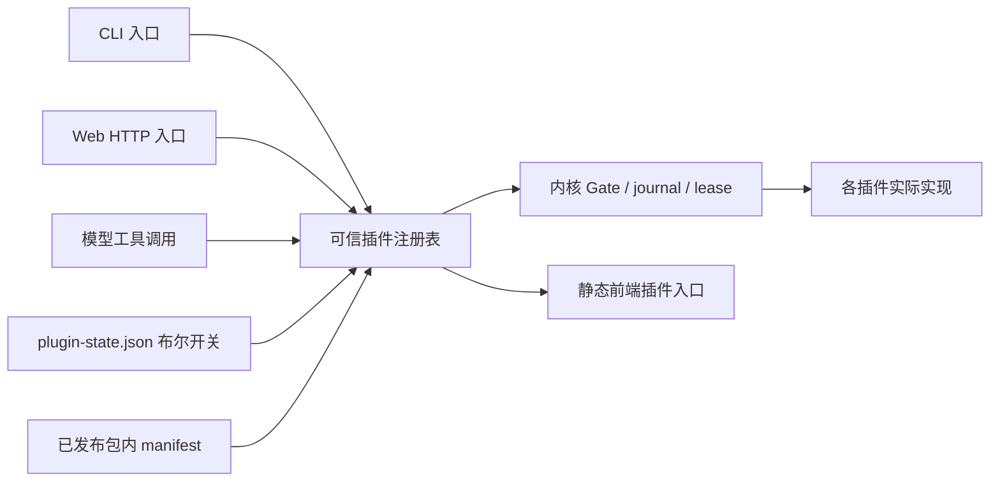

# Xueness 插件架构与功能归属

2026-10-10 双外观与侧栏宽度：目录现为 **28 个插件、180 项登记功能**。`sessions.sidebar_resize` 归属 `SidebarResizeHandle.tsx`，提供拖动、键盘、取消和分外观本机记忆。Shell 仅新增宽度值与展示槽，不处理保存或拖动业务；禁用 sessions 后停止偏好读写及监听。经典与 Claudex 使用独立组件和样式，但共享后端、用户字号与稳定的设置页阅读比例。见 [外观与使用方法](claudex-reference-review.md)。

2026-10-10 Claudex 外观与全局会话改进：目录现为 **28 个插件、178 项登记功能**。Claudex 归属既有 `settings.appearance`，只修改外观；`sessions.full_text_search` 和 `sessions.structured_questions` 新增有界正文搜索及结构化答复，`sessions.message_queue` 扩展安全编辑与折叠。新 Python/前端文件均登记于原插件 manifest。`BuiltinTool.schema_for_state` 是工具契约的可选纯数据转换接口，用于在持久插件过滤后调用所属插件的 schema 贡献；提问业务与开关判断留在 planning/sessions，不扩大共享白名单。使用方法、参考源码和兼容边界见 [Claudex 与会话改进](claudex-reference-review.md)。

2026-10-10 远程握手：按各插件 manifest 实点，目录现为 **28 个插件、176 项登记功能**。remote 新增实验功能 `remote.handshake`（默认关闭）。开启后，已批准的 POSIX SSH 先跑固定探测，再决定是否发送操作者命令；探测到 Windows 壳则拒绝。声明为 `system=windows` 的主机仍在 SSH 之前拒绝。见 [远程握手](remote-handshake.md)。

2026-10-10 宿主能力探测：按各插件 manifest 实点，目录现为 **28 个插件、175 项登记功能**。desktop 新增实验功能 `desktop.host_capability`（默认关闭）。开启后 `GET /api/desktop/host-capability` 用既有平台 helper 报告 Windows / macOS 能力；`POST` 签发 30 秒一次性票据，消费后不提升权限。关闭时不签发，`/api/desktop/status` 字段不变。见 [宿主能力](host-capability.md)。

2026-10-10 stdio 帧重放：按各插件 manifest 实点，目录现为 **28 个插件、174 项登记功能**（上文递增笔记停在 170，少计了 3 项既有功能）。remote 新增实验功能 `remote.frame_replay`（默认关闭）。开启后，app-server 为发出的帧编号并保留有界未确认队列；超过 8 MiB 或 45 秒则清空并通知放弃，客户端改走事件日志恢复。关闭时方法表和帧字段不变。见 [取消、重连与事件续传](sessions-resume-cancel.md)。

2026-10-10 取消传播：目录现为 **28 个插件、170 项登记功能**。sessions 新增实验功能 `sessions.cancel_propagate`（默认关闭）。开启后，运行循环在一次模型调用（含溢出重试）期间安装停止探针；providers 的 `cancel_watch` 只是既有套接字中断助手，不另登记模型能力。开关关闭时不启线程，也不改变 provider 方法签名。见 [取消、重连与事件续传](sessions-resume-cancel.md)。

2026-10-10 停止回执：目录现为 **28 个插件、169 项登记功能**。sessions 新增实验功能 `sessions.cancel_receipt`（默认关闭）。`POST /api/sessions/<sid>/stop` 仅在开关打开时额外返回 `outcome` 与每项 work 的结果；没有取消到任何东西时写明 `rejected` 或 `idle`。开关关闭时响应字段不变，HTTP 仍是 200。见 [取消、重连与事件续传](sessions-resume-cancel.md)。

2026-10-10 会话事件续传：目录现为 **28 个插件、168 项登记功能**。sessions 新增实验功能 `sessions.event_resume`（默认关闭）。`GET /api/sessions/<sid>/events.resume` 用 `logEpoch + seq` 续传派生事件；前缀被改写时 409 并带尾部快照。不修改 `xueness.events.v1`。见 [取消、重连与事件续传](sessions-resume-cancel.md)。

2026-10-09 会话统一与版本保护：目录现为 **28 个插件、167 项登记功能**。sessions 新登记 `sessions.zcode_conversation`、`sessions.message_edit`、`sessions.message_feedback`、`sessions.consistent_snapshot`；提供共用显示、发送前确认及版本保护的 journal 操作。planning 保留实际交付检查并将空清单入口放入更多菜单。内核仅在既有 compact 中重映射通用 `message_annotations`，属于 journal 位置维护；反馈创建、修改与显示仍归 sessions。未增加插件白名单例外。来源、测试范围与差异见 [会话对齐记录](zcode-conversation-parity.md)。

2026-10-07 工作规则补强：完整目录现为 **28 个插件、163 项登记功能**。`planning.work_policy` 在现有规划插件中提供标准／轻量两种任务执行规则，下一次请求遵守实际插件开关，参与原有输入预算。没有新增工具、模型调用、内核入口或权限；实际交付继续由宿主独立检查。用法见[Agent 工作规则](agent-work-policy-2026-10-07.md)。下方统计保留各阶段历史状态。

2026-10-07 压缩后的上下文连续性补强：完整目录现为 **28 个插件、162 项登记功能**。`subagents.context_restore` 在现有 `completion_instructions` 挂接点提供本轮未收集子任务的 ID 和最后记录状态（最多 8 项）；`skills.context_restore` 经现有工具事件观察器记住成功读取的技能索引（最多 6 项），按需重新读取提示最多 3000 字符。没有新增内核逻辑、动态加载入口或共享例外；关闭插件或依赖阻塞后不再贡献提示。子任务正文不复制到宿主规则，索引不是授权或完成证据。用法与验证见[上下文连续性说明](context-continuity-2026-10-07.md)。下方数量保留各阶段历史状态。

2026-10-07 ZCode 实机／源码会话对照：发送时清空及按接受状态恢复草稿属于 `sessions.composer`；journal 顺序、纯思考投影、单行工具和工作过程折叠属于 `sessions.streaming`，新增 `conversationJournalProjection.ts` 已登记。请求明细折叠扩展 providers，紧凑交付检查扩展 planning；容器只协调 ACK、状态及挂载，未新增共享例外。仍为 **28 个插件、160 项功能**。实测、源码依据与边界见[本轮会话核对](conversation-zcode-review-2026-10-07.md)。

2026-10-07 思考强度入口补齐：`sessions.runtime_model_switch` 提供标准/轻量模式共用的按钮与渐变拖动弹层，未知或单档位模型也可找到入口；拖动取消、焦点回退及模型切换清理均在 sessions 组件内。providers 的既有连接/默认选择功能新增精确方舟端点和模型组合的档位识别，公开目录、准备校验、默认选择及请求校验复用同一规则，显式声明仍优先。沿用既有模块和功能 ID，保持 **28 个插件、160 项功能**，用法与参考见[会话能力说明](xueness-composer-capabilities.md)。

2026-10-07 Mac/Windows 桌面统一：平台安全留白、原生窗口主题同步、双语宿主菜单、Windows 托盘/macOS Dock 快捷任务复用分别扩展既有 `desktop.window_chrome`、`desktop.background`、`desktop.tray_navigation`，原生词典纳入 desktopModules；实际安装方式提示属于 `updates.desktop`，Shell 默认选择修正属于 `terminal.preferences`。沿用既有插件和稳定功能 ID，仍为 **28 个插件、160 项功能**。统一范围与原生验收限制见[桌面统一记录](desktop-parity-2026-10-07.md)。

2026-10-07 添加菜单、上下文圆环与完全访问确认：当前为 **28 个插件、160 项登记功能**。完整清单与全量验证见[核查记录](composer-plugin-audit-2026-10-07.md)，用法与边界见[使用说明](xueness-composer-capabilities.md)。下方按日期保留的数量为对应阶段状态。

2026-10-07 隔夜优化复审：会话历史预览及阅读位置记忆沿用 `sessions.history`/`sessions.timeline_follow`；推理档位滑块沿用 `sessions.runtime_model_switch`；工具执行状态、失败详情复制及输出中断提示沿用 `sessions.streaming`。实现和辅助模块全部登记在 sessions，功能目录中的既有条目补齐具体名称，仍为 **28 个插件、147 项功能**。纯平台快捷键标签格式化属于基础 UI 的共享显示例外，理由见 CONTRIBUTING；配置、键盘监听与执行仍属于原插件。会话基础布局由 sessions 提供，不依赖子代理侧栏是否打开。复审证据及未接线的时间格式化辅助函数说明见[本轮记录](overnight-review-2026-10-07.md)。

2026-10-06 自动化美化与首次权限引导：当前完整目录为 **28 个插件、147 项登记功能**。新增 `onboarding.desktop_permissions` 与 `desktop.permissions`；界面、进度保存和原生权限查询分别登记在已有插件内。见[本轮说明](desktop-onboarding-2026-10-06.md)。

2026-10-06 交接修复与后续功能时为 **28 个插件、145 项登记功能**。新增 `sessions.answer_question_experimental`、`sessions.question_answer_ui` 和 `tools.call_budget_experimental`，全部归属可信插件，实验开关默认关闭。复核问题及新接口见[本轮说明](handoff-followup-2026-10-06.md)。下方按日期保留的记录和数量为当时状态。

2026-10-06 设置整理：`desktop.status` 的前端从 `DesktopSettings.tsx` 替换为 `DesktopAbout.tsx`，在「关于 Xueness」显示实际版本与数据位置；删除独立桌面端设置导航。`updates.desktop` 的侧栏入口仅在确认有新版本时显示红点，隐藏时仍维持已有状态轮询，手动检查保留在更新设置页。沿用既有插件和功能 ID，目录总数不变。使用位置见[桌面端说明](xueness-desktop.md#客户端更新)。

2026-10-05 前端体验（参照 Qoder IDE）：模型选择弹层重构为 `sessions` 的 `XuenessComposerToolbar.tsx` 内 `ComposerModelMenu`/`ComposerModelDetailCard`——顶部「标准 / 本地轻量」档位行、模型行右侧显示服务商声明的上下文窗口与推理档位、悬停/键盘聚焦弹出模型详情卡（模型 ID、协议、上下文、最大输出、推理档位与编辑入口，编辑跳转模型配置）。同轮新增的 `XuenessStartPage.tsx` 登记为 `sessions.start_page`，提供空会话起始页（左侧快捷动作块只接已有能力，右侧最近会话最多 5 条）。工作台用量速览归 `usage.quick_card`（`XuenessUsageQuickCard.tsx`）：输入框工具行的小「用量」按钮弹出本会话与今日的 Token 卡片，只统计服务商实际报告的用量，缺失不估算，usage 插件关闭时整个入口不渲染。与同日合入的 `planning.session_goal` 合计，当前完整目录包含 **27 个插件、115 项子功能**。

2026-10-04 前端优化：设置搜索归 `settings.destination_search`；命令面板搜索与键盘导航归 `sessions.command_palette`；跟随消息及回到底部归 `sessions.timeline_follow`。文件逐行差异与未变上下文折叠扩展既有 `files.changes`。启动主题解析位于 settings 的 `themeBoot.ts`，会话刷新调度位于 sessions 的 `SessionPolling.ts`，均登记实际 frontendModules。当前完整目录包含 **27 个插件、108 项子功能**。令牌、跳转主要内容、加载占位及局部渲染错误边界属于既有基础 UI，不执行产品操作，也不改变插件权限。完整改动与验收见 [本轮记录](frontend-optimization-2026-10-04.md)。

第二十批历史记录：2026-09-30。本轮将现有功能实现迁入独立包，同时补齐第十九批审查中的本地 Agent CLI 缺口。上游参照仍为 ZCode `29628c9`；功能范围以自用 CLI 与辅助 Web 为准。

## 边界与目录

会话结束记录的静态状态与协议错误文案由 sessions 的 `completionPresentation.ts` 提供；未通过验证不会显示运行中的加载动画。providers 的资源面板默认折叠，`runtimeSampling.ts` 管理展开时采样及收起/卸载时的请求取消，仍依赖 diagnostics 的资源接口。交付检查的未检查、通过、失败三态仍归 planning。上述修正没有增加新的共享内核例外。

后端实现位于 `xueness/bundled_plugins/<id>/`。每包包含 `manifest.json`、可信 `plugin.py` 入口和实际实现；旧 `xueness/provider.py`、`workflows.py` 等文件是模块身份兼容别名，旧导入和 monkeypatch 继续作用于同一实现。

内核保留持久 Store、单写入者 lease、工具 Gate、写锁、journal/事件协议、预算/验证、HTTP Host/Origin/CSRF 防护和注册表。lease 打开锁文件后再用描述符或 Windows 句柄确认它是普通文件，不把打开前的路径检查当作安全边界（Windows 上 `O_NOFOLLOW` 为 0）。会话 HTTP 路由、文件路由、工具处理器、模型、能力加载器和业务 API 均由插件贡献。插件开关与执行批准分别记录：启用插件不会授权写文件、命令、MCP、真实模型或外部连接。



`plugin_runtime.py` 是共同注册表：根据包内 manifest 处理依赖和命令/API 所属关系，调用 `register_cli`、`execute_cli`、`dispatch`、`tools` 等贡献。`tool_contract.py` 定义 `BuiltinTool` 和只在调用期间存在的 `ContextVar` 执行上下文；`tool_registry.py` 合并稳定工具对象，schema 和实际 dispatch 使用相同对象。执行批准所需的规范化 subject 由工具自身提供，防止 UI 与 handler 对同一调用产生不同批准内容。

前端产品组件放在 `webapp/src/plugins/<id>/`，容器从所属插件入口挂载；静态 `xuenessPluginRegistry.ts` 根据后端 `effective` 状态选择已知视图，目录数据不能注入 JavaScript 或任意路由。宿主恢复入口、工作台布局和跨资源的能力编辑界面属于共享基础设施。下表列出已迁入插件目录的 70 个工作台组件与登记模块（21 个插件目录）；完整声明以各插件 manifest 的 `frontendModules` 为准。共享理由只有一处的纯展示文件除外：settings 的 `SettingsPrimitives.tsx` 渲染分组卡片、行、空状态与工作区信息卡，不读取状态、不发请求也不判断权限，因此其它插件的设置分区可复用它保持同一布局。

| 插件 | 插件目录下的前端组件 |
|---|---|
| sessions | `XuenessComposerToolbar.tsx`、`XuenessConversationHistoryRail.tsx`、`XuenessRenameDialog.tsx`、`XuenessStartPage.tsx`、`XuenessTaskList.tsx`、`XuenessTimeline.tsx`、`XuenessWorkbenchView.tsx`、`CommandPalette.tsx`、`ComposerWorkspaceSelect.tsx`、`ConversationTimelineViewport.tsx`、`ForkSessionDialog.tsx`、`SessionPolling.ts`、`SessionQueue.tsx`、`completionPresentation.ts`、`composerCatalogLifecycle.ts`、`index.ts` |
| files | `DirectoryBrowser.tsx`、`FileBrowser.tsx`、`DiffView.tsx` |
| settings | `SettingsPanel.tsx`、`SettingsSections.tsx`、`SettingsPrimitives.tsx`、`XuenessSettingsView.tsx`、`XuenessShortcutsPanel.tsx`、`XuenessWorkspacePickerDialog.tsx`、`XuenessWorkspaceSettings.tsx`、`themeBoot.ts` |
| providers | `ProvidersPanel.tsx`、`LightweightWorkbench.tsx`、`LocalRuntimeMonitor.tsx`、`index.tsx`、`runtimeSampling.ts` |
| mcp | `McpDiagnostics.tsx`、`index.tsx`、`ElicitationForm.tsx` |
| usage | `UsagePanel.tsx`、`XuenessUsageQuickCard.tsx`、`XuenessUsageSettings.tsx` |
| memory | `MemoryPanel.tsx`、`MemorySettings.tsx`、`index.tsx` |
| terminal | `XuenessTerminalPreferences.tsx`、`index.tsx` |
| git | `XuenessCloneDialog.tsx`、`XuenessGitView.tsx` |
| office | `OfficeDocumentRenderer.tsx` |
| automation | `OffPeakTasks.tsx`、`automationModel.ts`、`index.tsx`、`offPeakModel.ts` |
| browser | `BrowserSettings.tsx`、`DesktopBrowserImport.tsx` |
| onboarding | `DesktopPermissionOnboarding.tsx` |
| desktop | `DesktopAbout.tsx`、`DesktopTitlebar.tsx`、`DesktopTrayBridge.tsx`、`DesktopTrayMenu.tsx`、`tray-main.tsx` |
| diagnostics | `index.tsx` |
| extensions | `PluginProfilePicker.tsx`、`index.tsx` |
| network | `NetworkSettings.tsx` |
| planning | `CompletionChecks.tsx`、`SessionGoal.tsx` |
| remote | `index.tsx` |
| subagents | `SubagentSettings.tsx`、`SubagentSidePane.tsx` |
| updates | `DesktopUpdates.tsx`、`updateLifecycle.ts` |
| workflows | `ExpertPanel.tsx`、`index.tsx` |

## 28 个插件

| ID | 主要能力 | 依赖 | 初始状态 |
|---|---|---|---|
| sessions | 会话、聊天、TUI、历史检索、导出导入、模型增量流、计划权限模式 | — | 开 |
| files | 文件读写/编辑/搜索、文件树与预览 | — | 开 |
| shell | 批准后执行 argv 命令 | — | 开 |
| planning | todo、ask_user 与交付清单检查 | — | 开 |
| providers | OpenAI-compatible、Anthropic、配置与多模态适配 | — | 开 |
| memory | 记忆注入、轨道、手动编辑/冲突检测 | — | 开 |
| settings | 配置、主题/编辑器、快捷键验证 | — | 开 |
| usage | 会话/步骤统计、厂商报告 token 与成本 | — | 开 |
| git | 状态/diff/log、暂存/提交/分支/stash、检查点/恢复、克隆仓库 | — | 开 |
| workflows | DAG/DSL、模型编排、actor、后台命令、复用/并发 | sessions, files, shell | 开 |
| terminal | 真实 POSIX PTY | sessions, shell | 开 |
| office | DOCX 页面、PPTX 图片/图表、XLSX 缓存值预览 | files | 开 |
| commands | 斜杠命令资源与自定义模板、内建 `/init` 提示命令、目录型 Markdown 命令发现与来源覆盖、`commands` 命令与 `/commands` | — | 开 |
| skills | 技能资源与按需目录/正文读取、目录型技能发现与来源覆盖、`skills` 命令与 `/skills` | — | 开 |
| hooks | 明确启用的事件钩子 | — | 开 |
| mcp | stdio/HTTP/旧 SSE、OAuth、resources/prompts、连接恢复 | — | 开 |
| subagents | 嵌套 Agent、进度/取消 | sessions, files | 开 |
| network | WebFetch、配置式 WebSearch | — | 开 |
| automation | 时区 cron、批准后的无人值守计划、历史 | workflows | 开 |
| extensions | manifest 市场浏览/安装/升级 | — | 开 |
| diagnostics | 脱敏诊断导出、状态存储统计、限定日志清理 | — | 开 |
| browser | Playwright 持久页面、精确动作批准与只读无障碍树快照 | files | **关** |
| remote | 命名 SSH 连接和字面 argv 执行 | — | **关** |
| bots | Telegram 白名单收件箱和明确回复 | sessions | **关** |
| onboarding | 隐藏密钥输入的配置向导、首次启动权限引导 | providers | 开 |
| updates | 源仓库快进更新与桌面客户端更新 | — | 开 |
| desktop | 原生窗口、目录选择、状态、标题栏与系统权限入口 | — | 开 |
| tools | 工具干跑及每轮工具调用预算（实验开关默认关闭） | — | 开 |

“开”指模块可用。Hooks/MCP/子代理等运行 opt-in 仍默认关闭；Web 写操作继续逐调用批准。禁用依赖不会改写其他开关，但会让依赖者 `effective=false`。重新启用依赖后，原来启用的依赖者恢复；显式关闭的插件保持关闭。文件禁用不影响独立 PTY，但 shell 或 sessions 禁用会关闭终端。

## 使用

```sh
python3 -m xueness plugins list
python3 -m xueness plugins show workflows
python3 -m xueness plugins disable files
python3 -m xueness plugins enable files
python3 -m xueness plugins enable browser
python3 -m xueness chat --tui
python3 -m xueness --language en chat
python3 -m xueness onboarding
python3 -m xueness automation list
python3 -m xueness automation create schedule.json
python3 -m xueness automation approve ID --approve-execution
python3 -m xueness automation daemon
python3 -m xueness remote --help
python3 -m xueness bots --help
python3 -m xueness update check
python3 -m xueness git turn-checkpoints --session SESSION
python3 -m xueness git rewind --session SESSION --latest --root DIR --confirmed
python3 -m xueness sessions fork-checkpoint SESSION --latest
python3 -m xueness skills list [--root DIR] [--json]
python3 -m xueness skills inspect NAME [--root DIR] [--json]
```

`--state DIR` 放在子命令之前；CLI 与该状态目录的 Web 服务共用开关。Web「设置 → 插件」默认展示全部 28 个实际功能插件及其启用/依赖状态；「资源清单」另列扩展 manifest，不能将其等同于功能插件。功能插件管理始终可访问；settings 关闭时通过账户菜单中的「插件管理」直达恢复入口，extensions/sessions 关闭也不影响目录。损坏的开关文件会关闭全部功能，并在目录中显示配置错误；修复 `plugin-state.json` 后恢复。它只允许 `apiVersion:1` 与已知 ID 的布尔 `enabled` 字典，不能提供 import 路径或命令。

`GET /api/plugins` 返回 `enabled/effective/blockedBy`；`POST /api/plugins/<id>` 仅接受 `{enabled:boolean}`，需要 CSRF。所有功能 API 都检查实际生效状态。禁用终端/浏览器会清理本进程持有的服务；运行中的工作流在节点边界停止调度新节点。停用不是撤销已经发生的文件或外部副作用。

## 本轮补齐的审查项

| 第十九批具体缺口 | 本轮实际实现 | 实际范围 |
|---|---|---|
| 模型增量输出、恢复、Anthropic | SSE 文本/tool-call 组装、持久 delta、流前最多三次退避、限流元数据、原生 Messages | 已输出文本后不重试整请求；保留中断文本，避免重复 side effect |
| 模型原生工作流 | create/amend/run/status 工具；AST 白名单声明 DSL | `agent/parallel/pipeline/phase` 声明语言，不执行任意 Python/JavaScript |
| 可写 actor、问答、结果复用 | 明确 writable 计划批准、转录与升级问题、答案继续、文件指纹复用验证 | 保守工作区指纹；更改计划会改变摘要，旧批准不能启动新计划 |
| 自适应并发 | provider/model 桶、429/503 AIMD 与 Retry-After、跨运行轮转 | 逻辑工具失败不会被当作限流；运行中降低上限不杀已活动节点 |
| CLI 全屏与多模态 | curses 全屏、TTY 回退、语言选择、图像/PDF/视频帧附件、显式 `/paste-image` | 根据模型能力拒绝不支持的附件；视频依赖 ffmpeg；剪贴板只在明确命令后读取；不是 ZCode 所有 TUI 小组件的克隆 |
| 原生长任务、网页工具 | 后台 start/status/logs/cancel 模型工具；WebFetch/WebSearch 与独立 SearchModel | WebFetch/WebSearch 每次经 Gate 批准；公网 HTTPS 读取固定并校验的 DNS 地址；服务密钥、OpenAI-compatible SearchModel endpoint/model/key 分别保存在 network 插件设置；仅在显式配置 DoH 且系统 DNS 全部为 RFC 2544 FakeIP 时使用 DoH |
| 跨会话上下文 | `read_session_context` 模型工具 | 只检索相同工作区的有限 user/assistant 片段 |
| MCP 生命周期 | PKCE/state、token 刷新、旧 SSE、连接失效恢复、资源与提示词 | OAuth endpoint/client 配置由操作员提供；工具失败不自动重放；关闭外部重定向 |
| Git 写操作与 checkpoint | stage/unstage/commit/branch/stash、临时 index 快照、恢复前备份 | 本地操作；保留原 index；恢复有 review/confirm 与 recovery checkpoint |
| Office 富预览 | 重构并清理 OOXML 后，懒加载 DOCX 页面与 PPTX 幻灯片/图片/缓存图表渲染器；XLSX 工作表缓存值；失败保留 DTO 预览 | ZIP/XML/图片预算；外链、HTML altChunk、宏、OLE、ActiveX、字体二进制不进入完整渲染包。旧 `.doc/.xls/.ppt` 和启用宏格式明确不支持；不是 Microsoft Office 的排版/动画引擎 |
| 定时自动化 | 五字段 cron、IANA 时区、下次时间、持久认领与历史 | 未批准的定时触发只生成待审计划；修改计划取消旧批准；host 禁止真实模型时不会越权启动 |
| 设置/用量/可移植会话 | 主题/字号/tab/wrap、实际快捷键与冲突检测、token/cost 元数据、脱敏导出导入 | 不估算厂商未报告的价格/额度；导入移除执行状态、批准和附件 payload |
| 插件拆分与 marketplace | 26 包、共同注册、CLI/Web 开关、manifest 市场安装/升级 | 下载内容为数据 manifest，不能执行外部插件代码；外部代码需要单独审计并加入可信构建注册表 |

另补充手动记忆编辑、诊断/存储管理、浏览器、SSH、Telegram、引导与 CLI 更新入口。浏览器需 Node/Playwright/Chromium，应用级 URL/IP 过滤不是 OS 沙箱；截图用一次精确 exec 批准，返回最多 450 KiB 的 PNG data URL，不自动写工作区。SSH 依赖事先信任的 host key，默认禁用用户 SSH 配置/ProxyCommand。渠道仅把白名单消息导入待处理会话，不自动执行或自动发送回复。

仍属于形态或产品范围差异的部分：原生桌面壳、厂商商业账号/配额/团队云服务、全部渠道协议、Microsoft Office 等价渲染/动画与旧格式转换、ZCode 全部 TUI/编辑器交互、远程 GUI/CUA 和平台分发更新器。本轮没有把这些声称为逐项完整复刻。

## 新增贡献方式

1. 在 `bundled_plugins/<id>/` 实现工具/API/CLI；工具使用 `BuiltinTool`，每个 handler 保留 Gate 检查，批准操作提供同一规范化 `approval_subject`。
2. 提供包内 manifest，声明依赖、tools/commands/panels；加入可信 `PLUGIN_IDS` 构建注册表。运行状态文件不能改变该 allowlist。
3. 需要前端时实现静态插件入口并登记在前端注册表，挂载/effect 使用后端 effective 状态。避免目录提供任意代码 URL。
4. 运行隔离/开关/依赖/权限测试；资源需尊重 state/workspace 范围和 symlink 边界。凭据只留服务端，诊断/导出不复制 provider/OAuth 状态。

自动化、浏览器、SSH、模型请求属于会产生长期资源或外部请求的贡献；明确管理 shutdown 和故障恢复。底层 MCP 协议参考 [授权说明](https://modelcontextprotocol.io/specification/2025-06-18/basic/authorization) 与 [传输说明](https://modelcontextprotocol.io/specification/2025-03-26/basic/transports)；渠道协议参考 [Telegram Bot API](https://core.telegram.org/bots/api)。

## 验证记录

Python 全量 **961 项通过**（141.739 秒）；随后快捷键有效默认值/平台别名冲突补测与 settings/bots 回归 **39 项通过**。前端 **238 项通过**，TypeScript、Vite 构建、两个 golden 协议校验及 `git diff --check` 通过。构建仍有既有的大 chunk/混合动态导入提示；Python 网络拒绝用例有 HTTPError 的 ResourceWarning，断言全部通过。

验收使用一次性状态目录和工作区，没有运行真实模型、SSH 更新、渠道发送或改变项目本身的 Git 状态。Git/checkpoint 用临时仓库；OAuth 用受控响应；浏览器持久进程实际检查公共只读页面和内存截图；Web 用真实 Python 后端和系统 Chrome 验证界面。剪贴板用模拟捕获测试，没有读取实际剪贴板。

浏览器实测：插件依赖级联与禁用 API、后台服务关闭、manifest 安装默认禁用、自动化待审、Git 检查点 review/confirm、手动记忆加载/冲突、脱敏诊断、偏好启动恢复、Mac 自定义快捷键。插件页浅色/深色均可读，390px 页面无横向溢出。Office 实测三个 DOCX 页面与嵌入图片、PPTX 图片与缓存柱状图，渲染过程外部网络请求为零；异步卸载会销毁 viewer。全部隔离 QA 服务已停止。

截图：[插件浅色](screenshots/batch20-plugins-light.png)、[深色](screenshots/batch20-plugins-dark.png)、[窄屏](screenshots/batch20-plugins-mobile.png)、[自动化](screenshots/batch20-automation.png)、[DOCX 页面](screenshots/batch21-office-full-docx.png)、[PPTX 图表](screenshots/batch21-office-chart.png)。

## 第二十八批目录补充（2026-10-01）

providers 的 CLI parser/handler 已迁入 `xueness/bundled_plugins/providers/operator_cli.py`，旧 `operator_cli` 仅作兼容转发。高级轻量选项在 `providers/lightweight_config.py`，输出观测在 `providers/activity.py`，模型发现仍由 providers API/transport 实现。sessions 的历史分叉位于 `sessions/forking.py`；本机资源采样由 `diagnostics/runtime_metrics.py` 提供，前端展示在 `webapp/src/plugins/providers/LocalRuntimeMonitor.tsx`。共同布局只负责挂载与状态协调。

这些入口继续使用插件开关、宿主 HTTP 防护、会话 lease 和 Gate；启用插件不是执行授权。详细轻量配置与遥测范围见 [本地小模型轻量模式](xueness-local-lightweight-mode.md)。

2026-10-05 的轻量恢复改进仍归 providers：`response_metadata.py` 提供有界的真实用量与生成结束原因，`context_budget.py` 提供会话内预算校准和无需额外推理的历史摘录。功能面板登记 `providers.termination`、`providers.budget_feedback`、`providers.checkpoints`。内核只协调既有预算/完成流程，截断结果不记录工具意图；events 的可选完成状态扩展为 `incomplete`，sessions 显示暂停原因，planning 不把截断当作交付通过。新增模块未扩大共享架构白名单。

轻量档的极简工作台前端归 providers（`providers.lightweight_layout`，实现在 `webapp/src/plugins/providers/LightweightWorkbench.tsx`）：选中本地轻量档且 providers 生效时，容器挂载极简输入控制区（模型名与上下文用量）、默认收起侧栏并隐藏与本地运行无关的会话头部面板与徽标；共享 `XuenessShell.tsx` 只新增初始收起这一布局原语，输入框与工具条的通用组件仍归 sessions。providers 未生效或切回标准档时恢复原有布局。

2026-10-06 的轻量/标准一致性与无障碍加深仍归同一功能，不新增插件、子功能或后端能力：状态词表读数、键位说明行、全局按键让位规则、焦点落点与实时区划分都实现于 `LightweightWorkbench.tsx` 与其样式文件，容器只提供挂载、状态与既有事件源。排队消息、审批、暂停原因与运行错误等横幅继续使用 sessions 与共享组件的同一实现，轻量档不复制第二套；完成行的判定直接调用 sessions 已导出的纯展示模块 `plugins/sessions/completionPresentation.ts`（按导出符号归属 sessions），不在 providers 内另写一套结论词表。两处回落修正写在归属组件自身而不是轻量档：档位切换后收起菜单并归还焦点、回落选择器认识轻量档输入框的类名，属 sessions 的 `XuenessComposerToolbar.tsx`；工具折叠控件不再用 `aria-label` 覆盖内容名，属 sessions 的 `XuenessTimeline.tsx`——两者都是既有组件的可访问性缺陷修复，不改变归属、开关或协议。布局判定与键盘判定是导出的纯函数，回归在 `LightweightWorkbench.test.tsx`。

## 新增功能的长期约束（2026-10-01）

项目所有者要求之后新增的每项产品功能都作为插件实现。已有领域内扩展现有插件，独立领域新建插件；业务实现、工具/API/CLI/前端入口、后台请求和生命周期都归属于插件，不能只登记名称而继续在宿主实现。详见根目录 [AGENTS.md](../AGENTS.md) 与 [CONTRIBUTING.md](../CONTRIBUTING.md)。

每份功能 manifest 的 `features` 提供稳定子功能 ID 和双语名称，`modules` 覆盖全部后端实现，`frontendModules` 登记前端实现或历史共享展示文件的导出。插件面板默认显示完整 catalog，展开卡片可核对子功能及 CLI/工具；资源市场清单另列。`tools/check_plugin_architecture.py` 是无状态、无网络的结构门禁，检查模块遗漏、双端目录/面板一致性、重复贡献、依赖及前端归属；实际开关与运行语义仍需行为测试。

## 功能逐项归属清单

下表概述当前 28 份 manifest 中的 142 项用户能力。命令/工具/依赖和实际实现文件以同一份 manifest 为准；前端卡片直接展示该功能清单，不维护第二份隐藏列表。纯安全内核与通用布局的边界如前文所述。

| 插件 | 已实现的用户能力 |
|---|---|
| sessions | 会话创建与 Agent 对话；选择、搜索、重命名、固定与归档；历史导航与跨会话上下文检索；闭合历史轮次分叉与来源链接；从轮次检查点分叉并记录来源快照；脱敏导出、导入与恢复；文本、思考与工具调用增量流；附件、上下文引用与会话输入；计划权限模式与会话计划草稿；多行 CLI、全屏 TUI 与中断恢复；运行中切换模型与推理档位（/model、/effort）；运行期间排队发送后续消息；命令面板搜索与键盘导航；时间线跟随与回到底部；空会话起始页快捷动作与最近会话；手动压缩上下文（/compact 与说明）；依赖感知的工具并发调度；统一模型选择与详情卡；会话事件的增量游标读取（实验，默认关闭） |
| files | 文件列表、搜索与分页读取；批准后的文件写入与编辑；目录浏览、新建与本机目录选择；文本、图像、PDF 与媒体预览；会话文件改动视图；工作区 AGENTS 指导文件加载 |
| shell | 批准后的 argv 命令执行 |
| planning | 待办计划读取与更新；提问、用户回答与继续；持久交付清单与内容完成检查；会话目标设置、每轮注入与完成核验 |
| providers | 模型配置保存、选择与切换；OpenAI 兼容与 Anthropic 协议；显式模型发现；本地小模型轻量档位；轻量档极简工作台布局；轻量紧凑时间线与极简输入状态；上下文、输出与安全预算；精简工具、按需发现与结果分页；JSON 工具协议与有限修复；兼容参数、超时与有限重试；本地接口对话、原生/JSON 工具、SSE 与工具续轮诊断；输出阶段、延迟、计数与速率趋势；默认模型与推理档位保存；生成结束原因与截断安全暂停；实际用量校准与缓存容量计入；用户要求保留与可追溯历史摘要；自定义模型空状态 |
| memory | 只读记忆轨道与上下文注入（支持 YAML frontmatter 与 HTML 注释自动清洗）；手动编辑与版本冲突检测；记忆能力与工作区配置 |
| settings | 工作区登记、项目选择与默认目录；主题、语言、字体与代码显示；快捷键配置、验证与冲突检测；Agent 运行与能力偏好；设置项搜索 |
| usage | 会话、步骤与日期统计；供应商实际报告的 Token 统计；实际报告成本与模型维度统计；工作台用量速览卡片 |
| git | 状态、差异、日志与分支查看；克隆远程仓库到已授权目录；批准后的暂存、提交、分支与 stash；检查点、恢复预览与恢复前备份；轮次首个改动前自动检查点；回退工作区到指定轮次检查点 |
| workflows | DAG、声明式 DSL 与模型编排；只读及已批准可写 actor 与问答；持久恢复、结果复用与文件校验；动态并发、限流退避与跨运行调度；后台命令、日志、状态与取消；专家工作流（调研、计划、实现、审查）；按会话列出、取消与恢复动态工作流运行 |
| terminal | 工作区交互式 POSIX PTY 与 Windows ConPTY；终端尺寸、日志、关闭与服务清理；默认 Shell 与终端偏好 |
| office | DOCX 页面与嵌入图片预览；PPTX 幻灯片、图片与缓存图表；XLSX 工作表与缓存单元格值 |
| commands | 自定义斜杠提示模板；内建 /init（生成或更新 AGENTS.md）；命令资源创建、编辑与开关；目录型 Markdown 命令发现与位置参数展开；commands list/inspect 命令与聊天 /commands |
| skills | 技能资源与按需目录摘要；有界技能正文读取；目录型技能发现与来源覆盖；skills list/inspect 命令与聊天 /skills |
| hooks | 明确启用的生命周期事件钩子；钩子命令审批与运行记录；工具执行前后事件管线接入（PostToolUse 可选）；工作区钩子发现与按摘要信任（hooks trust 命令） |
| mcp | stdio、HTTP 与旧 SSE 连接；OAuth PKCE、凭据刷新与隔离；外部工具、资源与提示词（支持工具名特殊字符清洗与结构化内容解析）；连接诊断、失效恢复与设置；结构化询问（默认关闭） |
| subagents | 只读子任务与嵌套代理（内置 general-purpose 与 explore 探索代理支持、支持 disallowedTools 工具黑名单过滤）；后台并发派发、主代理持续工作、结果收集与完成检查；子任务进度、结果与协作取消；子代理资源与能力配置；Web 端子代理运行态侧栏与卡片详情展开 |
| network | 受限公网 HTTPS 页面读取；显式配置的网页搜索服务；独立 OpenAI-compatible 搜索模型；搜索地址、模型 ID 与密钥管理；按需 DNS/服务诊断；FakeIP 环境下可选的公开 DoH |
| automation | 五字段 cron、时区与下次执行；计划审批与无人值守触发；持久认领、运行历史与暂停；闲时队列：本地低峰窗口排队执行、仅在空闲时与完成通知 |
| extensions | 可信资源清单市场浏览；数据 manifest 安装、升级与移除；插件市场清单只读校验与原子升级；插件组合 profile 档位 |
| diagnostics | 脱敏支持诊断导出；状态存储统计与限定日志清理；实时本机 CPU、内存与磁盘采样 |
| browser | 受审批约束的页面导航与检查；页面无障碍树快照（role、name、可交互元素 ref、层级缩进，超限标注截断）；精确点击、输入与内存截图（冗余输出动作裁剪）；浏览器控制配置与生命周期清理；桌面 Chrome 资料选择、确认导入与持久浏览器环境检测 |
| remote | 命名 SSH 主机连接配置；明确批准的远程 argv 执行（仅 POSIX；声明 `system=windows` 的 cmd/PowerShell 主机在执行前拒绝）；stdio JSON-RPC app-server 入口 |
| bots | Telegram 白名单收件箱；明确批准的消息回复 |
| onboarding | 模型与工作区初次配置向导；隐藏密钥输入与配置保存；首次启动当前平台支持的系统权限引导及进度保存 |
| updates | 源仓库版本与更新检查；明确批准的干净仓库快进更新；桌面客户端检查、下载、取消与安装控制 |
| desktop | Windows/macOS 桌面宿主集成；原生目录选择与平台状态；集成标题栏、窗口控制、双语菜单及主题同步；单实例、启动恢复与后台进程清理；Windows 托盘/macOS Dock 后台运行与恢复；共用会话分组、快速打开、新建与反馈入口；系统权限真实状态与固定原生授权入口 |
| tools | 副作用工具调用的干跑预览（写/编辑给出目标路径与差异摘要，执行给出 argv 与工作目录；实验，默认关闭） |

计划权限模式 `sessions.plan_mode` 在 build/edit/yolo 之外补上第四种模式。四种取值的单一来源是 `sessions/plan_mode.PERMISSION_MODES`（前端为 `plugins/sessions/permissionModes.ts`）；WebGate、专家工作流、app-server 与 CLI 都引用它。`plan` 下读取、搜索类工具照常，写/编辑/执行/网页工具一律拒绝，唯一例外是本会话专属的计划草稿 `<状态目录>/plan-drafts/<会话 id>.md`（在状态目录内按会话划分，不在工作区内）。草稿路径布局与中英双语拒绝文案都由 `sessions/plan_mode.py` 决定，WebGate 与 CLI 使用的内核 Gate 只按该插件给出的凭据精确匹配放行一次写入，files 的写/编辑解析也先问 Gate，因此工作区 jail 未被放宽、没有新增内建工具。拒绝结果带 `plan_mode_denied`，不会伪装成可批准的等待项；sessions 禁用或依赖不可用时 `plan` 值被拒绝，从 plan 切回 build/edit/yolo 沿用既有 `permission_mode_history` 审计。内核 `mode=plan` 仍是更硬的天花，连草稿一并拒绝，也压过 `permission_mode=yolo`。CLI `run`/`chat` 增加 `--permission-mode build|edit|yolo|plan`：plan 映射为只读加草稿，yolo 仍不自动放行远程 SSH，旧的 `--allow-*` 与 `--mode` 保持兼容；省略该参数时只继承已保存的 plan，不把已保存的 edit/yolo 静默套到 CLI 上。聊天 `/mode plan` 继续设置内核天花。完整格子见 `docs/xueness-permission-modes.md`。草稿路径、命令、技能和钩子的包含判断与写锁共用主机路径比较：Windows 与 macOS 忽略大小写，Linux 保持区分；比较不上仍是拒绝，不会放宽 jail。

`extensions.plugin_profiles` 的设置入口采用「精简 / 本地轻量 / 完整功能」三个统一卡片，分别对应稳定的 `minimal / lightweight / standard` 数据 ID；自定义档位继续使用其名称与中英文说明。每个档位只提供一个切换入口，选中卡片显示当前状态，加载或切换期间禁用操作，窄屏改为单列。卡片上的数量表示组合中声明开启的插件数；手动插件开关仍优先，实际可用状态以完整插件目录为准。切换组合不会更改模型连接、推理参数、工作区或审批权限；这也不等同于切换模型运行时的轻量模式。

## 第二十九批复核结果（2026-10-01）

这次复核纠正了“开关已登记，但部分 CLI 行为仍在宿主实现”的遗漏。会话 parser/聊天/运行器已迁入 `sessions/cli.py`；settings、usage、memory、git、MCP 的 parser/执行在各自 `operator_cli.py`，workflows 也提供自己的 CLI 执行入口。主 CLI 只保留公共解析、归属检查、分发和兼容包装，旧提示输入/剪贴板/运行器 patch 接口继续有效。子代理专属的选择、只读子任务构造、进度/取消及结果处理迁入 `subagents/runner.py`，内核仅保留桥接和共享运行引擎。

所有插件的实际 Python 模块已登记；诊断、市场和远程面板与前端声明对齐；sessions 删除了不存在的 `demo` 命令声明。内建工具、实际 CLI parser 与 manifest 的唯一归属已核对。上下文绑定的直接工具调用在共同分发边界再次检查持久开关；扩展数据资源 CRUD 归 extensions，功能插件管理本身保留为内核恢复入口。

插件卡片直接展示 manifest 中 85 项能力的中英名、稳定 ID、工具和命令，并支持这些字段的搜索。全部 26 个插件关闭时，仍能从账户菜单进入插件管理，显示完整插件卡片及功能目录；该页面只请求插件目录，不启动其它功能请求。providers 与 diagnostics 可独立禁用：关 diagnostics 只停止监测，模型设置仍可用；关 providers 不妨碍诊断导出。窄屏与英文界面通过真实构建检查。生产只读检查通过，没有改变用户配置或会话。

长期规则已写入根目录 AGENTS、CONTRIBUTING 和 README；前端 prebuild 与本地打包均调用结构检查。结构检查及实际命令/工具/禁用边界回归共同核验，不能用填空壳清单代替真实拆分。

截图：[中文窄屏](screenshots/batch29/plugins-320-zh.png)、[英文展开](screenshots/batch29/plugins-1280-en.png)、[全部关闭](screenshots/batch29/plugins-all-disabled-1280.png)、[生产功能搜索](screenshots/batch29/plugins-production-320.png)。

最终验收：后端运行 1189 项（210.434 秒），1166 通过、23 条环境/复用覆盖条件跳过；前端 368 项通过，类型、构建、协议 golden、机壳残留检查与 197 个依赖声明检查通过。MCP 官方 SDK 和第三方 server 缓存当前未提供，单独互操作检查确认整类跳过；unittest 的整类跳过按一条计数，所以总数与前次条件不同。新增的结构/发布检查 15 项通过，子代理迁移后相关回归 68 项通过。没有安装缺失依赖、下载模型或调用真实模型。

## Windows / macOS 桌面端（第三十批）

新增第 27 个 `desktop` 插件，共 88 项登记能力。Python 集成在 `desktop/{host,bridge,windows_job}.py`，前端状态页在 `plugins/desktop/DesktopSettings.tsx`，Electron 原生模块通过 `desktopModules` 登记。文件锁、Windows ConPTY、后台命令的 Windows 管道以及本机指标分别归共享锁、terminal、workflows、diagnostics。

桌面应用窗口、私有后端传输和恢复入口属于运行宿主基础设施，与 Web HTTP 服务同等；它们需要在全关后保留插件管理入口。desktop 关闭后不提供原生目录选择或桌面状态业务，settings/sessions 的目录授权仍优先。具体打包与验证见 [桌面端说明](xueness-desktop.md)。

共享例外审查：`process_runtime.py` 协调进程全局的 Windows DLL 搜索路径，防止冻结后端的私有 DLL 环境传给外部程序。所有插件共用短暂的创建锁，并在等待子进程之前恢复原目录。它还为 Windows 最小子进程环境补齐固定 allowlist 中的系统、架构、用户目录和 PowerShell 模块路径，保留调用者显式覆盖，不继承模型密钥等其它私密变量；PowerShell/.NET 在缺少完整系统启动上下文时会卡在初始化。同一 helper 还统一进程树终止和子进程文本解码：POSIX 对自建会话 `killpg`，Windows 对已记录整数 pid 使用 `taskkill /T /F`，文本管道默认 UTF-8 与 `errors=replace`。这些都是操作系统进程创建适配，业务逻辑、权限与开关仍在所属插件，不能作为新增用户能力绕过插件归属的理由。

## 网络工具设置与 DNS 诊断

`network.search_services` 由 `network/search_services.py` 提供 Tavily、Brave 和 SearXNG 请求与结果适配。普通、轻量和诊断入口复用同一配置快照；Tavily 使用独立的 `search-key-tavily.json`，Brave 沿用旧密钥文件，SearXNG 不发送凭据。每个服务保留自己的端点和密钥；界面切换服务后先保存再测试。Tavily 固定基础搜索、最多五条摘要，缺少鉴权和额度上限返回明确错误。所有适配保留既有批准和公网网络边界，图片服务继续使用 Brave 独立凭据。

网页搜索服务与 SearchModel 的接口、模型 ID、密钥和 FakeIP 解析选项由 `network` 插件独立管理，不会覆盖主模型供应商。设置页的读取和打开不会访问外部网络；服务密钥和 SearchModel 密钥分别保存在状态目录下 `network/search-key.json` 与 `network/search-model-key.json`，使用仅所有者可读写的权限，API 只返回是否已配置，绝不回显密钥。留空密钥会保留已有值；删除按钮只清除本地保存的值，管理员提供的 `XUENESS_SEARCH_KEY` 环境变量仍可作为服务密钥回退。旧部署可继续使用 `XUENESS_SEARCH_ENDPOINT`。

「检查搜索服务 DNS」由用户明确触发，仅解析已配置的搜索服务主机名，不连接服务。系统 DNS 地址全部通过公网地址检查后才会建立 TLS 连接，连接固定到已检查地址，并继续按原主机名验证证书；所有 DNS 记录都必须是公网地址。只有系统 DNS 的全部结果都位于 `198.18.0.0/15` RFC 2544 FakeIP 段，且用户显式填写公开 DoH 地址时，才会查询 DoH。DoH 使用无凭据的 HTTPS `application/dns-json` GET，每次查询最多等待 5 秒、最多读取 64 KiB；其 DNS 记录也必须全部是公网地址。私网、混合 FakeIP/公网或其它非公网结果不会触发解析器回退。

SearchModel 使用独立的 OpenAI-compatible Chat Completions endpoint、model ID 和密钥，端点仅限经过完整公网 DNS 检查的 HTTPS 主机，不允许本机/私网地址。模型响应必须包含 JSON `sources` 数组；自由文本不会被当成搜索结果。模型来源会标记为 `search_model`，每条 URL 只通过 HTTPS 结构验证，`urlsVerified:false` 且 `networkAccess:"unverified"`，不会暗示已访问网页。「发送一次测试搜索」会明确提醒并发送一条最小请求，服务商可能按其计划计费。WebFetch/WebSearch 仍逐调用受 Gate 批准；权限拒绝与 DNS/网络错误使用不同结果分类，临时网络状态允许重试，非法 URL、私网目标、缺少密钥和永久 HTTP 状态会返回可操作的中文原因并停止重试。相关行为由带假 DNS/HTTP 的回归测试覆盖，不调用真实搜索提供商。

## 可靠性、搜索模型与客户端更新（2026-10-01）

当前完整目录为 27 个可信插件、98 项登记功能。`network` 登记搜索接口与凭据管理、独立搜索模型、DNS/服务诊断和显式真实 DNS 路径；`planning.delivery` 提供持久交付清单；`providers.compatibility_checks` 提供实际协议诊断与显式采用验证参数，现有请求活动能力补充实际用量和工具计时；`desktop.window_chrome` 提供集成标题栏，`desktop.background` 提供 Windows 托盘与关闭后后台运行，`desktop.tray_navigation` 提供会话分组、快速打开、新建与反馈入口；`updates.desktop` 提供客户端检查、下载、取消和安装控制。具体功能 ID、依赖与实现模块以 manifest 为准，前端插件面板读取同一完整 catalog。

证据别名、一轮引用修复及插件完成检查回调属于现有通用完成验证与 journal 协议；具体交付业务留在 planning。安装前的 HTTP 操作登记与关闭接入属于宿主安全和生命周期边界，版本判断、下载和安装决策属于 updates。没有扩大结构检查的共享白名单。使用与验证范围见[可靠性、搜索模型与客户端更新](xueness-reliability-and-updates.md)。

`updates.desktop` 的紧凑入口放在侧栏左下角，详细状态保留在插件设置页；容器只负责挂载和导航。`desktop.window_chrome` 的隔离 preload 读取现有主题 token，主进程经主窗口、主 frame、后端 origin 与颜色校验后更新 Windows 原生控件颜色。窗口配色沿用宿主恢复基础设施边界，不增加业务入口或扩大共享白名单。

## 会话交互与桌面浏览器资料（2026-10-02）

既有共享资源存储 `resources.py` 统一检查资源根、父目录与 kind 目录的符号链接及 Windows reparse point，避免 junction 重定向变成新的安全根。各资源插件复用该存储边界，仍自行负责业务加载、执行与开关，不新增产品功能或共享模块白名单。

同一存储层在原子状态文件写入前应用私有权限：POSIX 0600，Windows protected DACL（文件 owner、SYSTEM、本地 Administrators）。使用同一文件对象的安全句柄，不按可被替换的路径重新打开；权限失败不写入敏感数据。providers、network、MCP OAuth 保留各自业务实现并复用保护，不扩大插件权限或架构白名单。

MCP 插件的 `windows_process.py` 管理 stdio server 的 Windows Job Object 生命周期：先挂起创建进程，绑定 Job 后恢复，避免启动器提前创建未受管理的后代。关闭、超时与启动失败均回收整棵进程树，并等待已锚定进程句柄退出；旧进程树清理失败时中止重启并保留诊断。该模块归属现有 `mcp.recovery` 能力，已登记在 MCP manifest，仍经原有运行开关与 Gate。共享 `process_runtime.py` 提供进程创建适配和进程树信号，不承接 MCP 的 Job 绑定、重启或插件生命周期业务；POSIX 上 MCP 关闭改走 helper 的会话组信号，Windows 仍由这个 Job Object 回收后代。

会话队列的私密 sidecar 写入复用私有文件保护，归档会话同时清理队列；会话插件继续管理队列领取、暂停和归档语义。浏览器插件先保护导入 staging 与持久 profile 目录，再复制数据或启动 worker。共享存储只提供无链接目录句柄上的 0700 / protected DACL，以及后续文件的私有继承；Chrome 资料范围、复制、互斥和运行权限仍由 browser 插件实现。

完整目录现为 27 个插件、100 项登记功能。新增 `browser.desktop_import` 和 `sessions.message_queue`，分别提供桌面环境识别、用户确认的 Chrome 资料导入，以及运行期间持久排队后续消息。浏览器复制实现留在 `browser/profiles.py`，运行环境探测留在 `browser/runtime.py`；会话队列留在 `sessions/queue.py`，不把业务能力搬进 Web 宿主。工具批准、权限和依赖边界保持独立。

sessions 的时间线展示自然回复和 Markdown，识别协议封装后显示正文；结束状态去除重复答案，思考与工具详情可展开。完成验证区分工具证据与无需工具的普通交流，规划交付检查仍由 planning 执行，不能以自然回复替代文件或工具验证。跨轮事件扩展由已有共享 journal 协议承载，不新增共享业务例外。托盘菜单的字号、字重和行高统一，由 desktop 插件样式管理。

使用与验收范围见[会话体验](xueness-conversation-experience.md)、[桌面浏览器资料](xueness-browser-profiles.md)。模型能力、真实网站登录迁移和未提供的 Codex 产品能力不能由界面相似性推定。

## 轮次检查点、回退与检查点分叉（2026-10-05）

目录新增三项能力：`git.turn_checkpoints`（轮次首个改动前自动检查点）、`git.rewind`（回退工作区到轮次检查点）、`sessions.fork_from_checkpoint`（从轮次检查点派生新会话）。完整目录现为 27 个插件、110 项登记功能。

自动快照归 git 插件的 `turn_checkpoints.py`：当 git 插件 `effective` 且会话工作区是 git 仓库时，本轮第一个真正会改动文件或执行命令的工具（Gate 类别 `write`/`edit`/`exec`）在 Gate 成功放行后、handler 继续执行前复用既有 `actions.checkpoint()`，把会话 id、轮次序号、检查点 id、commit、触发工具与时间写入会话记录的 `turn_checkpoints`，每轮只记一次，最多保留 200 条。计划拒绝、策略拒绝、未批准的调用都不会创建 Git ref；等待批准期间的工作区变化会在重放并获批时进入快照。只读工具、非 git 工作区、还没有任何提交的新仓库、远程绑定会话以及插件关闭都只是不记录，原有工具结果不变；快照自身的异常也降级为「没有检查点」，不会破坏该次工具调用。

共享内核为此登记了 `after_tool_authorization` 通用观察事件：Gate/WebGate 的 `check()` 成功返回前调用 `plugin_runtime.after_tool_authorization(...)`，仅分发给 manifest 声明该事件的 effective 插件，并同步等候回调完成后才继续 handler。它不透传返回值、不改变 Gate 决策；同步等待保证快照不会在实际写入后才落盘，回调应使用有界操作。hooks 插件既有的 PreToolUse 仍在 registry 分发前运行，不受此时序调整影响。快照业务全部留在 git 插件，没有把产品逻辑写进 `core.py`。

回退复用 `actions.restore()`，因此与现有恢复具有同一授权语义：需要 `confirmed is true`，先写 `Recovery before restoring …` 工作区范围快照再还原，会话没有检查点返回 409、检查点未知返回 404，`checkpoint` 与 `latest` 必须二选一，插件关闭时 CLI/HTTP 一律 403。检查点和恢复都以会话工作区为 Git pathspec；嵌套在仓库中的工作区不会改写外部路径或真实 index。恢复前若目标涉及当前被忽略且恢复快照无法保存的文件，操作返回 409 并保留文件；工作区内不属于检查点路径的未知未跟踪文件不会被删除。CLI 为 `git turn-checkpoints --session`、`git rewind --session --checkpoint|--latest [--root DIR] --confirmed`；HTTP 为 `GET /api/sessions/<sid>/git/turn-checkpoints`、`POST /api/sessions/<sid>/git/turn-checkpoints/rewind`，经 `route_owner` 归 git，沿用 Host/Origin/CSRF 与插件生效检查，并在会话 lease 下执行；CLI 与 HTTP 走同一 `dispatch`，因此开关、确认与 lease 语义一致。`--root` 是防误用护栏：与会话工作区解析结果不同即 403，绝不按命令行走别处。

`sessions.fork_from_checkpoint` 择优复用既有安全轮次分叉实现（`forking._boundaries` + `_make_fork`）：按检查点的轮次序号取「该轮之前」的闭合边界，只复制更早轮次的规范化消息与结果，剥离执行状态，并在 `fork_parent` 中同时记录来源会话/轮次与 `checkpointId`/`checkpointTurn`。它不改写共享工作区——那是 `git.rewind` 的职责；第 1 轮的检查点没有更早的可分叉闭合轮次，返回 409。CLI 为 `sessions fork-checkpoint <sid> [--checkpoint ID|--latest|--turn N] [--title …]`，HTTP 为 `POST /api/sessions/<sid>/fork-from-checkpoint`。回归见 `tests/test_turn_checkpoints.py`（临时仓库 + 隔离状态目录，不访问网络）。

## 插件生命周期与服务注入（2026-10-05）

本轮把「谁在什么时候启停什么」从注册表搬回插件本身，参照 DeepSeek Harness（Cordis）的 everything-is-a-plugin 生命周期，但没有引入它的依赖注入容器，也没有引入动态加载：插件仍只从构建期 `PLUGIN_IDS` 加载，`plugin-state.json` 仍只允许已知 ID 的布尔开关，manifest 的新字段全部是字符串数组数据，状态文件与目录数据都不能引入可执行代码。

共享内核新增 `xueness/plugin_scope.py`，已登记为结构门禁的内核基础设施。它是例外而非产品功能，理由是这一层只描述生命周期协议本身：终端、浏览器、自动化各自的启停条件、获取的资源与释放方式都留在所属插件的 `plugin.py` 里，内核只决定 effective 集合变化时**何时** activate、**何时** dispose，不认识任何具体功能。这与 Store、lease、Gate、journal 协议同层级；后续新增有状态功能不再需要改内核，只需在自己的包内实现 `activate`。

- `PluginScope`：`add_disposer(fn)`、`provide(name, service)`、`inject(name)`、`ensure(name, acquire, release, live=…)`、`dispose()`。dispose 按注册的**逆序**释放，单个 disposer 抛错只记录 `{plugin, disposer, error}` 并继续释放其余，不会把后面的资源留在原地；作用域已销毁后再申请抛 `ScopeActive`，注入尚未就绪的服务抛 `ServiceUnavailable`，两者信息都带插件 ID 与服务名；同一服务被第二个插件 provide 会被拒绝。
- `activate(scope, ctx)` 是 **reconcile 钩子**：每次请求与开关边界的 `sync_services` 都会对仍 effective 的插件再跑一次 activate，由 `ensure` 保证真实资源只获取一次。这样保留了既有运行语义——更新关闭准入时自动化不启动定时器、重新开放后的下一次 sync 才创建；宿主把 `ctx['automation_service']` 置空（桌面安装前）后，下一轮 sync 重新获取；`deactivate(pid)` 只停一次而插件仍启用时，下一轮同样会自动重建，不需要操作员重新开关。
- `ScopeRegistry` 按 manifest 的 `dependencies` 与 `inject → provides` 边做拓扑定点排序，provider 先于注入者 activate；离开 effective 集合的插件逆序 dispose，依赖级联因此连带失效。

manifest 新增三个可选数据字段：`provides`、`inject`（点分服务名，如 `terminal.broker`）与 `httpFamilies`（`/api` 之下的一段式模式，`*` 恰好匹配一段，如 `sessions/*/git`）。当前 3 个插件 provide 服务，24 份 manifest 登记 http 家族（shell、office、onboarding 在该历史批次尚无 `/api` 家族故留空，字段是可选的）；`inject` 尚无 bundled 使用方，跨插件取服务仍走既有显式 entrypoint 调用，机制由回归覆盖，等有真实需求时不必再改内核。`plugin_contract.lifecycle_field_errors` 与 `tools/check_plugin_architecture.py` 共同校验：字段必须是不重复的字符串数组，服务名与路由段格式合法，`*` 不能是首段；跨包拒绝同一 http 家族或同一服务出现两个属主、同深度可重叠的模式分属两插件、声明 `provides` 却没有 `def activate(scope, ctx)`，以及 `inject` 指向无人提供的服务。

`route_owner` 不再持有硬编码 family→插件映射，改为按 `httpFamilies` 建立最深匹配索引，结果与原映射在所有 `/api/...` 路径上逐项一致（用 3688 条生成路径对照旧实现验证，含 `resources/<kind>`、`plugins/marketplace`、`sessions/*/git` 等嵌套归属）。`plugin_runtime.sync_services` 只做 native policy sync 加一次 `ScopeRegistry.sync()`；`ctx['terminals']`、`ctx['automation_service']` 等外部可见键保持不变，但写入与清空由对应插件负责。Web 服务器 `server_close` 改为 dispose 作用域，因此停服释放的是插件真正获取过的资源，而不再重复一遍启停条件；浏览器 worker 从「每次请求边界扫一遍」改为「持有者释放时清理」，CLI 禁用仍走 `on_disabled`，进程退出仍保留 `atexit` 兜底。

`catalog()` 在既有 `enabled/effective/blockedBy` 之外补出 `activated` 与 `activationError`：启用且依赖齐备但服务注入无法满足的功能会显示原因（`service unavailable: …`、`provider cannot activate: …`、`dependency not effective: …`、`cyclic service injection: …`、`activation failed: …`），把「为什么这个功能没跑起来」放进目录而不是日志。前端目录类型是结构化的、按已知字段渲染，新增数据字段被忽略，因此本轮没有改动 webapp。

验证：`python3 tools/check_plugin_architecture.py` 通过；`tests/test_plugin_scope.py` 21 项覆盖 disposer 逆序与容错、provide 属主冲突、inject 缺失与级联、依赖拓扑、循环注入、禁用后 dispose、再次启用重新激活、宿主替换服务后重取、以及真实 bundled 插件的 terminal/automation/browser 生命周期与目录字段；原有 plugin_runtime、plugins、HTTP 边界、web、terminal profiles、browser runtime 与架构门禁回归合并 296 项通过（20 条环境跳过）。

## 会话目标、每轮注入与完成核验（2026-10-05）

`planning.session_goal` 让一个会话持有一条跨轮生效的目标，完整目录现为 27 个插件、112 项登记功能。目标只写在会话 JSON 的 `goal` 字段：`text`（1..5000 字）、`status`（`active`/`achieved`/`cleared`）、`setAt`/`updatedAt` 与最多 20 条 `history`（`set`/`replace`/`clear`/`achieved` 及来源 `cli`/`http`/`composer`/`agent`）。读取按数据处理而非契约处理：文本非法、超长或状态未知都当作「该会话没有目标」，不会因为坏字段抛错；历史子项非法只丢弃该项，不牵连同一条可用目标。`cleared` 记录保留历史但从会话详情与目标接口中读作空位。

每轮注入复用 planning 已有的 `completion_instructions` 通道，不新增内核入口：插件 `effective` 且目标为 `active` 时追加一段不超过 600 字的提示，目标文本按剩余预算截断并以省略号结束，提示本身要求模型在结束前对照目标自查并明确声明结论。轻量模式把这段 host guidance 作为 `prompt_view(host_instructions=…)` 的 system 前缀参与成本估算，因此自动受同一输入预算约束，`context_budget.py` 与可选上下文预算逻辑均未改动；非轻量模式沿用原有按 guidance 长度预留的做法。

完成核验保持确定性与保守，不调用额外模型：planning 的 `completion_check` 把原有交付清单检查和目标核对合并成同一贡献项。运行总结未声明达成时给出「需要说明目标完成情况」的原因并以未通过呈现；只有总结明确写出「目标已完成」/“Goal achieved”（否定句除外）才把目标状态改为 `achieved` 并记录历史，该状态由外层运行循环在同一轮 `save_session()` 中持久化。合并取 `passed`/`not_assessed`/`failed` 中最差一项，因此仅有目标声明、没有交付清单时不会显示「交付检查通过」，未评估的普通聊天也不会被目标伪装成失败。

三个入口共用 planning 的 `dispatch`，开关、确认与 lease 语义只存在一处：CLI 为 `xueness goal --session <id> [show|set <文本>|replace <文本>|clear]`，`xueness run/chat` 增加 `--target "<文本>"` 与 `--target-replace`（已有目标且未给 `--target-replace` 时拒绝覆盖并说明改用哪个入口，返回 409 语义）；HTTP 为 `GET|POST|DELETE /api/sessions/<sid>/goal`，由 planning manifest 的 `httpFamilies` 登记 `sessions/*/goal` 并经 `route_owner` 最深匹配归 planning，沿用 Host/Origin/CSRF 与插件生效检查，在会话 `lease` 下写入，会话正在运行时以 409 拒绝修改；Composer 把带 `goal: true` 的输入**原文**登记为该会话目标（预备文本含附件展开内容，不适合作为目标文本），写入时机仍由 sessions 决定，planning 只负责校验与构造记录，前端「+」菜单的「添加为目标」也改由 `isPluginEffective('planning')` 决定，与 workflows 入口同一约定。planning 关闭或依赖不生效时，CLI 与 HTTP 一律 403 拒绝、注入与核验都不发生，Composer 的 `goal` 标记同样 403；目标写入只发生在持有 lease 的路径内，插件不重复保存。

前端 `plugins/planning/SessionGoal.tsx` 只在会话标题下方占一行：状态标记、省略号目标文本与点击查看/清除，`cleared` 或缺失时不渲染，清除走 `DELETE /api/sessions/<sid>/goal`。它登记在 planning manifest 的 `frontendModules`，容器仅在 `isPluginEffective('planning')` 时挂载，业务逻辑不进容器。回归见 `tests/test_session_goal.py` 与 `webapp/src/plugins/planning/SessionGoal.test.tsx`，使用隔离状态目录与本地假 provider/HTTP，不访问网络、不调用真实模型。

## 专家工作流（workflows.expert，2026-10-05）

目录新增 `workflows.expert`：对齐 ZCode `/expert` 的持久专家工作流，固定四阶段「调研 → 计划 → 实现 → 审查」。与同日合入的会话目标、设置卡片与模型弹层等合计，完整目录现为 27 个插件、116 项登记功能（加上随后合入的 dynamic_runs、manual_compact 为 118 项）。实现全部位于 workflows 包内：`expert.py` 持有固定阶段定义（每阶段简短角色提示、目标与完成条件）、expert run 投影与三个入口；`ExpertPanel.tsx` 在工作流面板内提供状态条。引擎、调度、恢复、并发与停用边界全部复用既有 DAG 运行时，没有第二套子代理实现。

- **运行时**：每个 expert run 是一份持久记录（`<状态目录>/workflows/expert/<id>.json`，原子写 + 记录锁），字段为 id、底层 workflow id、session、task、root、permission_mode、status（`running|paused|done|stopped|failed`）、phase 与各阶段 status/摘要/error，读取时从底层 DAG 运行单向同步（`queued/running → running`、`paused/awaiting_user → paused`、`completed → done`、`cancelled → stopped`、`failed/interrupted → failed`）。四阶段就是四个 `agent` 节点的链式 DAG；上一阶段产物经引擎既有的依赖摘要机制进入下一阶段会话，节点会话本身也持久在 `<状态目录>/workflows/<wid>-sessions`。
- **互斥**：同一会话（含无会话的 CLI 启动桶）同时最多 1 个 active expert run；检查与创建在目录级 mutex 锁内原子完成，判定前先对候选记录做一次同步，底层已结束的旧 run 不会挡住新 run。
- **权限映射**：只读阶段（调研/计划/审查）总是自动运行；实现阶段是否可写由绑定会话的 `permission_mode` 决定——`yolo`/`edit` 时实现节点为 writable actor（引擎 Gate 只放写/编辑，不含 exec），`build`/`plan` 时保持只读、只产出拟改动方案。ZCode 的 `/expert <task>` 以 yolo 启动持久专家工作流；Xueness 不照搬这一点，绑定会话为 yolo 或 edit 时实现阶段才可写。permission_mode 只能由服务端从会话记录派生，客户端不能传入。会话绑定的 expert 会把 `owner_session` 写进底层 DAG：执行节点时重读该会话，`permission_mode` 或内核 `mode` 为 plan 则强制只读，command 节点直接失败；拥有者记录读不到或模式非法时按 plan 失败关闭。无主的操作员工作流不套这层天花。真实模型调用仍受宿主 `XUENESS_ALLOW_REAL`（HTTP）或既有 `--allow-real` 语义（workflows CLI）约束；expert 的 CLI 启动本身就是运行模型阶段，等价于 `chat` 发消息。
- **入口**：CLI 为 `xueness expert <task|start|status|resume|stop>`（`--session`、`--run`、`--answer`、`--root`）；HTTP 为 `GET/POST /api/workflows/expert`、`GET /api/workflows/expert/<id>`、`POST /api/workflows/expert/<id>/resume|stop`，归 workflows 的既有 http family，沿用 Host/Origin/CSRF 与工作区根校验（列表与详情只暴露允许根内的 run）。专家路由不读不改会话 journal，因此不取会话 lease；工作区互斥由引擎的 workspace lease 保证。会话内 `/expert [status|resume|stop|<task>]` 经由共享分发 seam 进入同一实现。
- **共享 seam 审查**：`plugin_runtime.dispatch_slash`/`slash_owner` 是新增的通用路由函数（与 `cli_owner`、`route_owner` 同层）：按 manifest `commands` 找到斜杠命令属主插件，调用其 `execute_slash(name, argument, ctx)`；属主插件禁用时返回既有禁用文案而不是把 `/expert` 落成模型提示，未认领的名字返回 None、聊天循环行为不变。会话聊天循环只在通用 seam 上分发，不包含任何 expert 业务。writable 决策、状态映射与摘要全部留在 workflows 包内。

`tests/test_expert_workflow.py` 覆盖启动（计划形状、yolo/edit 可写、会话派生权限、启动失败标记）、用真实引擎驱动的阶段推进与失败映射、status/resolve、resume（含失联恢复与 actor 答案）、stop（活动取消与无主 settle、中途取消落地 stopped）、同会话互斥、禁用拒绝（开关与依赖级联、slash 禁用文案、CLI/HTTP）、HTTP 路由与工作区根过滤。前端 `ExpertPanel.test.tsx` 覆盖活动 run 选择、固定阶段顺序、按会话轮询与静态结构。

## 动态工作流运行管理与手动压缩（2026-10-05）

`workflows.dynamic_runs`（新模块 `bundled_plugins/workflows/dynamic_runs.py`）在一个会话内管理该会话工作区产生的工作流运行，连同同轮合入的 `workflows.expert`，完整目录现为 27 个插件、118 项登记功能。它不引入第二套运行时：DAG 引擎、后台 worker、事件日志与 resume 语义全部复用 workflows 既有实现，本模块只做「按会话检索 + 结构化决策」。归属按两条证据合并——记录里的 `owner_session` 戳（由 `tools.py` 在 `bind_execution` 的会话上下文里创建运行时写入）与运行工作区等于会话工作区的回退归属。执行 agent/command 节点时会再读这份拥有者的 `permission_mode` 与内核 `mode`：任一为 plan 则 agent 只读、command 直接失败，避免已批准的可写计划在会话切到 plan 之后继续改工作区。外部传入的 `owner_session` 值只当数据处理，不匹配会话 id 形态就忽略，因此一个会话看不到另一个会话的运行。列表视图每项给出 `id/name/status/startedAt/updatedAt/attribution/inFlight/stale/requiresApproval/requiresRealModel/resumable/resumeRefusal`，其中 `resumable` 与原因是服务端判定：存活看 `.runner` 非阻塞 flock，已结束、正在被其他进程驱动、`created` 尚未启动、等待 actor 回答、需要审批或需要真实模型各自返回不同 reason，前端与 CLI 只渲染结论，不自行推断。取消走既有 `control('cancel')`（`stopping` 由驱动循环落到 `cancelled`），未给 runId 时只取消唯一进行中项、没有则说明、多个则列出候选而不擅自选择，已结束的运行重复取消是幂等且不改写事件日志；恢复走既有 `control('recover')` + `launch`，审批与真实模型开关沿用 `start/resume` 的约定。所有拒绝是 `{reason, detail}` 结构（`plugin_disabled`/`invalid_session`/`session_not_found`/`invalid_run`/`not_found`/`none_in_flight`/`ambiguous`/`not_active`/`not_resumable`/`already_running`/`approval_required`/`model_execution_disabled`/`workspace_not_allowed`/`invalid_arguments`）配 HTTP 状态，拒绝是答案而不是异常外泄。三个入口共用同一实现：CLI `xueness workflow dwf [list|cancel [runId]|resume <runId>] --session <id>`（挂在既有 `workflow` 命令下，不新增顶层命令）、HTTP `GET /api/workflows/dwf?session=<id>` 与 `POST /api/workflows/dwf/cancel|resume`（`workflows` 家族已登记，沿用 Host/Origin/CSRF 与工作区围栏）、聊天 `/dwf` 只把文本交给插件 `dynamic_runs_command` 钩子渲染，不复制判断。插件关闭时 CLI 在 `_require_cli_plugins` 就退出（stderr 提示、stdout 为空）、HTTP 返回 403、聊天打印同一行拒绝；启用只是暴露入口，不构成执行授权。

`sessions.manual_compact`（新模块 `bundled_plugins/sessions/manual_compact.py`）把已有的确定性压缩提前到用户手里，不调用模型、不改 `context_budget.py`。预算规则是 `max(256, min(目标基数, 当前字数 × 0.6))`，基数默认 24000、可由 `--max-chars` 显式收紧但不能放宽，轻量模式再与 `runtime_budget.inputBudgetTokens × 2` 取小，因此手动压缩不会成为绕过输入预算的后门。实际压缩仍是 `core.compact`：可复用的不变量由内核保证（system 提示与原始任务保留、每一轮用户发言原文保留、tool 调用与结果成对保留、被丢弃内容在 `archived_messages` 留有原文、超长输出截断为头尾加回指产物路径）。`instructions` 上限 2000 字符、含控制字符或非文本直接拒绝，原文按空白归一后写进摘要 system 消息的 `operator note`，并在 `compactions` 新增记录上逐条标注 `manual: true` 与 `source`（`chat`/`cli`/`http`）、`targetChars`、`instructions`、`instructionsChars`，让「人主动要求的压缩」与「每轮自动压缩」在会话数据里可分辨；已经在预算内时返回 `nothing_to_compact` 且不写文件。入口同样共用一份实现：`xueness sessions compact <sid> --instructions TEXT` 与 `POST /api/sessions/<sid>/compact`（`sessions` 家族已登记，无需改 `httpFamilies`）在会话 lease 下执行，跨进程占用返回 409 `session_busy`、会话正在运行时返回 409 `run_in_progress`；聊天循环已持有同一把非重入 flock，因此 `/compact` 走不重复取锁的 `compact_now`。前端只增加 Composer 斜杠建议里的 `/compact` 一项，归属检查为 `isPluginEffective('sessions')`，不新增面板。回归见 `tests/test_dynamic_workflow_runs.py`（24 项）与 `tests/test_manual_compact.py`（20 项），使用隔离状态目录与本地假 provider，含真实 `chat` 循环与真实 worker 恢复，不访问网络、不调用真实模型。

## 插件市场 validate/update 与插件组合 profile（2026-10-05）

extensions 插件登记两项新功能：`extensions.validate_update`（插件市场清单只读校验与原子升级）与 `extensions.plugin_profiles`（插件组合 profile 档位）。完整目录现为 **27 个插件、120 项登记功能**。两项都是「把已有数据检查清楚、把已有开关组合表达出来」，没有新的下载源、没有新的状态文件、没有任何动态加载：业务全部在 `xueness/bundled_plugins/extensions/`（`validate_update.py`、`profiles.py`、`profiles.json`），共享内核只补了 profile 层的合并顺序和一个「按 manifest 声明找子命令属主」的通用函数。

### 只读校验 `xueness plugins validate <path>`

校验对象是数据清单，因此检查就是解析 JSON、比对既有 `plugin_sdk` 契约并给出结论，不 import、不 exec、不 eval，也一个文件都不写（状态目录不会被创建，校验前后字节完全一致）。单个文件、市场列表和「目录内所有 `*.json`」三种输入走同一套规则，所以列表能描述的软件包不会是 CLI 拒绝安装的软件包：

- **封闭字段集**：manifest 只允许 `id/version/apiVersion/enabled/builtin/capabilities/dependencies/name/description/sha256`，列表条目只允许 `id/name/description/sha256/manifest`；多余键是 `unknown_field` 而非「也许有用」。
- **按名拒绝可执行字段**：`entrypoint`、`command`、`module`、`scripts`、`hooks`、`downloadUrl`、`install`、`eval` 等 25 个名字直接判错（`executable_field`），即使封闭字段集已经排除它们，也保留一条明确结论。
- **信任边界清楚**：带 `features`/`frontendModules`/`panels`/`defaultEnabled` 的是构建期受门禁审计的可信 manifest，出现在市场数据里判 `build_manifest` 拒绝；`id`/`apiVersion`/`version`/`builtin`/`capabilities`/依赖名形态与 `sha256` 摘要都按既有契约校验，依赖存在性与循环依赖另有 `unknown_dependency`、`self_dependency`、`dependency_cycle`。
- **读取即防护**：符号链接与悬挂链接一律 `symlink_refused`（打开时 `O_NOFOLLOW`），超出预算判 `too_large`（单文件/列表 1 MiB，目录内 manifest 256 KiB，目录最多读 200 份），坏 JSON 判 `invalid_json`；目录里没有任何可解析文档时报告 `nothing_to_validate`，而读取失败本身作为结论保留。

输出是机器可读的一层结构 `{path, kind, ok, errors[], warnings[], items[]}`，每条 finding 为 `{code, message, id?}`，无 `errors` 才 `ok`；warnings 是可用但不建议的组合（例如 `no_capabilities`）。CLI 打印缩进 JSON 并按 `ok` 返回 0/1，非零退出码只表示「清单有错」，不区分错误种类，便于脚本判断。

### 原子升级 `xueness plugins update <id>|--all [--dry-run]`

不引入任何新下载源：候选一律来自 extensions 既有的 `marketplace.catalog()`，安装复用既有 `marketplace.install(..., update=True)`（同一把目录锁 + `_atomic_write_json` + 失败回滚），因此本轮没有新增写入路径。ID 与 `--all` 必须二选一；`--all` 把「目录里已消失」当作 `skipped` 而非错误，单独指定则判 `not_in_catalog`。每个目标先重新跑一遍 `validate` 的 manifest 规则，再核对 catalog 摘要与清单内容是否仍一致（`digest_mismatch`），任一失败都只记错误、不碰已安装文件；版本不比当前新则 `skipped`（已是所列最新版，降级同样被拒），未安装该 ID 判 `not_installed`。`--dry-run` 返回同一结构的计划（`fromVersion/toVersion/sha256`）且不写盘；写入失败（含 `OSError`）汇总为 `update_refused` 并保持原文件字节不变。结果形状为 `{ok, dryRun, updated[], skipped[], errors[]}`，`ok` 取决于有无 `errors`。

### 插件组合 profile：纯数据的档位

profile 是 Cordis/DeepSeek 那种「组合配置档」的最小安全版本：一张 allowlisted 插件 ID → 布尔值的映射，别的什么都没有——没有路径、命令、模块名、钩子或 URL。内置 `minimal`、`lightweight`（`extends: minimal`）、`standard` 三档随包以 `profiles.json` 分发，可选 `extends` 逐层合并（深度上限 8，重复或成环直接拒绝，父档缺失拒绝）；操作者可把自己写的同名 JSON 放进 `<状态目录>/plugin-profiles/*.json`，同样按数据读取校验（`.py` 等一律忽略，符号链接拒绝，单档 ≤64 KiB、总数 ≤64），内置名与自定义名冲突时内置优先。

合并顺序固定为 **用户显式开关 > profile 覆盖层 > manifest 默认值**。overlay 存在既有 `plugin-state.json` 的 `profile` 键里（`{name, overlay}`），沿用同一把锁与同一次原子写，因此没有新增状态文件，`plugins enable/disable` 也照旧保留该层。这意味着档位只能收窄或恢复插件集合，永远不能放宽 Gate、批准、Host/Origin/CSRF、工作区边界或 permission_mode；`plugins`/`settings` 属主与共享内核不受任何档位影响，切换后插件管理入口始终可达。profile 也不会偷偷开启依赖：某档打开 X 而 X 的依赖关着时，目录继续报 `blockedBy`，`apply` 结果里的 `blocked[]` 明说这件事。结果结构为 `{ok, dryRun, profile, source, extends[], changes[], blocked[], warnings[], catalog[]}`，`changes` 逐项给 `enabled/wasEnabled/effective/wasEffective`；被显式开关挡住的项给出 `explicitSwitchKept` 提示，`--dry-run` 走同一比较（`plugin_runtime.preview`），因此预演结论与实际 apply 不可能漂移。若某档把 extensions 自己关掉，会附一条 `profileOwnerDisabled` 提示，说明如何用 `xueness plugins enable extensions` 恢复入口。

内核侧唯一的语义增量在 `plugin_runtime`：`_chooser(manifests, switches, overlay)` 与 `profile_state/set_profile`，`catalog()`/`preview()`/`set_enabled()` 共用该优先级；`catalog()`、`preview()`、`set_profile()` 的既有签名不变，历史调用行为不变。

### 入口与属主

- CLI：`xueness plugins validate <path>`、`xueness plugins update [id] [--all] [--dry-run]`、`xueness plugins profile [list|show <name>|apply <name> [--dry-run]]`（`plugin` 单数别名同样可用）。命令组仍由内核路由，因为插件管理必须在其它插件关闭后可达；子动作是产品行为，所以按 manifest 声明分发——`plugin_cli` 只做 `MANAGED_ACTIONS`（list/enable/disable/show）自处理，其余用 `plugin_runtime.plugins_action_owner(action)` 找属主、检查该属主 `effective`、调用其 `execute_cli(args)`。这里没有任何「命令名 → 插件」的硬编码表，属主禁用即退出码 1 且 stdout 为空。
- HTTP：`POST /api/plugins/marketplace/validate` 的请求体必须**恰好**是 `{"document": ...}`——只允许校验调用方已经持有的文档，否则这个端点就成了服务端路径探测器，路径校验始终是 CLI 独有能力；`GET /api/plugins/profiles` 返回 `{active, profiles[]}`；`POST /api/plugins/profiles/apply` 只接受 `{name, dryRun?}`，内联 overlay 一律 400（否则等于把插件开关伪装成数据绕过命名档位的校验）。三个家族都登记在 extensions 的 `httpFamilies`（`plugins/marketplace`、`plugins/profiles`），沿用 `_guard` 的 Host/Origin/CSRF 与 `require_enabled`；apply 生效后调 `sync_services`，与开关边界同一套生命周期收敛。`route_owner` 的匹配逻辑未改动：新增的 `_plugin_owned_segments()` 从 manifest 派生 `/api/plugins` 之下的自有子段，让 `dispatch_http` 继续把未认领的 `plugins/<x>` 交回内核。

### 门禁与回归

`tools/check_plugin_architecture.py` 新增两条声明式约束：manifest 可选 `pluginsActions`（字符串数组，跨包唯一属主，声明者必须有 `def execute_cli(args)`）与 `dataFiles`（包内相对路径，禁止 `..`/绝对路径/盘符）；包里任何未被 `dataFiles` 认领的 `*.json`（除 `manifest.json`）都判错，杜绝「数据文件躲在审计之外」。门监会真的读取被声明的数据文件并按形状审计 profile 文档（未知插件、非布尔、空开关、未知顶层/条目字段、自名不一致、环与超深继承），同时受 256 KiB 读取预算约束，且全程只用 JSON 解析、不导入插件代码。`plugin_contract` 同步校验新字段形态。

回归：`tests/test_plugin_validate_update.py`（24 项）覆盖好/坏清单与列表、可执行字段、可信构建 manifest 拒绝、依赖循环、符号链接与超限、目录逐文档报告、`update` 的计划/成功原子替换/摘要不符/校验失败不动原字节/降级与未安装/写入失败回滚、HTTP 只接受内联文档、属主禁用后 CLI 与 HTTP 的拒绝、以及 `route_owner` 未被改坏；`tests/test_plugin_profiles.py`（22 项）覆盖内置档位形状与包含关系、自定义档按数据读取、各类拒绝、环与超深、`preview`/`apply` 一致、显式开关优先与状态文件键集合、依赖不开启时 `blockedBy` 保持、dry-run 与实切无漂移、内核 `set_profile` 拒绝、状态目录只多出锁与 `plugin-state.json`、CLI/HTTP 三入口与禁用行为；`tests/test_plugin_architecture.py` 增加 `pluginsActions`/`dataFiles`/profile 数据的 6 项门禁用例。前端 `webapp/src/plugins/extensions/PluginProfilePicker.tsx` 挂在「设置 → 供应商」的模型管理之上，只在 `isPluginEffective('extensions')` 时加载与渲染，未开启时不发请求也不显示；轻量档位提示（`lightweightTierHint`）只在当前不是 `lightweight` 时出现，点击调用与后端同一 `POST /api/plugins/profiles/apply`，供应商轻量逻辑本身未改动。`webapp/src/plugins/extensions/PluginProfilePicker.test.tsx` 4 项覆盖提示可见性、行渲染与禁用态、切换摘要文案、以及插件关闭时渲染为空字符串。所有测试使用隔离状态目录与本地假 provider，不访问网络、不调用真实模型。


## 依赖感知的工具并发（2026-10-05）

目录新增 `sessions.tool_concurrency`：同一轮模型返回多个工具调用时，连续的并发安全只读调用合成批次并发执行，其余调用按原顺序逐个串行。完整目录现为 27 个插件、121 项登记功能。

声明式并发标记是纯数据：`BuiltinTool` 新增 `concurrency_safe` 字段（默认 False），只有确定无副作用的内置工具标为 True——`read`/`list`/`glob`/`grep`（files）、`todo_read`（planning）、`tool_result_read`（providers）与 `read_session_context`（sessions）。写文件、编辑、命令、终端、网络、子代理、MCP、workflow/后台任务以及会写会话状态的工具（`todo_write`、`delivery_plan`、`tool_search`——后者看似只读，实际会写会话的 `discovered_tools`）一律保持默认串行。

调度实现在共享运行内核 `core.py` 的单轮工具执行循环内（与 Gate、预算、完成验证同层的调度基础设施，不是新的产品入口；用户能力归 sessions 插件登记）：按调用顺序做静态预检后，连续通过的调用切成批次，批次上限读取环境变量 `XUENESS_MAX_TOOL_CONCURRENCY`（默认 10；非法值回退默认；设 1 即完全串行），批次内用线程池并发执行注册表 dispatch，每个 worker 自行绑定执行上下文。可入批的充要条件之一是工具的 gate kind 属于 `Gate.check` 中无需交互审批的只读集合，因此审批交互永远不会与其它调用并发弹出；需要审批的调用、被 disallow/策略名单拒绝、轻量档未激活、远程绑定受限或所属插件被禁用的调用都单独串行，其暂停/短路语义与串行完全一致。PreToolUse 钩子 veto 与参数校验仍在主线程按调用顺序串行进行（外部钩子命令可能有副作用，不并发）；PostToolUse/PostToolUseFailure/PermissionRequest 钩子、证据别名、activity 统计与逐调用 save 均在主线程按原顺序执行；`before_tool_execution` 观察钩子只对可变工具触发，而可变工具从不入批，轮次检查点时机因此不变。取消/中断语义不变：stop 仍在步骤与批次边界生效，运行中不重放。

结果严格按原调用顺序回填：`tool_call`/`tool_result` 事件逐调用成对出现，journal 的消息与结果顺序和串行一致；单个批内成员异常只降级为该调用的结构化失败结果，不影响同批其他调用。与串行的唯一已知差异是诊断性的：批内某成员在 handler 内部才产生的暂停类拒绝（例如只读工具的工作区路径逃逸被 Gate 拒绝）发生时，同批其余只读成员仍会完成并记录真实结果——它们没有副作用，批间短路与暂停状态仍与串行完全一致。计划模式下写/执行/网络工具照旧在 Gate 被拒且从不入批，行为与串行完全一致。回归见 `tests/test_tool_concurrency.py`（屏障/区间验证并发与串行、批次切分、结果顺序、上限=1、异常隔离、审批不并发、plan 模式不变），全部使用隔离状态目录与注入的假 handler，不访问网络、不调用真实模型。


## app-server stdio 入口与运行中切换模型/推理档位（2026-10-05）

目录新增三项能力：`remote.app_server`（stdio 上的 JSON-RPC 2.0 入口）、`sessions.runtime_model_switch`（`/model`、`/effort` 与运行中切换）、`providers.default_selection`（把模型与推理档位存为默认）。与同日先行合入的插件档位 profile、工具并发合计，完整目录现为 **27 个插件、124 项登记功能**。

### app-server：给 IDE 用的 stdio 协议入口

实现全部留在 `remote/app_server.py`（remote manifest 的 `modules` 与 `commands` 同时登记 `app_server` / `app-server`），CLI 入口是 `xueness --state DIR app-server [--web-runs PATH] [--workspace-root PATH]... [--allow-real-provider|--no-real-provider]`。remote 未启用时启动即以退出码 2 结束并在 stderr 说明如何开启，不写任何 stdout 帧。

运行中的服务也检查 remote 的 effective 状态：协议请求与 worker 执行边界均拒绝禁用后的新工作，关闭与取消入口只用于清理。stdin 读取使用容量为 1 的队列，主循环可以在空闲或半帧输入期间发现插件禁用，停止活动轮次并释放插件 scope；不依赖 Windows 不支持的 stdin select。

**帧格式（二选一里选行分隔）**：一条消息 = 一行 UTF-8 JSON-RPC 2.0，LF 结束，单行上限 `MAX_FRAME_BYTES = 1 MiB`；超限的行被读完并丢弃，只回一条 `-32700` 错误，绝不把超长输入缓冲进内存。**stdout 只输出协议帧**：整个请求周期在 `contextlib.redirect_stdout` 下运行，功能代码里残留的 `print` 落到 `_LogStream` 并进 stderr，帧写入器自己持有真实 stdout buffer；所有日志与异常说明都走 stderr。**从不监听任何网络端口**，`initialize` 的 `capabilities.networkListener` 因此固定为 `false`（回归用替换 `socket.socket` 的方式断言整段服务过程一次都没有建过 socket）。

方法集合是最小的一套：`initialize`（协议名/版本、Xueness 版本、`plugin_runtime.catalog()` 的 `enabled/effective/blockedBy` 与每个插件的功能 ID）、`session/list`（`archived` 可选）、`session/get`、`session/create`、`turn/start`、`turn/cancel`、`session/setModel`、`session/setEffort`、`shutdown`/`exit`。`turn/start` 立刻回 `{accepted, sessionId, cursor}`，随后以 JSON-RPC notification 推流：`turn/started`、`session/event`（逐条转发 journal 事件协议 `events.page_events` 的光标窗口）、`turn/finished`（带 HTTP 侧同款 result 与最终状态）。通知方法名与帧上限都写进 `initialize.limits`，客户端不需要猜。`shutdown` 先对每个在跑的轮次发 `/stop` 再 join（5 秒上限），然后结束服务循环。

**权限语义与 HTTP 完全一致**：所有会话与运行操作都经 `plugin_runtime.dispatch_http` 走 sessions 既有路由，因此插件生效检查、Gate 与逐次批准、`permission_mode`、工作区根边界、单写者 lease 一个都没少——`--workspace-root` 只把既有的允许根传进 `host.build_context`，越界根仍按 400 拒绝（stdio 不构成豁免）。remote 没有声明 sessions 依赖，所以 `turn/start` 里只有 `permissionMode` 的取值枚举在协议边界做一次词表检查（非法即 `-32602`，不开轮也不发通知），真正的权威判定仍在 sessions 的 run 路由：插件关闭返回 403、`plan` 不可用、lease 冲突等一律按该路由的状态码反映到 `turn/finished.error`。

**信任模型**：没有 HTTP 就没有 `Handler._guard` 的 Host/Origin/CSRF 层，这不是被绕过的检查，而是根本不存在的前置条件；唯一的信任对象是启动本进程的父进程。`initialize.capabilities.trustModel` 与 `hostOriginCsrf: false` 把这点写进协议，IDE 侧必须自行保证只把子进程的管道交给自己。桥接对象 `_Bridge` 只实现路由真正用到的 `_ctx`/`path`/`headers`/`client_address`/`_send`/`write`，`client_address` 固定为 `127.0.0.1:0`，不伪造 Cookie 与请求行。

**错误码**：`-32700` 解析/超限、`-32600` 不是合法 Request 对象（缺 `jsonrpc:"2.0"`、`id` 类型非法、`method` 为空）、`-32601` 未知方法（`data.known` 给出已知集合）、`-32602` 参数非法（未知键、`sessionId` 格式、`params` 不是对象）、`-32603` 内部异常（`data.exception` 只给类型名，细节进 stderr）、以及 `-32000` 「被 Xueness 拒绝」：请求合法但被策略挡下，`data.status` 就是同一调用在 Web API 上会得到的 HTTP 状态码（400/403/404/405/409/500/501/503 一一映射），拒绝原因沿用路由的 `error` 文本。通知（无 `id`）只执行不回帧，服务端异常不会杀死循环。

### 运行中切换模型与推理档位

`sessions/model_switch.py` 是唯一实现，三个入口共用：chat 循环的 `/model`、`/effort`，`POST|GET /api/sessions/<sid>/model`（sessions manifest 的 `httpFamilies` 登记 `sessions/*/model`，`route_owner` 最深匹配归 sessions，未改匹配逻辑），以及 app-server 的 `session/setModel` / `session/setEffort`（转投同一 HTTP 路由）。

- `/effort`、`/effort list` 显示当前档位与可选档位；档位来源是服务商 profile 声明的 `reasoningLevels`，未声明时回落到 `providers_api.known_reasoning_levels` 的已知家族，再回落共享 `REASONING_LEVELS` 白名单（`declared_reasoning_levels` 只用于「Offer」，**校验**仍走 `_validate_reasoning_effort`：没有声明就等于没有证据，照旧拒绝）。
- `/effort <level>` 切换本会话档位并写入 `model_selection`；`/model list` 给出当前选择与已存 profile；`/model provider/model` 是新写法，同时兼容既有 `/model ID [MODEL]` 与 `env`；换模型即清空档位，使用该模型自己的默认档位（旧档位属于别的 profile，留着会在下一次请求处失败）。
- 会话正在运行时切换**不打断当前请求**：`SwitchableProvider` 门面把待切换选择挂起，只有 run 下一次向 provider 取 `complete`/`stream` 时才换掉背后的适配器，因此留痕 `model_history` 的 `effect` 为 `next_request`；空闲时直接落盘，`effect` 为 `immediate`。`request_deadline` 属于这一轮而不是某个模型，切换时随之带走；`copy.copy`（轻量模式的私有副本）共享同一个挂起状态。运行档位（`runtime_profile`）不同的模型不能中途替换——工具协议在半轮里会半新半旧——一律 409，请用户先停这一轮。CLI 的切换在下一轮生效（`effect: next_run`）。
- `model_history` 与 `permission_mode_history` 同构：`from`/`to`/`at`/`source`/`effect`，最多 50 条。运行中切换写的是 run 正在持有的那份会话（不绕过单写者 lease），同时把 `ctx['running_context'][sid].model_selection` 更正，好让排队中的下一轮不再用旧模型；会话详情 GET 顺带返回 `model_history`。

### 保存为默认

`providers/default_selection.py` 把选择存进 settings 文档的 `modelDefault` 段——纯数据、走 settings store 既有原子写、未知键保留。该段**故意不在** `settings_store.SECTION_IDS` 里，设置接口的通用分区写不进去也读不到，唯一写路径是 providers API 的 `GET|POST /api/providers/default`（POST 复用 profile 路由同一把锁与同一套校验：Anthropic 协议拒绝 reasoning-effort、档位必须被该模型声明、指向已删除 profile 的默认在读回时自动失效）。入口有三处：chat 里 `/model save-default`、`/effort save-default`；HTTP `POST /api/sessions/<sid>/model` 带 `saveDefault: true`（同一调用里校验并写入，写失败则会话不动）；Web 端模型弹层页脚的「设为默认」小按钮。`provider_config.resolve` 的优先级是：请求里显式给出的任何一项 > 保存的默认（只在完全不指定时生效，避免把部分选择悄悄指向另一个 profile）> `XUENESS_PROVIDER`/`XUENESS_API_BASE`/`XUENESS_MODEL` 环境回落——从未保存默认的部署行为不变。

前端只加了一个入口：`ComposerModelMenu` 页脚的 `onSaveDefault`（未接线或没有选中模型时整个按钮不渲染），容器仅在 `isPluginEffective("providers")` 时接线，走 `xuenessApi.saveDefaultModelSelection` 的 CSRF 上行；保存成功后按钮改口「已设为默认」并带确认标记，切换选择后标记自动复位。校验一律由服务端判定，400 的 `error` 文案直接呈现。

验证：`tests/test_app_server.py` 21 项（真实管道驱动协议环：initialize 描述与信任模型、`-32601`、坏 JSON `-32700`、1 MiB 超限行、信封校验、create/list/get 往返、`setModel`/`setEffort` 与非法档位、假 provider 的 `turn/start` 通知流与 `turn/finished`、取消、同会话二次开轮 409、stdout 只含协议帧（provider 里的 `print` 出现在 stderr）、插件禁用退出码 2 与 CLI 非零退出、全程零 socket、工作区越界仍 400、逐次批准不被 stdio 放宽、sessions 中途禁用后 403）；`tests/test_runtime_model_switch.py` 24 项（`/effort list` 与非法档位、`/model provider/model` 与旧写法与 `env`、换模型使用其默认档位、save-default 驱动后续未指定请求、默认随 profile 删除失效、HTTP 空闲与运行中切换、只影响下一次请求、轻量副本共享挂起切换、运行档位不兼容 409、路由归属与禁用 403、历史封顶）；前端 2 项新增用例覆盖按钮接线/未接线与 CSRF POST 路径。均使用隔离状态目录与本地 fixture provider，不访问网络、不调用真实模型。

## 闲时任务 automation.off_peak（2026-10-05）

automation 插件内的新功能，登记为 `automation.off_peak`（中英双语 feature），完整目录现为 27 个插件、128 项登记功能。它把「不急的任务」排进一个本地闲时队列：一条队列项只是数据——提示词、工作区绝对路径、可选模型、单次运行超时、`onlyWhenIdle`、窗口/时区覆盖，以及两个独立开关 `approved`（批准这份不可变计划无人值守执行）与 `allowReal`（允许调用真实服务商）。队列落在 `<状态目录>/offpeak.json`（JSON 数组，沿用 `resources._atomic_write_json` 的原子写、符号链接拒绝、2 MiB 读取预算、最多 50 项、每条任务保留 20 条按尝试的历史），窗口设置落在 `<状态目录>/offpeak-settings.json`（只允许 `window`/`timezone`，64 KiB 上限）。两份文件都只可能是数据：状态目录里的任何内容都不会被当作代码加载，本功能没有 `importlib`、`eval` 或动态模块名。

窗口判定按**本地墙钟分钟**而不是 UTC，`start > end` 即跨午夜；`in_window`/`next_window_open` 都接受时区名与时钟注入，因此回归用固定 epoch 断言而从不读运行机时间。触发完全复用既有 automation 调度器：`Scheduler._loop` 里 cron 那一行之后追加一次 `queue.tick()`，仍在 `is_enabled(state,'automation')` 判断之内、共用同一把异常吞掉与 15 秒等待，**没有新线程、新进程或新轮询循环**；禁用插件后调度线程照旧不再产生任何队列工作。每次 tick 先把 `running` 项按其 workflow 结果收敛（completed → `completed`；仍在 ACTIVE 且超过 `deadlineSeconds` → 取消该运行并记 `timed out after Ns`；其他终态 → `workflow <status>`），再认领到期项。认领是 at-most-once：`queued → running` 的迁移与新的 `runId` 在同一次队列锁（`.offpeak.lock`，flock）内写出，同一窗口里的后续 tick 只会看见 `running`，因此重复执行在结构上不可能；一次尝试只有一条历史记录，随结果就地更新，与 cron 侧 `Automations.run` 的写法一致。

真正的执行仍走 workflows 的既有契约：`validate_plan` 生成单节点 agent 计划（`prompt`/`cwd`/`timeout`，可选 `model`/`provider_id`），队列项存下该计划的 sha256 摘要，启动前重算——摘要变了就以 `plan changed after approval` 失败并 hold 到下一个窗口开启，随后 `WorkflowStore.create` + `launch(approved=True, allow_real=row['allowReal'])`。无人值守的前提是三个条件同时成立：任务已批准、任务允许真实服务商、**主机**允许真实服务商；缺任何一条都记 `awaiting_approval` 并把任务留在队列里、`holdUntil` 推到下一次窗口开启，绝不静默降级或放宽任何限制。`run-now` 只跳过窗口与 `onlyWhenIdle`，不跳过这三道闸门；`cancel` 在队列锁内落终态，再在锁外尽力 `control(workflowId,'cancel')`，取消的任务不可能被后续 tick 复活。`onlyWhenIdle` 的「空闲」默认取 `host_is_idle`（本机没有 ACTIVE 的 workflow 运行），可注入替换以便测试。

入口与归属：模型侧只有一个 `offpeak_create` 内置工具（gate kind 复用 `exec`，计划模式与未批准状态照旧拒绝；工具创建的项固定 `confirm=False`，因此必须由操作员在面板或 CLI 批准，返回里明确写「操作员批准后才会无人值守执行」）；CLI 是 `xueness automation offpeak list|add|approve|run-now|cancel|settings`（`approve` 必须带 `--approve-execution`）；HTTP 家族登记进 automation 的 `httpFamilies`（`automation/offpeak`），`route_owner` 的匹配逻辑一字未改，Host/Origin/CSRF 沿用 web 层既有防护，`GET` 概览/`POST` 入队/`POST <id>/approve`（`confirmed` 必须为 true，否则 400）/`POST <id>/run`/`DELETE <id>`/`GET|POST settings`；`dispatch_http` 的属主effective检查与模块内 `require_enabled` 双保险，插件关闭时 HTTP 为 403（body 带 `plugin: automation`）、CLI 退出码 1、工具返回 `plugin disabled`。

取消与启动交接：workflow 创建后、launch 前先把 ID 写入同一 runId 的队列项，并重新检查取消与插件开关。创建期间取消的任务不进入 launch；launch 期间取消的任务在返回后再次停止底层 workflow，延迟成功或失败不会把取消项重新排队。回归使用屏障复现这两种竞态，全程不调用真实模型。

前端新增 `webapp/src/plugins/automation/offPeakModel.ts` 与 `OffPeakTasks.tsx`（登记进 manifest 的 `frontendModules`），面板 `XuenessAutomationsPanel({ offPeakEnabled })` 由工作台容器两处挂载点传入 `isPluginEffective("automation")`：`offPeakEnabled` 为 false 时组件直接 `return null`，不发请求、不起轮询，既有「定时计划」列表与静态注册表面貌不变（`XuenessPluginFeaturePanels.test.tsx` 里「不出现闲时任务」的断言在缺省 props 下继续成立）。面板提供队列列表、入队表单、窗口设置与完成通知：表单校验镜像后端上限（提示词 1–5000、名称 ≤120、绝对路径、超时 60–14400 秒、允许真实服务商必须先批准计划），通知按尝试 ID 逐个出现一次且首屏只登记已有历史（不把旧运行当新通知回放），已完成/已取消的任务不再提供运行与取消按钮。i18n 只在 `webapp/src/i18n.ts` 末尾追加一个独立 `Object.assign(messages, {...})` 块。

门禁与回归：`tools/check_plugin_architecture.py` 通过（`modules` 增加 `off_peak`、`tools` 增加 `offpeak_create`、`httpFamilies` 增加 `automation/offpeak`、双语 feature 与前端归属一致，队列状态文件不在包内故不涉及 `dataFiles`）；`tests/test_automation_off_peak.py` 21 项覆盖队列增删查与输入拒绝、容量与超限/损坏/符号链接状态文件被拒、历史有界、跨午夜窗口与下一次开启、本地墙钟与 UTC 的区别、到点只认领一次、审批与主机服务商闸门、`onlyWhenIdle`、启动失败与超时写史、完成收敛、取消停止运行、`run-now` 不放宽闸门、插件关闭后的 HTTP/CLI/工具与依赖阻塞、CLI 组与 HTTP 全矩阵、以及 cron 计划与队列并存；`webapp/src/plugins/automation/offPeakPanel.test.tsx` 8 项覆盖关闭即空渲染、窗口文案与审批缺口可见、终态按钮收敛、通知一次一尝试与表单校验。全部测试使用隔离状态目录、注入时钟与假 workflow launch，不访问网络、不调用真实模型，也不改动 `core.py`、`tool_registry.py` 调度、`plugin_runtime.py` hook 分发或任何其他插件。

## 目录型技能与 skills 命令（skills.file_skills，2026-10-05）

参照 ZCode 的目录型技能（每个技能是 `<name>/SKILL.md` 一个目录）能力，按 Xueness 结构重写为 skills 插件内的 `file_skills.py`；新增两项稳定功能 `skills.file_skills`（目录型技能发现与来源覆盖）与 `skills.cli`（skills list/inspect 命令与聊天 /skills）。manifest 只增加数据——`commands: ["skills"]`、`httpFamilies` 增 `resources/skills/files`、`modules` 增 `file_skills`/`files_api`/`skills_cli`、`description` 与 `features` 更新，`tools`/`panels`/`frontendModules`/`resources` 不变，依赖仍为空。完整目录现为 **27 个插件、127 项登记功能**，README 与本文清单同批更正，没有新增共享内核例外。

### 扫描布局与来源覆盖

优先级从高到低：`<workspace>/.xueness/skills/<name>/SKILL.md`（`project`）> `<workspace>/.zcode/skills/…`（`project-compat`，为外来布局提供的**只读**兼容根，调用侧可用 `include_compat=False` 排除）> `<state_dir>/skills/…`（`user`）> 既有 JSON 资源库 `<state_dir>/resources/skills/<id>.json`（`resource`）。每根只读一层目录，不做递归。行身份 `id` 为 `file:<source>:<name>`（资源行保持原 JSON 资源 id）。合并只有一处：`skills.list_all(state_dir, root)` 把资源行与文件行交给 `file_skills.merge`，按（小写 name、来源优先级、id）排序后由 `_claim_keys` 认领名称——资源行同时以 name 与 id 认领，因此外来目录不会悄悄顶掉用户已经存下的资源技能。**被覆盖的行不删除**，而是带 `shadowed: true` 与 `shadowedBy: <胜出来源>` 一起出现在列表里，来源、`scope`、路径、字节数与诊断都是可见数据。

### frontmatter 是纯文本，不是配置

`---` 围栏内的顶层 `key: value` 行按文本解析：支持引号剥离与真实技能文件常用的折叠（`>`，含 `>-`/`>+`）和字面（`|`，含 `|-`/`|+`）块标量；**没有引入 PyYAML**，键名限定 `[A-Za-z0-9_-]{1,64}`，未识别的键只作为 `frontmatterKeys` 报出来。必填 `name`、`description`，可选 `tags`。校验规则：`name` 匹配 `[a-z0-9](?:[a-z0-9-]{0,62}[a-z0-9])?` 且 ≤64 字符，`description` ≤1024 字符，单个 tag ≤32 且最多 16 个。规模上限是显式常量：单个 `SKILL.md` 256 KiB（`MAX_SKILL_FILE_BYTES`）、每个来源 128 条（`MAX_SKILLS_PER_ROOT`）、每个技能最多列出 32 个同级附件名（`MAX_ATTACHMENTS_PER_SKILL`，超出置 `attachmentsTruncated`）。附件**只报名与字节数，字节内容从不读取**，`inspect` 默认不打印它们。

坏条目是一次回答，不是一次异常：`file_skills.diagnostic(code, severity, message, path)` 产出结构化诊断，缺失/未闭合/非法 frontmatter、名字与描述违规、超限、编码失败、不可读、根不可读、根越界都走这条路，CLI/聊天/HTTP 三个入口都原样带出。当前代码会发出的码：`skill_root_symlink`、`skill_root_unreadable`、`skill_root_escapes`、`skill_directory_symlink`、`skill_file_symlink`、`skill_escapes_root`、`skill_unreadable`、`skill_file_too_large`、`skill_invalid_encoding`、`skill_missing_frontmatter`、`skill_unclosed_frontmatter`、`skill_invalid_frontmatter`、`skill_missing_name`、`skill_invalid_name`、`skill_missing_description`、`skill_description_too_long`、`skill_root_limit`。

### 只读与不逃逸

发现与读取全程只读，从不 import、执行或以任何方式运行技能内容。链接拒绝复用 `resources._is_link`（符号链接与 Windows reparse point 同一判定），作用于三个层级：技能根本身、技能目录、`SKILL.md`；此外每个解析后的真实路径必须仍落在它自己的技能根内（`_contained`），否则 `skill_escapes_root`——被重定向的目录不能把围栏搬到别处，围栏外的链接不跟随。文本读取用 `os.open(..., O_RDONLY | O_NOFOLLOW)` 并读 `max_bytes + 1` 以区分「正好等于上限」与「超限」。状态目录自身是链接时只跳过 `user` 根，`project` 根不受影响。`read_body` 在**读取时**重新校验链接与包含关系，因此拿一份旧 listing 的行（`path`/`rootPath` 由调用方持有）不构成绕过手段。

### 提示注入沿用既有预算

会话带 `skill_catalog` 时，`SkillsPlugin.load` 注入 `skills.catalog(state_dir, workspace)`——目录现在同时含文件技能（非资源行多一个 `source` 字段），但总预算仍是原来的 `TOTAL_MAX_CHARS = 4000`、封顶仍写 `(catalog truncated)`、被覆盖的行照旧不进目录；按需读取仍是 `skills.read_skill(state_dir, sid, workspace)`，正文 `READ_BODY_BUDGET = 12000`、总量 `READ_TOTAL_BUDGET = 14000`，返回内容仍以 `memory.UNTRUSTED_PREAMBLE` 开头，`skill_read` 的 schema 与「按精确目录 id 读取」契约一字未改（`file_skills.find` 保持精确、大小写敏感匹配，查找值永不当作路径或 glob）。**一个刻意的不对称**：`skill_catalog` 关闭时的急切 `load()` 仍只渲染资源库技能——工作区里的文件不该悄悄扩大每一轮的提示上下文，目录型技能只能经「有界目录 + 按需读取」进入模型视野。

### 三个入口

- **CLI**：`xueness [--state DIR] skills [list|inspect NAME] [--root PATH] [--json]`，`--root` 默认当前工作目录、无子命令等同 `list`；解析与执行由 `skills_cli.add_parsers`/`execute` 经 `plugin.register_cli`/`execute_cli` 贡献，人类可读与 `--json` 出自同一份数据。skills 未 `effective` 时由 CLI 宿主的既有插件检查拒绝：stderr 给出开启方式、退出码非零、stdout 为空。`inspect` 未命中同样退出码 1，并列出当前可用名字与诊断。
- **聊天**：`skills` 登记进 manifest `commands`，`plugin.execute_slash` **只**认领 `skills`（其余名字返回 `None`，chat 循环既有行为不变），`/skills`、`/skills list`、`/skills inspect <name>` 经 `plugin_runtime.dispatch_slash` 路由；工作区取 `ctx['root']`，回落到 `session['root']`；插件禁用就是既有的 `plugin disabled or dependency unavailable: skills`。格式化与 CLI 共用 `format_listing`/`format_inspection`，因此同一份清单不可能在两个地方读出不同结果。`/help` 的一行索引不在此轮改动内（由合入方在 sessions 的聊天宿主里补）。
- **HTTP**：`GET /api/resources/skills/files?root=…`（`files_api.py`，`httpFamilies` 登记，最长匹配自然归 skills，`route_owner` 与匹配逻辑未改），返回 `{root, stateDir, skills, diagnostics, limits}`。`root` 必须先过既有工作区围栏 `web._allowed_root(candidate, ctx['web_runs'], ctx['project_dir'], settings.workspaces_api.allowed_roots(ctx))`——越界一律 400 `workspace root not permitted`，不给出围栏外存在什么的任何线索；缺少 web 上下文的 ctx 同样失败关闭。非 GET 该路径 405，插件禁用 403（`dispatch_http` 既有生效检查），Host/Origin/CSRF 一层未动。不匹配该前缀的请求返回 `None`，`GET /api/resources/skills` 的既有 JSON 资源行为与通用资源 CRUD 照旧。

前端本轮不新增实现：`设置 → 插件 → 已安装功能插件` 的能力卡片按 manifest `features` 泛型渲染，两项新功能自动出现在 skills 卡片内，`panels`/`frontendModules` 因此保持不变、结构门禁的前后端一致性不受影响；新端点是只读展示用，没有 UI 接线时不产生任何请求、轮询或后台任务。

验证：`tests/test_file_skills.py` 66 项，全部使用 tempfile 隔离的状态目录与工作区，不访问网络、不调用真实模型——frontmatter 正常/缺失/未闭合/非法与块标量、名字规则与长度、描述长度、tag 数量与长度、单文件字节与每根条数上限、project > project-compat > user > resource 的覆盖及 `shadowed`/`shadowedBy`、四类链接拒绝（技能目录、`SKILL.md`、整个 `.xueness` 根、用户根，均断言重定向目标的私有内容不泄露）、陈旧行的读取时重校验、`catalog` 与 `skill_read` 的预算与截断标记、`SkillsPlugin.load` 的两种运行缝（目录模式与急切模式）、CLI 的 list/inspect/`--json`/无子命令走 cwd/禁用后非零退出且 stdout 空、`dispatch_slash` 的 `/skills` 三态与禁用文案、HTTP 的归属与 400/405/403 以及 `['api','resources','skills']` 仍是 200。

## 工具执行事件管线（2026-10-05）

hooks 插件登记新功能 `hooks.tool_events`（工具执行事件管线接入），共享内核把原先单一的 `before_tool_execution` 观察缝补齐为与 DeepSeek harness（Cordis 风格）capability seams、ZCode call-runner pre/post hooks 对齐的「工具执行前后可拦截事件管线」。完整目录现为 27 个插件、128 项登记功能。

### 三个事件与声明式授权

`before_tool_execution`（registry 工具调用执行前、任何副作用发生前）与 `after_tool_execution`（handler 结算出结果之后、`_record_outcome` 记账与回填模型之前）仍在 `tool_registry.dispatch` 的同一条 seam 上触发，因此串行调用、并发批次成员、以及 web 审批重放（`replay_approved` 走 `core.execute` → dispatch）走的都是同一份事件语义；MCP、子代理与 skill_read 仍走各自既有 seam，不入本管线。凡绑定策略存储（`session` 与 `state_dir` 均在）的 registry 工具调用都触发前后事件——包括只读调用。

新增的 `after_tool_authorization` 由 `Gate.check`/`WebGate.check` 在授权成功后、handler 继续前调用。它只通知 manifest 声明该事件的 effective 插件，忽略返回值，不可批准、拒绝或改写工具结果。这个边界让 Git 轮次快照落在实际权限决定之后：计划拒绝、策略拒绝、待批准调用不创建检查点，审批重放会在 handler 写入前快照；调用同步完成后才返回 handler，因此不能复用允许超时后脱离工具继续运行的观察回调执行器。该观察者自身必须使用有界操作。Hooks 插件的 PreToolUse 仍在 registry 分发前拦截，顺序保持原样。

参与门槛与授权分级：`before_tool_execution`/`after_tool_execution` 保持现有观察与声明式干预；`manifest.json` 的可选纯数据字段 `toolEvents` 采用 `{"events": [...], "priority": int}`，`events` 是三个已知名称（含 `after_tool_authorization`）的唯一非空子集，`priority` 为 [-1000, 1000] 内整数。声明 before 才可返回 `{"decision": "deny", "reason": ...}` 阻止调用（未声明或缺可用 reason 的 deny 记为 `deny_ignored` 诊断后忽略），声明 after 才可返回 `{"decision": "rewrite", "result": {...}}` 改写结果；`after_tool_authorization` 只能观察，不授予 Gate 干预能力。管线没有 allow 通道，Gate、审批、permission_mode、工作区边界仍完全由 handler 内的既有检查决定；显式 `{"decision": "allow"}` 与返回 None 等价。deny 结果以 `{"ok": false, "error": "denied by plugin <id>", "error_code": "plugin_denied", "plugin": <id>, "user_reason": <截断到 500 字的原因>}` 作为工具错误回填，不带 `retryable: false`，因此运行不暂停、模型在下一步看到原因并自行调整——既不进入审批队列（与 `error: "denied"` 的审批语义区分），也不触发 PermissionRequest 钩子。

改写验证（`_rewrite_problem`）保证结果结构合法：替换体必须是对象、JSON 可序列化；`ok` 必须与原值完全一致（`is` 判定，失败不能改成成功、成功也不能改成失败，杜绝伪造证据别名）；`tool_call_id`/`_tool_call_id` 若存在则必须原样保留。工具名与调用 ID 从不进入改写载荷——它们由内核持有（journal 消息结构与 `results` 键），改写在结构上不可能改变结果归属。每个回调看到的是上一个插件已接受的改写结果，链式脱敏/截断可行。

### 分发顺序、隔离与超时

分发顺序由 `tool_event_plan(state_dir)` 决定：先按插件依赖拓扑（依赖一定先于依赖者分发），拓扑留出的自由度内按 manifest 声明的 `priority` 降序，再按 `PLUGIN_IDS` 构建顺序破平；结果对同一状态目录确定。before/after 回调在全局锁内串行执行（`_TOOL_EVENT_LOCK`），在 `TOOL_EVENT_TIMEOUT_SECONDS`（默认 10 秒）内未返回即丢弃观察结果并继续工具调用。`after_tool_authorization` 也持有同一锁但直接同步调用，不使用会在超时后继续运行的辅助线程；它必须完成后 handler 才能继续，Git 的命令调用自身有 15 秒上限。回调异常按类型名隔离记录（异常文本可能携带不可信数据，不回显），诊断限 50 条、detail 截断 200 字；`tool_event_plan`/catalog 自身损坏时 seam 整体降级为"无事件"。观察回调不得经由 dispatch 同步执行其它工具（跨线程事件锁可能造成死锁）。

运行循环还把 `_dispatch_registry_tool` 的 `_tool_call_id` 注入从仅 web 审批门扩展为无条件注入（dispatch 在调用 handler 前剥离该键，handler 参数不受影响），使事件载荷与诊断在 CLI/HTTP/批次里都携带宿主签发的调用 ID，与 legacy hooks 载荷的 `tool_call_id` 语义一致。

### hooks 插件的 PostToolUse 接入（默认关闭）

hooks 插件新增 `tool_events.py` 模块并从入口导出 `after_tool_execution`，把用户显式启用的生命周期钩子**可选**接入同一管线：钩子资源 JSON 只有显式声明 `"pipeline": true` 才改走管线（仅 `PostToolUse`/`PostToolUseFailure` 两个事件），stdin 载荷在既有字段之外增加 `result`（超 8000 字节降级为 `{"truncated": true, "preview": ...}`）；未声明该标志的钩子仍在运行循环原位置以原载荷触发、行为与默认关闭状态分毫未动，`HookRunner.fire` 对这两个 Post 事件按标志二分、其余事件忽略标志，任何钩子都恰好触发一次。管线钩子沿用同一"偏执"执行器（argv-only、stdin 载荷、最小环境、单钩超时、退出码语义），观察者身份返回 None，永不改写已记录的结果。hooks 插件自身不声明 `toolEvents`——它只观察，不 deny、不改写。

### 门禁与回归

`plugin_contract.tool_events_field_errors` 在 manifest 载入时拒收坏声明（未知/重复/空事件名、非整数或越界 priority、未知字段），`tools/check_plugin_architecture.py` 以纯 JSON 静态校验同一形状（不导入插件代码）；`tests/test_plugin_architecture.py` 新增 8 组坏形状断言。回归见 `tests/test_tool_events.py`（22 项）：after 观察与声明后改写、未声明改写被拒、`ok` 双向翻转与身份伪造/非 JSON 改写被拒、声明后 deny 与原因回填、未声明 deny 被忽略且 allow 惰性、缺 reason 的 deny 逐类忽略、plan 模式下管线不能放宽 Gate、回调异常隔离（git 崩溃不影响 hooks 与本轮）、超时封顶、插件禁用立即失效、拓扑+优先级排序、plan 授权读取、并发批次的逐调用事件/回调串行（重叠检测）/结果顺序、批次内 deny 保序不伤同批、以及 hooks 管线接入的真实子进程端到端（legacy 载荷不变、管线载荷含 result、failure 事件、关闭即停、无钩子零开销），另含契约校验与载入期 fail-closed。全部使用隔离状态目录与注入的假 handler 或 `sys.executable` 子进程，不访问网络、不调用真实模型。

## 目录型自定义命令与 commands 命令（commands.file_commands，2026-10-05）

参照 ZCode 的自定义命令（工作区里一个 `<name>.md` 就是一条斜杠命令）能力，按 Xueness 结构重写为 commands 插件内的 `file_commands.py`；新增两项稳定功能 `commands.file_commands`（目录型 Markdown 命令发现与位置参数展开）与 `commands.cli`（commands list/inspect 命令与聊天 `/commands`）。manifest 只增加数据——`commands: ["commands"]`、`httpFamilies` 增 `resources/commands/files`、`modules` 增 `file_commands`/`commands_cli`/`files_api`、`description` 与 `features` 更新，`tools`/`panels`/`frontendModules`/`resources` 不变，依赖仍为空（没有 import skills 插件的模块，因此不存在跨插件启用阻塞）。完整目录现为 **27 个插件、130 项登记功能**，README 与本文清单同批更正，没有新增共享内核例外。

### 扫描布局与来源覆盖

优先级从高到低：`<workspace>/.xueness/commands/<name>.md`（`project`）> `<workspace>/.zcode/commands/…`（`project-compat`，为外来布局提供的**只读**兼容根，调用侧可用 `include_compat=False` 排除）> `<state_dir>/commands/<name>.md`（`user`）> 既有 JSON 资源库 `<state_dir>/resources/commands/<id>.json`（`resource`，Stage 5 契约一字未改）。每根只读一层目录，那一层目录名成为命名空间：`git/pr.md` 的调用名是 `/git:pr`，第二层目录报 `command_namespace_too_deep` 而不是悄悄扩大名字空间。合并只有一处：`commands.list_all(state_dir, root)` 把资源行与文件行交给 `file_commands.merge`，按（id、来源优先级）排序后**先认领者为胜**，被覆盖的行保留在列表里带 `shadowed: true` 与 `shadowedBy: <胜出来源>`。整名另有两条硬约束：段名 `[A-Za-z0-9._-]{1,64}` 且整名（含命名空间）≤64 字符，与聊天匹配器 `INVOCATION_RE` 同源，因此清单里存在的名字不可能在展开时认不出来。

**内置名优先**：`merge` 先查 `is_reserved(name)`——宿主自己回答的斜杠名（`help`/`model`/`skills`/`retry`…）或任何 manifest `commands` 已登记的名字（答案取自 `plugin_runtime.slash_owner`，与 CLI/聊天同一路由来源，并按名记忆化，与内核记忆化 HTTP 路由索引同一先例）。冲突的**文件**命令标为 `shadowedBy: "builtin"` 且永不展开；资源行不受此标记，其既有 store 契约比本清单更早。

### frontmatter 是纯文本，不是配置

`---` 围栏内的顶层 `key: value` 行按文本解析：支持引号剥离、CRLF、折叠（`>`，含 `>-`/`>+`）与字面（`|`，含 `|-`/`|+`）块标量；**没有引入 PyYAML**。`description` 与 `argument-hint` 生效，`model` 只回显（附 `command_model_not_applied` info），其余键——`allowed-tools`、`skills`、`name`、`disable-noninteractive` 之类——一律只作为 `frontmatterKeys` 报回并附 `command_unsupported_frontmatter` 警告：**一个不受信任的命令文件不能给自己发工具、挂技能或改权限模式**。没有围栏是合法的（描述回落到正文第一行，剥掉 `#`/`>`/`-`/`*` 前缀），未闭合围栏与整块不可读才是一次丢弃。**规模上限是显式常量**：单个命令文件 64 KiB（`MAX_COMMAND_FILE_BYTES`）、每个来源 64 条（`MAX_COMMANDS_PER_ROOT`）、描述 ≤1024、hint ≤128、`inspect` 正文预览 2000 字符。坏条目是一次回答，不是一次异常：`diagnostic(code, severity, message, path)` 产出的码有 `command_root_symlink`、`command_root_unreadable`、`command_root_escapes`、`command_entry_symlink`、`command_file_symlink`、`command_escapes_root`、`command_unreadable`、`command_file_too_large`、`command_invalid_encoding`、`command_unclosed_frontmatter`、`command_invalid_frontmatter`、`command_empty_body`、`command_invalid_name`、`command_invalid_namespace`、`command_namespace_too_deep`、`command_root_limit`、`command_unsupported_frontmatter`、`command_model_not_applied`、`command_shell_expansion_unsupported`，CLI/聊天/HTTP 三个入口原样带出。

### 展开只有文本，没有 shell

`commands.expand(commands, text)` 仍是 Stage 5 的单命令匹配 + `EXPAND_MAX_CHARS = 8000` 裁剪，正文来源换成合并后的胜出行；替换由 `substitute_arguments` 一趟 `re.sub` 完成：`$ARGUMENTS` 替换为原始参数串，`$1`..`$9` 取 `split_arguments` 的空白切分结果（双引号成对时把空格并进同一参数，没有 shell、没有转义、缺失的位置成为空串，`$10` 因负向预查保持字面文本）。**一趟**很关键：用户提供的值不会再次扫描占位符。正文不含任何占位符且参数非空时，照旧在正文下方空一行追加参数。

**这里刻意不实现 shell 展开**：ZCode 的 `` !`cmd` `` 与 ```` ```! ```` 围栏在 Xueness 里原样保留为文本，绝不被执行，并在诊断里标出「不支持 shell 展开」（`command_shell_expansion_unsupported`）；`@file` 引用同样原样保留，展开**不读任何额外文件**。命令目录里的东西永不被 import、执行或以任何方式运行。

### 只读与不逃逸

发现与读取全程只读，链接拒绝复用 `resources._is_link`（符号链接与 Windows reparse point 同一判定），作用于三个层级：命令根（`.xueness` 被重定向出工作区即 `command_root_escapes`、用户根自身是链接即 `command_root_symlink`）、命名空间目录与 `.md` 文件；每个解析后的真实路径还必须仍落在它自己的命令根内（`_contained`）。文本读取用 `os.open(..., O_RDONLY | O_NOFOLLOW)` 并读 `max_bytes + 1`。`read_body` 在**读取时**重新校验链接与包含关系，因此拿一份旧 listing 的行（`path`/`rootPath` 由调用方持有）不构成绕过手段。JSON 资源库仍走既有 `_kind_dir` + 目录链接拒绝 + `O_NOFOLLOW` 那条路，没有因为新增来源而放宽。

### 四个入口与聊天路径

- **CLI**：`xueness [--state DIR] commands [list|inspect NAME] [--root PATH] [--json]`，`--root` 默认当前工作目录、无子命令等同 `list`；解析与执行由 `commands_cli.add_parsers`/`execute` 经 `plugin.register_cli`/`execute_cli` 贡献，人类可读与 `--json` 出自同一份数据。commands 未 `effective` 时由 CLI 宿主既有插件检查拒绝：退出码非零、stdout 为空。`inspect` 未命中同样退出码 1。
- **聊天**：`commands` 登记进 manifest `commands`，`plugin.execute_slash` **只**认领 `commands`（其余名字返回 `None`），`/commands`、`/commands list`、`/commands inspect <name>` 经 `plugin_runtime.dispatch_slash` 路由；工作区取 `ctx['root']`，回落到 `session['root']`；插件禁用就是既有的 `plugin disabled or dependency unavailable: commands`。格式化与 CLI 共用 `format_listing`/`format_inspection`。`/help` 的一行索引不在此轮改动内，建议合入方补：`/commands [list|inspect <名称>]  列出或查看文件型与存储的自定义命令`。
- **HTTP**：`GET /api/resources/commands/files?root=…`（`files_api.py`，`httpFamilies` 登记，最长匹配自然归 commands，`route_owner` 与匹配逻辑未改），返回 `{root, stateDir, commands, diagnostics, limits}`；`root` 必须先过既有工作区围栏 `web._allowed_root(...)`，越界一律 400 `workspace root not permitted`，非 GET 405，插件禁用 403，Host/Origin/CSRF 一层未动；不匹配该四段路径的请求返回 `None`，`GET/POST /api/resources/commands` 的既有 JSON 资源 CRUD 照旧。
- **运行缝**：会话聊天宿主与 Web Composer 读的是同一份合并清单。sessions 侧只是将既有 seam 补上工作区参数——`_load_commands(state_dir, root=None)` 调 `commands_module.load(state_dir, root)`，聊天循环、`/help`、排队轮次与追问轮次把已解析的 `root` 传进去，composer 的准备阶段同样传 `root`；`load_commands(state_dir, root=None, deps=None)` 保持通用 wrapper 形状，因此 `xueness/cli.py` 里那份历史兼容 wrapper 只需接住并转发多出来的可选参数（`_load_commands(state_dir, root=None)`），此前它把工作区丢掉、文件命令在兼容路径上根本看不见。调用形状、`CHAT_HELP` 文案与 sessions 业务逻辑均未改动。

前端本轮不新增实现：`设置 → 插件 → 已安装功能插件` 的能力卡片按 manifest `features` 泛型渲染，两项新功能自动出现在 commands 卡片内，`panels`/`frontendModules` 不变；新端点是只读展示用，没有 UI 接线时不产生任何请求、轮询或后台任务。

验证：`tests/test_file_commands.py` 119 项，全部使用 tempfile 隔离的状态目录与工作区，不访问网络、不调用真实模型——frontmatter 正常/缺失围栏/未闭合/非法与块标量、`name:`/`allowed-tools:`/`model:` 的三种待遇、描述与 hint 的长度、命名空间与第二层拒绝、非 Markdown 与隐藏项忽略、project > project-compat > user > resource 覆盖及 `shadowed`/`shadowedBy`、`/help` 与 `/commands` 这类内置名冲突后不展开、`$ARGUMENTS` 与 `$1..$9`（引号成组、缺失位置为空、`$10` 字面、值不再扫描）、无占位符时追加、8000 字符裁剪、`` !`…` ``/围栏 shell 与 `@file` 原样保留且不读目标、64 KiB 与每根 64 条上限、四类链接拒绝（命令文件、命名空间内文件、命名空间目录、整个 `.xueness` 根与用户根，均断言重定向目标私有内容不泄露）、陈旧行读取重校验、发现与展开不写字节（whole-tree mtime/size 快照一致）、CLI 的 list/inspect/`--json`/无子命令走 cwd/用法错误 stdout 为空/禁用后非零退出、`dispatch_slash` 的 `/commands` 三态与禁用文案、`sessions_cli.load_commands` 与 Composer 准备阶段确实吃到文件命令（含禁用后的原始轮次）、HTTP 的归属与 200/400/405/403 以及 `['api','resources','commands']` 仍是 200。既有 JSON 命令回归 `tests/test_commands.py` 37 项一字未改仍通过。


## 工作区钩子与按摘要信任（hooks.workspace_trust，2026-10-05）

hooks 插件登记新功能 `hooks.workspace_trust`（工作区钩子发现与按摘要信任），对齐 ZCode 的「工作区（项目级）钩子 + 按摘要信任」能力：仓库可以随代码提交钩子，但仓库里的钩子会执行命令，所以必须先经用户按摘要显式信任才能运行。完整目录现为 27 个插件、131 项登记功能。实现全部位于 hooks 包内（`workspace_hooks.py` 发现/摘要/信任存储/准入、`hooks_cli.py` CLI、`trust_api.py` 只读 HTTP），manifest 登记 `commands: ["hooks"]`，`httpFamilies` 沿用既有 `resources/hooks`；没有任何动态加载，钩子命令只经既有 HookRunner 的既有执行路径运行。

### 发现（只读，默认关闭）

发现逻辑只读两个文件：`<workspace>/.xueness/hooks.json`（原生扁平格式，`{"hooks": [...]}` 或裸数组，条目与用户钩子资源同构：`id`（可省略，按 `workspace-hook-<源序号>-<条目序号>` 派生）、`event`、`matcher`、`command`、`args`、`timeout`、`enabled`、`pipeline`）与 `<workspace>/.zcode/config.json`（**只读兼容** ZCode 的嵌套 `hooks` 键格式：`{enabled, timeoutMs, events: {事件: [{matcher, hooks: [{type, command, args, enabled, timeoutMs}]}]}}`）。ZCode 的 `command` 型声明是 shell 字符串，argv-only 执行器绝不运行 shell 字符串，因此以 `hook_unsupported_type` 诊断报出而不是变成条目；`process` 型正常解析。整个功能默认关闭：`<状态目录>/workspace-hooks.json` 必须显式写 `{"enabled": true}`（`xueness hooks workspace on|off|show` 切换），关闭时运行缝、CLI 与 HTTP 完全不读工作区文件。规模上限是显式常量（单文件 256 KiB、每源 64 条、整个工作区 128 条、每事件 32 个 matcher 组）。链接拒绝复用 `resources._is_link`（符号链接与 Windows reparse point 同一判定），作用于 `.xueness`/`.zcode` 目录、配置文件本体，且 resolve 后必须仍在工作区内；坏条目（未知事件、空命令、坏 args/timeout/enabled/pipeline、重复 id、坏 JSON、超限、越界）各自产出结构化诊断，一次坏条目只损失该条目，绝不抛错。发现从不写任何文件。

### 按摘要信任

对每条声明计算稳定 sha256 声明摘要：规范化载荷为 `["xueness-workspace-hook-declaration", 版本, 源相对路径, 条目序号, id, event, matcher, command, args, 解析后超时(整毫秒或 null), pipeline]`；任何影响执行的内容一变（含位置移动、id 变化），摘要就变，必须重新信任。整份 bundle 也有摘要（`["xueness-workspace-hook-bundle", 版本, [源列表], [[声明摘要, enabled], ...]]`），供 `--all-current` 全量授权时校验「审查之后文件没有被改过」。`enabled` 不进声明摘要（信任跟随命令内容，开关只控制是否生效），但进 bundle 摘要。信任记录存 `<状态目录>/hook-trust.json`（`{"schemaVersion": 1, "records": [...]}`，按「工作区规范路径 + 摘要」记 `decision: trusted` 与授予时间、当时的 event/展示命令/来源路径；沿用 `resources._atomic_write_json` 原子私有写、符号链接拒绝、256 KiB 读取上限、最多 512 条）。信任存储是权限边界，读取按封闭字段集严格校验：未知字段、坏类型、坏摘要形状、重复键、链接、超限一律整体判 **corrupt**（fail-closed，不存在部分可信），corrupt 文件在读取时改名为 `hook-trust.json.corrupt-<时间戳>` 隔离；status 明确报 `trust_store_corrupt`，grant/revoke 以同一原因拒绝（绝不把恢复副作用伪装成一次成功授权），删除遗留文件或从备份恢复后即重建全新存储。

### 运行时准入

`HooksPlugin.load` 与 hooks 管线缝（`tool_events.fire_pipeline`）都经同一条准入缝合并钩子：**用户钩子在前，已准入的工作区钩子在后**（与 ZCode 的插入规则一致）。只有「已信任且 enabled」的工作区条目进入 HookRunner；未信任的一律不运行，并按摘要去重后在会话的 `hook_diagnostics`（限 50 条）记录一条 `pending_trust` 提示——不阻断本轮。工作区条目声明的 `"pipeline": true` 与用户钩子同一语义：仅 PostToolUse/PostToolUseFailure 两个事件改走管线触发，任何钩子都恰好触发一次；功能关闭时该缝是恒等函数，用户钩子的加载、审批、默认关闭状态分毫未动。启用插件不代表授权执行：会话仍须既有 `allow_hooks` 通道显式激活 hooks 插件，Gate、批准与工作区边界照旧。

### 入口

- **CLI**：`xueness hooks trust status|review [--workspace PATH] [--json]`、`grant --workspace PATH (--hook-digest <sha256> ... | --all-current --bundle-digest <sha256>)`、`revoke --workspace PATH (--hook-digest <sha256> ... | --all)`，以及功能开关 `xueness hooks workspace on|off|show`。grant 校验顺序对齐 ZCode：`--hook-digest` 与 `--all-current` 恰选其一，`--all-current` 必须带 `--bundle-digest` 且与当前发现不一致即拒绝（`bundle_changed`），摘要不在当前发现中即 `digest_mismatch`；信任存储 corrupt 时 grant/revoke 一致失败。人类可读与 `--json` 出自同一份文档；`--json` 的拒绝是 stdout 上的 `{"accepted": false, "reason": ...}` 且退出码 1。功能关闭时 status/review 只报 `feature_disabled`（不读工作区），grant 拒绝，revoke 允许（撤权是安全操作，且不读任何工作区文件）。hooks 插件未生效时由 CLI 宿主的既有检查拒绝：退出码非零、stdout 为空。
- **HTTP**：只有只读的 `GET /api/resources/hooks/trust?root=…`（`trust_api.py`，落在 hooks 既有的 `resources/hooks` 家族内），走 `_allowed_root` 工作区围栏，越界一律 400 且不泄露围栏外信息；非 GET 的 `trust` 子路径返回 None 交回通用资源路由，既有 CRUD 行为不变。**授权/撤权没有 HTTP 写入口**：授信是看过摘要之后的操作者决定，走 CLI。

### 门禁与回归

`tools/check_plugin_architecture.py` 以纯 JSON 校验新增 manifest 数据（`commands` 唯一属主、`modules` 与实际文件一致、双语 feature 条目）。回归见 `tests/test_workspace_hook_trust.py`：功能默认关闭时不读工作区文件（含符号链接文件不产生诊断的强证明）、发现与坏条目诊断、四类链接拒绝（目录链接、文件链接、越界 resolve、信任存储链接判 corrupt）、摘要稳定性与内容一改即变（命令/matcher/位置）、未信任钩子不运行且记录 pending_trust、已信任才运行（`sys.executable -c` 写 tempfile 标记的真实子进程）、grant 单条与 `--all-current`（bundle 摘要不匹配被拒）、revoke 单条与 `--all`、信任存储损坏时 status/grant/revoke 一致报告且隔离文件可重建、CLI `--json` 输出与插件关闭时非零退出且 stdout 为空、用户钩子行为回归不变（合并顺序用户在前、管线缝兼容）。全部使用 tempfile 隔离的状态目录与工作区，不访问网络、不调用真实模型。

## 页面无障碍树快照（2026-10-05）

browser 插件新增 `browser.snapshot`，完整目录现为 **27 个插件、135 项登记功能**。只读工具 `browser_snapshot` 与 `browser_inspect` 同为 `exec` 门、`mutating=false`：计划模式与其它既有 exec 策略对二者一视同仁，没有新的权限种类，也没有改计划模式或轻量档的提示词和工具上限。

实现留在 browser 包内。`bridge.mjs` 对当前公网 HTTPS 页调用 Playwright `ariaSnapshotJSON({ mode: "ai" })`，不执行模型提供的脚本，也不新增 `eval`、动态导入或子进程。返回前按与 `snapshot.py` 相同的上限裁剪节点（最多 200 个、深度 24、名称 120 字符，扫描不超过 5000）。`snapshot.py` 再格式化为缩进树：每行是 role、可访问名称，可交互元素带稳定 ref（`eN`，iframe 内为 `f<序号>eN`），并在超出节点或 12000 字符上限时于树末标注截断。页面内容标为 `untrusted`。

既有 `browser_click` / `browser_fill` 仍只收 `selector`。Playwright 在 AI 快照时把可交互元素登记到 `aria-ref` 选择器，因此 selector 写 `aria-ref=<ref>` 就能点到或填入该节点，直到下一次快照或导航。这不是新的动作参数，也不放宽选择器长度、批准或公网 HTTPS 限制。ZCode 快照里的整页 DOM、xpath、矩形和属性清单没有做。

## 模型选择弹层与自定义模型空状态（2026-10-05）

sessions 登记 `sessions.model_picker`，providers 登记 `providers.custom_empty`。完整目录现为 **27 个插件、135 项登记功能**。两者都只组织前端已经拿到的模型字段，不新增后端请求，也不调用真实服务商。

模型弹层仍在 `plugins/sessions/XuenessComposerToolbar.tsx`。2026-10-07 简化为同一列表展示环境模型和已保存配置，移除没有真实路由作用的「自动 / 旗舰 / 性能 / 高效」分类与「新模型 / 自定义」标签，避免用上下文窗口、推理字段或配置来源暗示能力等级。功能归属仍为 `sessions.model_picker`，不新增后端请求。模型行仅在目录给出正数 `costMultiplier` 时显示倍率。悬停或键盘聚焦打开详情卡，列出上下文、推理（已声明档位，否则「—」）、成本（否则「—」）和一句由已有字段拼出的说明；Edit 关闭弹层并打开该服务商设置。Esc 关闭弹层并恢复触发按钮焦点。既有「标准 / 本地轻量」运行档位、模型选择、设为默认、思考强度和管理入口保留。未配置的模型仍显示但不能选用。

自定义模型列表为空时，`ProviderEmptyState` 显示内联 SVG、说明、主按钮「添加」，以及右上角「+ 添加」和「查看模型文档」。文档指向仓库已有的 `docs/xueness-local-lightweight-mode.md` 的公开副本，因为工作台源站不提供 `docs/`。列表有数据时这一空状态不渲染。

## Web 端子代理运行态侧栏（subagents.sidepane，2026-10-05）

subagents 插件登记新功能 `subagents.sidepane`（Web 端子代理运行态侧栏），对齐 ZCode 的 `SubagentSidePane` / `SubagentDirectorySidePane` 运行态侧栏面板。完整功能插件目录现为 27 个插件、135 项登记功能。

### 能力与架构边界

1. **组件与样式归属**：实现位于 `webapp/src/plugins/subagents/SubagentSidePane.tsx` 与 `webapp/src/styles/subagent-sidepane.css`，在 manifest 登记 `frontendModules: ["plugins/subagents/SubagentSidePane.tsx"]`，并在 `panels` 与 `xuenessPluginRegistry.ts` 中声明 `subagents` 面板。工作台容器 `XuenessWorkbenchContainer.tsx` 仅负责受控状态开关、会话头部按钮及抽屉/分栏布局挂载，不包含子代理具体业务逻辑。
2. **零请求与轻量档保护**：侧栏在未打开（`isOpen=false`）、会话未选中、插件禁用或轻量模式（`lightweightLayout` / `activeRuntimeProfile === "lightweight"`）下直接返回 `null`，且不启动任何 HTTP 轮询；仅在面板打开且页面可见（`document.visibilityState === "visible"`）时按 2s 间隔通过既有只读接口 `GET /api/sessions/<id>/tasks` 刷新。
3. **协作取消**：会话级取消改为头部的「中止整个会话」按钮，调用既有会话停止接口 `POST /api/sessions/<id>/stop`，主代理与子代理协同优雅退出；已结束任务不显示取消按钮。单个子任务的取消是实验功能 `subagents.cancel_one`，默认关闭，见文末「实验：单个子任务取消（2026-10-06）」。
4. **历史合并**：后端 `operations_api.py` 的任务列表接口合并会话持久历史中的 `task_runs` 与内存中正在运行的活跃注册表 `task_registry`，确保多轮对话后历史子任务记录完整呈现。
## 起始页与克隆仓库（git.clone，2026-10-05）

git 插件登记新功能 `git.clone`（克隆远程仓库到已授权目录）。对齐 Qoder 欢迎页：空会话起始页左侧三个动作块「打开项目」（复用既有工作区选择，sessions/settings 生效时出现）、「克隆仓库」（git 生效时出现）、「通过 SSH 连接」（remote 生效时出现，只打开既有远程连接面板，不新造 SSH 实现）；右侧「最近项目」取 settings 已登记的 `recentDirectories`，按 lastUsed 降序最多 5 个，点击切换工作区；起始页不可见或插件未生效时不请求。

### 克隆的安全边界

- 入口：`POST /api/git/clone`（httpFamilies `git/clone`，沿用宿主的 Host/Origin/CSRF 防护与插件开关）与 CLI `xueness git clone <url> <dest> --confirmed [--root <父目录>]`。两者都走 `clone.clone_repository`，每次重新读取 git 开关；缺少 `confirmed: true` 一律 400。
- 远程地址只接受 `https://`（不允许内嵌凭据）、`ssh://` 与 scp 式 `[user@]host:path`；主机名必须以字母或数字开头，scp 路径不能以 `-` 开头。`file://`、`ext::`、`git://`、`http://`、本地路径、以 `-` 开头的值和含空白/控制字符的值在启动子进程前就被拒绝。
- 命令是固定 argv：`git -c protocol.ext.allow=never clone -- <url> <dest>`，不经 shell，带 300 秒超时；环境设 `GIT_TERMINAL_PROMPT=0`、清空 askpass，ssh 默认 `BatchMode=yes`，不会卡在交互提示上。git 的 stderr 只进服务端日志，返回给浏览器的是固定文案。
- 目标目录必须是绝对路径、不含 `.`/`..`、末段是合法项目名；上级目录必须已存在、可写、不是根目录/家目录/临时目录等宽泛位置，且位于已授权工作区内（HTTP 用 operator 配置与原生选择器授权的根；CLI 以命令行给出的上级目录为授权，可用 `--root` 钉住）。目标不能是符号链接，已存在时必须是空目录。
- 成功后通过 settings 插件既有的 `remember_directory` 登记为最近项目，不新增第二份授权列表、不扩大 allowlist。
- 回归见 `tests/test_git_clone.py`：危险 URL 形式逐条拒绝且不触达子进程、固定 argv 与 `--`、目录约束（越界、非空、文件、符号链接、`..`、相对路径、宽泛目录）、`root` 钉住、确认必需、插件关闭 403、真实克隆本地裸仓库（经测试专用 `URL_TRANSPORT` 把已通过校验的 https 地址改指本地仓库，而不是放开 `file://`）并登记最近项目、CLI 确认与参数校验。

## MCP 结构化询问（mcp.elicitation，2026-10-05）

mcp 插件登记 `mcp.elicitation`。完整目录现为 **27 个插件、139 项登记功能**，工作台组件表为 **70** 个。外部 MCP 服务器在工具调用过程中可以发 JSON-RPC `elicitation/create`，请操作者填一份扁平表单；客户端回 `accept`、`decline` 或 `cancel`。

开关是服务器配置里的布尔字段 `elicitation`，只有精确的 `true` 才打开，缺省、`false` 和其他类型都关闭。关闭时 `initialize` 不声明 elicitation 能力，stdio 仍首选协议 `2024-11-05`，HTTP 仍首选 `2025-03-26`；此时收到 `elicitation/create` 直接回 JSON-RPC `-32601`，不挂起。打开后能力为 `{"elicitation": {}}`，未钉死 `protocolVersion` 时首选 `2025-06-18`。能力编辑对话框里的「允许 MCP 询问少量信息」写入同一个字段，未勾选就是 `false`。

### 请求与回答

stdio、Streamable HTTP 的 SSE 响应体、以及旧 SSE 的消息队列，都在等待工具结果时识别带 `id` 的服务器请求。`elicitation/create` 之外的请求回 method not found，避免把服务器挂住；通知仍然忽略。用户等待不计入工具调用超时：stdio 把等待时长加回截止时间；打开该开关的 HTTP/SSE 连接使用更长的读超时，避免等待期间把连接读断。默认关闭的服务器仍用原来的短超时。

`requestedSchema` 只接受 2025-06-18 的扁平对象：string（format 仅 email/uri/date/date-time，可带 minLength/maxLength）、number/integer（minimum/maximum）、boolean，以及 string 上的 enum/enumNames。属性最多 16 个，说明最长 2000，enum 最多 32 项，字符串最长 4000。嵌套对象、数组、组合 schema、未知关键字和超限都 decline，并记一条只有代码和服务器 id 的诊断。format、属性名或标题像 password/secret/token/credential/api-key 时直接 decline，表单不会渲染。

通过校验的请求挂在本会话上，来源显示服务器名。`GET/POST /api/sessions/<id>/elicitation` 归 mcp（httpFamilies `sessions/*/elicitation`），沿用宿主的 Host、Origin 与 CSRF。POST 成功体只有 `{ok, action}`。内容不合格时返回 400 并保留这次等待，操作者可以改完再提交。10 分钟没有回答则自动 `cancel`。同一会话同时只挂一条；第二条直接 decline。

### 无人值守与命令行

计划权限模式、子代理、工作流与专家工作流、automation 计划与闲时任务、app-server，以及没有可交互客户端的调用，一律立即 decline，不写待回答文件、不读标准输入。判定只看会话字段、线程名和调用栈里的插件模块，不改这些插件本身。

多行 CLI（调用栈里是 `sessions.cli` 且 stdin 是 TTY）逐项提示，可输入 `/decline` 或 `/cancel`；提示写到 stderr，不回显输入。连续 5 次不合格则 cancel。curses TUI（`sessions.cli_tui`）和非 TTY 的 CLI 自动 decline。

### 隐私与安全边界

- 回答只出现在回给该 MCP 服务器的 JSON-RPC result 里。若服务器把回答放进工具结果，模型才会看见；会话、待回答文件、诊断、日志和 HTTP 响应都不保存回答。
- 待回答文件只含服务器名、说明、schema 和过期时间，放在状态目录 `mcp-elicitations/` 下，回答后删除。符号链接路径不写。
- 界面固定提示「不要在这里填写密码或密钥。」前端按同一 schema 再校验一遍，控件是文本、数字、开关和下拉，没有密码框。
- 工作台容器只挂载 `McpElicitation`。表单、样式和轮询在 `webapp/src/plugins/mcp/ElicitationForm.tsx`。页面隐藏时暂停轮询。
- 不新增 eval、动态导入、监听套接字或 shell。测试用临时目录里的假 stdio 服务器（`sys.executable` 固定 argv）和内存中的假 SSE 响应，不访问网络、不调用真实模型。
## 轻量模式紧凑时间线与状态行（providers.lightweight_compact_timeline，2026-10-05）

providers 插件登记新功能 `providers.lightweight_compact_timeline`（轻量紧凑时间线与极简输入状态），完整目录现为 **27 个插件、139 项登记功能**。对标 Pi coding agent 进行前端打磨：
1. **紧凑时间线**：工具调用默认折叠为单行（工具名 + 关键参数摘要 + 状态 + 耗时），点击/回车展开详情；连续只读工具自动合并为折叠组；思考过程默认折叠。
2. **极简状态行（Pi Footer）**：单行底部 footer 仅展示前端已有真实数据——当前模型名、工作区路径缩写、已报告 Token 用量（无数据显示「—」，不估算）与运行状态指示，不发起额外后端请求。
3. **输入区交互**：单行起步自动增高、Enter 发送 / Shift+Enter 换行、Esc 中断运行中的回合（复用原有中断接口）、运行中输入排队追加；去除轻量档下非必要按钮与徽标。
4. **键盘优先**：Ctrl/Cmd+L 清屏式滚到底、上下键在空输入框中调出本会话历史输入，所有快捷键不与系统或应用注册表冲突。

## 内建 /init 提示命令（commands.init，2026-10-05）

commands 插件登记新功能 `commands.init`，完整目录现为 **27 个插件、139 项登记功能**。对齐 ZCode 的 `/init`：一条斜杠命令展开成固定的内建提示，让代理只读调研当前工作区，然后生成或增量更新工作区根目录的 `AGENTS.md`。

- **提示词来源**：中英两版都写在插件内 `builtin_prompts.py` 的常量里，随界面语言选择（显式 `language` 参数优先，其次 `XUENESS_LANGUAGE`，默认中文；未知值回落默认，不报错）。工作区文件不能覆盖它：同名的 `.xueness/commands/init.md` 或 `.zcode/commands/init.md` 在清单里标为 `shadowedBy: "builtin"`，`inspect` 会说明是哪个文件被内建命令遮蔽。
- **提示内容**：先只读浏览目录结构、脚本定义、CI 配置、README/CONTRIBUTING/docs；只写在仓库里核实过的命令，找不到出处的放进「未确认」；已有 `AGENTS.md` 时先读再增量编辑，不整篇覆盖；`CLAUDE.md`、`.zcode/AGENTS.md`、`.agents/AGENTS.md` 只读参考；写文件必须走会话已有的写入/编辑工具和 Gate 逐次批准；plan 权限模式下只输出草稿。
- **参数**：`/init` 后面的补充说明作为数据追加在固定提示下方的代码块里（最多 3000 字符），不做 `$ARGUMENTS` 替换，模板不会被用户文本再扫描。
- **需要工作区**：提示里写的是绝对目标路径，所以没有工作区时清单里不出现内建行。
- **入口**：CLI 聊天 `/init [说明]`（`/help` 中英各补一行）、Web Composer 斜杠候选（改为读取 `GET /api/resources/commands/files` 的同一份合并清单，过滤掉被遮蔽和已停用的行，不在 UI 维护第二份名单）、`xueness commands list/inspect`（标注为内建，inspect 显示完整提示与渲染语言）。commands 插件关闭时 `/init` 不出现也不展开。
- **安全**：纯文本展开，没有新增 eval、动态导入、子进程、监听套接字或 shell；本命令不授予任何写权限。

验证：`tests/test_init_command.py`（展开关键约束、参数追加、语言切换、插件关闭拒绝、与同名文件命令的优先级、plan 模式草稿要求、CLI list/inspect），`tests/test_file_commands.py` 与 `tests/test_commands.py` 回归通过。

## 2026-10-06 起始页与桌面更新修复

起始页继续归属 `sessions.start_page`：快捷入口改为紧凑按钮，最近项目和会话改为轻量列表，沿用容器按插件生效状态传入的既有能力。更新传输适配器 `desktop/src/electron-net-asset.cjs` 登记在 updates 的 `desktopModules`，属于既有 `updates.desktop`：逐跳校验可信下载地址，保留系统代理、取消、流式写入与校验。主进程只注入适配器，不实现下载业务。未新增插件、功能 ID 或共享例外；完整目录仍为 27 个插件、139 项功能。
## 实验：单个子任务取消（subagents.cancel_one，2026-10-06）

subagents 插件登记新功能 `subagents.cancel_one`（单个子任务协作取消）。完整目录现为 **27 个插件、141 项登记功能**：本分支先后加入 `sessions.events_cursor` 与 `subagents.cancel_one` 各一项，文首与 README 的 139 项记录尚未随实验功能更正。

### 开关与归属

- 设置键 `agent.subagentCancelOneEnabled`，**默认关闭**，只有严格 `true` 才算开启；缺失、`false`、字符串或数字等任何非布尔值都按关闭处理（`settings/preferences.py` 校验，写入非法值被拒）。
- 后端业务全部在 `xueness/bundled_plugins/subagents/cancel_one.py`，manifest 的 `modules` 新增该模块，`features` 新增 `subagents.cancel_one`（中英双语）。入口 `plugin.py` 只做统一分发：先问 `cancel_one.handle`，返回 `None` 才交给既有 operations API。
- 前端仍留在 subagents 目录：`SubagentSidePane.tsx` 的逐条「取消此项」与 `SubagentSettings.tsx` 的实验开关；工作台容器只按插件生效状态透传 flag，不实现业务。新增文案全部登记 `webapp/src/i18n.ts` 英文对照。

### 端点与安全边界

`POST /api/sessions/<sid>/tasks/<tid>/cancel`，请求体必须为空。属主判定复用插件已声明的 `httpFamilies: ["sessions/*/tasks"]`（最长匹配），不新增 family、不加共享白名单。Host、Origin、Referer、桌面令牌、CSRF、并发准入与「属主插件是否生效」都由共享内核 `_guard` 在 handler 之前执行，本功能没有放宽 Gate，也没有新增 eval、动态导入、子进程、监听套接字或权限种类。

回答顺序固定为「请求形状 → 实验开关 → 会话 → 工作区根 → 子任务」：

| 情况 | 回答 |
| --- | --- |
| 非 POST | 405 method not allowed |
| 请求体非空 | 400 request body must be empty |
| 开关关闭 | 403 single subtask cancellation is disabled |
| 会话不存在或 id 非法 | 404 session not found |
| 会话工作区不在允许根内 / 不可读 | 403 workspace root not permitted |
| 子任务不存在 | 404 subtask not found |
| 子任务属于别的会话 | 403 subtask does not belong to session |
| 子任务工作区与会话不一致（含缺失 root） | 403 subtask workspace does not match session |
| 子任务已不在运行 | 409 subtask is not running |
| 成功 | 200 `{cancelled: true, taskId}` |

开关关闭时不查任何状态，所以实验未开启的部署无法用它探测 id 是否存在；形状检查（405/400）在开关之前，畸形请求始终是畸形请求。开启后跨会话回 403、未知 id 回 404，因此已认证的本机调用者能区分「该 id 属于别的会话」与「该 id 不存在」——注册表只在进程内、只保存 id/parent/root/status，调用者本来就能看见本状态目录的全部会话，故保留这个可诊断性差异。`/w/workspace` 与 `/w/workspace-evil` 这类前缀陷阱按解析后的绝对路径比较，不按字符串前缀。

### 取消语义

协作式取消，不强行杀线程：`task_registry.cancel(tid)` 把状态翻成 `cancelled` 并记下结束时间，子代理在下一次 provider/工具边界读到 `is_cancelled` 后自行收尾；worker 槽位在其 provider 请求真正退出时才归还，所以「取消后立即重开满并发」仍受 4 个在途请求的既有上限约束。父会话、兄弟子任务与父会话 journal 都不被改写，`GET /api/sessions/<sid>/tasks` 与既有会话级「中止整个会话」（`POST /api/sessions/<sid>/stop`）行为不变。

被撤回的子任务在既有 `completion_check` 里记作 unsuccessful，因此父回合即便正常收尾也会落到 `needs_review`——这是保守的交付校验：用户主动撤回的发现不能算「已完成的证据」。前端不假装相反：会话头部只在存在运行中任务时出现「中止整个会话」，逐条「取消此项」只在实验开启且该条为 running 时出现，且都要二次确认。

验证：`tests/test_subagents_cancel_one.py`（22 项：路由属主、默认关闭且不泄露状态、非布尔存储值仍关闭、精确取消一条而父会话/兄弟/别会话不受影响、开关形状与 405/400/404/403/409、CSRF 与跨 Origin 守卫、插件停用与恢复、工作区根与任务 root 校验、以及一条真实 `/run` 端到端——两个子任务在跑，取消其一，父代理继续独立工作并收集剩余结果）；前端 `SubagentSidePane.test.tsx` 与 `SubagentSettings.test.tsx` 覆盖开关开/关的渲染差异与旧文案不再出现；`tests/test_settings_store.py` 覆盖布尔校验。

## 实验：会话事件增量游标（sessions.events_cursor，2026-10-06）

实现位于 sessions 的 `events_cursor.py`，设置 → 通用 → 会话实验功能可开启 `general.sessionsEventsCursorEnabled`；只有布尔 `true` 生效。默认关闭，sessions 停用时整个会话 API 被拒绝。无 `cursor`/`since` 的旧路由响应及 SSE 保持兼容。

`GET /api/sessions/<sid>/events?cursor=0&limit=200` 开始同步。`cursor` 与别名 `since` 可接受 `0` 或宿主返回的 opaque `c1.<position>.<prefix-revision>` token；多个值必须一致。limit 只接受十进制数字，默认 200，限制为 1–500。非法参数 400；开关关闭但请求游标时明确拒绝，不默默返回全量。

响应 `{id,status,steps,events,next_cursor,next_cursor_token,has_more}`。事件 `seq` 为派生列表位置；**下一次请求必须使用 `next_cursor_token`**，`next_cursor` 数字仅作位置说明。已消费前缀哈希排除原地变化的 status 事件，status/steps 始终通过信封更新。追加保持旧 token 有效；已读事件替换、问题清空、压缩、缩短后重新增长，以及超前 token 均返回 409 `{errorCode:"sessions.events_cursor.resync_required",resync_cursor:0}`。客户端须清空本地派生投影并从 0 重同步；无版本信息的非零旧数字也明确要求重同步，避免静默漏取。

`Accept: text/event-stream` 时每帧 `id:` 为该事件后的 token，data 保留数字 seq；token 哈希以一次扫描生成，不逐事件重算整个前缀。payload 继续采用旧摘要与边界，不携带额外原文。不带游标的老客户端完全不受上述契约迁移影响。

回归覆盖追加续页、别名/重复参数、同长度替换、压缩后增长、legacy 零游标、旧响应、插件关闭和 SSE token 续页。

## 实验：工具干跑（tools.dry_run_experimental，2026-10-06）

新的可信 bundled 插件 `tools`（工具执行策略）登记实验功能 `tools.dry_run_experimental`（工具调用干跑预览，默认关闭）。该策略实现在 `xueness/bundled_plugins/tools/dry_run.py`。同插件后续新增 `call_budget.py` 和只读预算状态接口，前端 `plugins/tools/ToolExecutionSettings.tsx` 提供实验开关与预算状态；没有新增模型可见工具或授权能力。宿主只挂载插件界面、分发通用执行协议。

打开后，一个「会写东西或会执行」的工具调用不再真正发生，而是返回结构化的「本次将要执行什么」；只读工具照常运行。它的用途是让小模型或实验配置先看清自己的打算，再决定切回可写模式。

### 开关

- 设置键 `general.toolsDryRunEnabled`：只有精确的布尔 `true` 打开。缺省、`false`、`"true"`/`1` 等非布尔值、`general` 段不是对象都算关闭；`POST /api/settings/general` 对这一键做布尔校验，非法值回 400 `toolsDryRunEnabled must be boolean`。可通过「设置 → 通用 → 工具执行实验功能」开启，或使用设置接口（沿用 Host/Origin/CSRF）。
- 操作员环境变量 `XUENESS_TOOLS_DRY_RUN=1|true|yes|on`（与项目里其他环境覆盖同样的拼写）只能**打开**本功能，不能反过来把已设置为真的开关关掉；其他值一律视为未打开。
- 开关按每次调用绑定的状态目录读取（执行上下文 → store 目录 → gate），所以改了不必重启，也不会串到别的状态目录。`tools` 插件被停用或 `state_dir` 缺失且环境未覆盖时，策略完全不生效，行为与本功能不存在时一致。

### 分类：借用现有 Gate/工具分类，不新增类别

副作用判定只用已经存在的两个信号：注册表里 `BuiltinTool.mutating` 为真，或 `gate_kind` 属于 `Gate._check` 已视作变更的那一组（`write`、`edit`、`exec`、`mcp`、`web_fetch`、`web_search`）。当前 34 个登记工具因此分成三类：

| 处理 | 工具 | 结果 |
|---|---|---|
| 协作返回预览 | `write`、`edit`、`exec` | 由所属插件的处理器在动手之前问一次守卫，答案是不执行 + `preview` |
| dispatch 之前拒绝 | `remote_exec`、`web_fetch`、`web_search`、`browser_click/fill/navigate/screenshot/snapshot/inspect`、`background_exec/cancel`、`offpeak_create`、`workflow_run`、`workflow_answer_actor`（共 14 个） | 本插件的 `before_tool_execution` 参与者给出 `plugin_denied`，处理器根本没跑 |
| 照常执行 | `read`、`list`、`glob`、`grep`、`todo_read/todo_write`、`tool_result_read`、`tool_search`、`read_session_context`、`ask_user`、`workflow_create/amend/status`、`background_logs/status`、`task_collect`、`delivery_plan`（共 17 个） | 不受本功能影响 |

- `browser_snapshot` 与 `browser_inspect` 名义上是只读观察，但既有分类里它们走 `exec` 门，因此干跑下同样被拒绝而不是执行：建不出预览的调用宁可少一次观察，也不留一个「按只读之名放行副作用」的口子。
- 诚实的范围外：MCP 工具经 capability 缝直达服务器、不进这份注册表；PreToolUse 钩子在 dispatch 之前自己运行命令；子代理派发的任务也不经过 `dispatch`。本功能对这三条路径不做任何声明，绝不假装预览过它们。

### 预览形状

外层统一是 `{ok: false, error: "dry_run", error_code: "dry_run_preview", dry_run: true, feature, tool, gate_kind, executed: false, awaiting_approval: false, retryable: false, requires_approval, preview, user_reason}`，`user_reason` 中英双语。

- `write`：`path`、解析后的绝对 `target`、`creates_new_file`、`previous_chars`、`content_chars`、有界的 `content_preview`、`diff{changed, added_lines, removed_lines, excerpt, truncated}`。
- `edit`：`path`、`target`、`old_chars/new_chars`、`matches`、`would_apply`、`file_exists`、同样的 `diff`（对文件当前内容计算）。目标不存在时不会创建文件，预览如实给出 `file_exists: false`、`would_apply: false`——它替代的本来是一次失败。
- `exec`：`argv`（最多 64 项、每项 300 字符，超出置 `argv_truncated`）、`cwd`、`shell: false`、`would_filter_secrets_from_environment: true`——命令串与密钥过滤都和真跑时同一套。
- 目标路径经 files 插件自己的 `_mutating_target` 解析，plan 草稿例外一并生效，所以预览里出现的绝对路径正是本次调用真会写入的路径；越界路径在解析阶段就抛 `PermissionError`，守卫让位，处理器给出原样的边界拒绝。
- 内容与差异都有输出上限（预览 2000、差异 4000 字符 / 80 行）；文件读取和 diff 处理另外设上限。已有但不可读、非普通文件或超过读取上限时返回 preview_unavailable / 不可可靠计算 diff，存在性保持真实，不伪装成新文件。
- `ok: false` 且 `error` 不是 `"denied"`：预览既不会被 `changed_files` 当作改动收集（那里要求 `ok` 为真），也不会进 `pending_denials`（那里只认 `error == "denied"`），界面因此不会长出假的「批准」按钮。

### 只能收紧，不能放宽

- **Gate 照旧判定。** 守卫不猜测策略，而是复制一份当前 Gate 的政策字段（`root`、`allow_write/edit/exec/mcp/network`、`mode`、`disallow`、`permission_mode`、`plan_draft`、`hold_remote_exec`），用处理器原本要交给 `Gate.check` 的**同一个 subject 字符串**先问一次「这会被拒吗」。这份副本不持有任何批准桶、`interactive=False`，因此既不会提示操作员，也不会消耗一次性批准。判为拒绝时守卫立刻返回 `None`，让处理器按原样调用自己的 `gate.check`——`plan_mode_denied`、`permission_denied`、越界 `denied` 的字段与文案都不变。
- **不发放也不消耗权限。** 本该等批准的调用仍报 `requires_approval: true`，桶里的条目一条都不会被预览花掉（回归测试直接断言批准后 `call-1` 仍在，关开关后仍能正常消耗）。预览不进入 `after_tool_authorization`，所以 git 检查点这类观察者也不会看到一次「并未被授权」的调用。
- **建不出预览就不执行。** 参数畸形时处理器继续返回自己的原错误；差异计算等环节出意外时返回 `{action, preview_unavailable: true}`，同样不落盘。没有预览的副作用工具走的是拒绝，而不是「算了，让它执行」。
- **关掉就是零变化。** 守卫与参与者在开关关闭（或插件停用）时一律返回 `None`，dispatch 路径、载荷、批准消耗与检查点与之前逐字段相同。

### 验证

`tests/test_tools_dry_run.py`（31 项）覆盖：分类与注册表对齐、无副作用工具能逃逸开关、只认显式布尔与环境覆盖、`tools` 停用压过开关、设置校验文案、三种预览的形状与上限且可 JSON 序列化、开关关时行为完全不变、开时 `write/edit/exec` 不落盘不执行、只读工具照常、开关即时生效不需重启、无预览的副作用被 `plugin_denied` 且一次都没调用底层实现、plan 权限模式与内核 `mode=plan`、`disallow`、越界路径的拒绝载荷不变、预览不消耗一次性批准、非法参数保持原错误、其它状态目录不受影响、manifest 只放数据且功能 ID 双语登记。结构门禁 `python3 tools/check_plugin_architecture.py` 与 `tests/test_plugin_architecture.py` 同步通过。

## 本轮答复与预算归属

sessions 的 `answer_question.py`、`PendingQuestion.tsx`、`questionApi.ts`、`SessionExperimentSettings.tsx` 分别拥有结构化答复 API、标准/轻量共用表单与设置。tools 的 `call_budget.py`、`ToolExecutionSettings.tsx` 拥有执行前预算、状态投影和设置。所有子功能均可在完整功能插件目录检索；没有独立面板的 tools 仍完整显示。

共享基础设施的新增 seam 是声明式 `before_tool_effect`：在既有 Gate/能力授权通过后、真正执行前同步调用可信插件策略；观察性 hook 不承担 fail-closed 策略。注册表不读取预算配置，不导入预算业务。`execution_scope` 只是一份通用临时数据映射，具体计数由 tools 提供。共享 `ui/StreamingCommitGate.ts` 只调度文本提交/清理计时器，由 sessions 登记导出符号，providers 轻量界面复用纯调度器；不拥有模型、请求或权限策略，也不扩大整个插件依赖。


## 2026-10-07 添加菜单、上下文与权限确认

本轮仍使用现有 28 个 bundled plugins，不增设动态执行入口。完整功能目录现有 160 项功能；可信源码贡献的添加菜单与资源 manifest 分离。每个能力在前端按 effective 状态显示可用/停用，prepare 服务端再次核对归属、依赖与实际工具。关闭或阻塞的能力保留可见说明，不可选择/执行。

| 用户能力 | 插件与功能 ID | 实际入口 |
| --- | --- | --- |
| 附件、文件/会话/技能上下文 | sessions.composer | 上传/读取及 composer prepare |
| 添加菜单与能力上下文 | sessions.composer_capabilities | 静态 entrypoint 贡献及短期 prepared token |
| 使用指南 | sessions.usage_guide | 可信配置与诊断指引 |
| 当前请求用量圆环 | sessions.context_usage_ring | 最新 runtime_activity 与明确标注的容量来源 |
| 完全访问确认 | sessions.yolo_confirmation | 前端取消/确认与 HTTP 新升级的 acknowledge_yolo 校验 |
| 会话目标编辑 | planning.goal_editor | 既有目标 HTTP API，替换必须显式确认 |
| 工作流创建 | workflows.engine / workflows.dynamic_runs | 既有工作流面板、创建与校验 API |
| 插件创建器 | extensions.plugin_creator | plugin_manifest_validate，数据资源不执行、不自动安装 |
| 技能创建器 | skills.skill_creator | skill_validate，与发现机制复用相同 frontmatter 规则 |
| PDF / PPTX / XLSX / DOCX 编写 | office.*_authoring | office_read / office_create / office_replace |
| 浏览器操作 | browser.composer_operation | 既有真实 browser_* 工具，每轮显式 opt-in |
| 搜图 | network.image_search | 真实图片服务、公网 HTTPS/DNS 校验、有界来源元数据 |

Node/Electron 浏览器宿主是现有 browser/desktop 运行设施，不是可选择的用户技能；数据清单不能加载 JS 或 Python。Office 依赖由桌面构建固定打包，源码运行安装 desktop/requirements-office.txt。内核只保留既有工具分发、批准和上下文基础设施，实际实现和说明均位于所属插件。

本轮共享基础设施仍限于通用 API 与历史投影：会话快照结构比较不解释目标、权限或模型字段；`changed_paths` 按注册工具的 write/edit 与路径 subject 元数据投影成功结果。具体路径元数据由 files/office 的工具注册声明，宿主不维护 Office 工具名清单，也不产生新的执行权限。结构检查白名单未为这些功能新增例外。

## 会话反馈与 Office 交付修复（2026-10-07）

`sessions.composer_capabilities` 拥有可搜索添加菜单、可见已选标签和模型未配置提示；`sessions.streaming` 拥有标准/轻量共用的请求阶段标签，纯标签模块在 sessions manifest 登记。`providers.activity` 拥有实时状态、已报告用量、有效运行时钟与有界耗时明细；禁用 providers 后不挂载，不引入新的后台请求。

Office 内容交付检查复用 `office.tooling.delivery_content_text` 的有界解析，planning 在检查 files 与 office 生效状态和工作区读权限之后调用。二进制文档不再按 UTF-8 读取；缺少内容、截断、禁用及越界仍检查失败。已通过且内容定义未变化的交付清单由宿主在 completion history 写入摘要哈希，sessions 完成策略允许之后的普通聊天不再要求新工具引用；新工作区动作、失败/缺失/变化的清单继续要求验证。共享 core 仅保存验证元数据和统一完成结果，不拥有新产品能力。

## 工具协议与完整回合诊断（2026-10-09）

`providers.tool_recovery` 拥有无损 JSON 外包装规范化、重复键/非法值拒绝、原生 SSE 调用身份校验、已声明参数约束预检与有界无正文诊断；实现为 providers 的 `tool_protocol`、`tool_arguments`。JSON 兼容诊断和实际运行共用同一个 decoder；候选配置必须通过工具结果续轮，不能仅凭第一条工具 JSON 验证通过。协议修复按连续错误计数，失败流以结束状态归档，不生成助手假消息。

`sessions.native_evidence` 拥有原生 Markdown 回答末尾的显式证据引用行；实现为 sessions 的 `native_evidence`。内核仍负责统一 journal、真实结果验证、审批及停止边界，引用只允许当前轮真实成功证据，关闭 sessions 后不能借此通过验证。前端复用已有 providers 编辑器和 sessions 请求阶段，不新增布局容器或共享例外。详见 [工具调用审查](tool-protocol-audit-2026-10-09.md)。

既有 `git.clone` 复用共享 reparse 检查拒绝 Windows junction。既有 Office authoring 的原子替换复用 `resources.replace_file`：仅 Windows 的 WinError 5/32/33 在约半秒内重试，每次尝试前仍核对读取时的 sha256；其它平台和其它错误立即失败。期间外部编辑、路径重定向和永久拒绝继续失败。这是现有工具执行的跨平台修复，不增加工具或共享业务例外。
